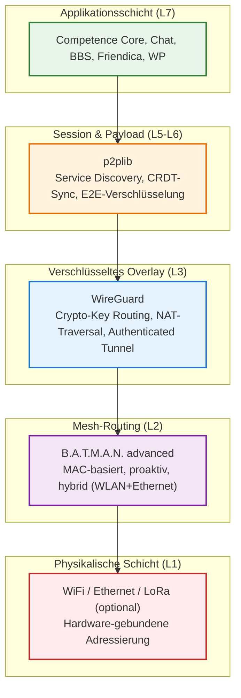
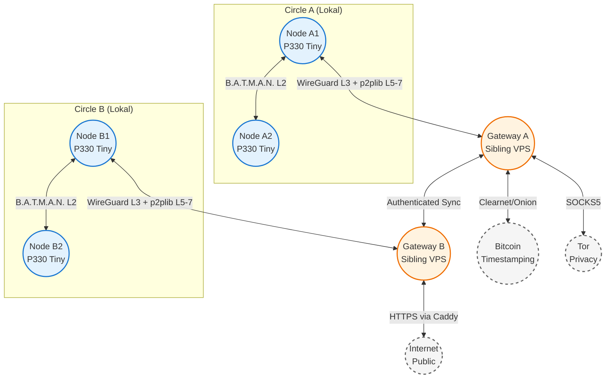

# Positionspapier: Digitale Souveränität durch Echtes Peer-to-Peer
## Warum dezentrale Infrastrukturen die notwendige Antwort auf den Überwachungskapitalismus sind

**Paper of position v0.5.1 (FINAL DRAFT)**

---

Dokumenten-Information

| Feld | Wert |
|------|------|
| **Dokument-ID** | `DAE-PP-2026-001-v0.5.1` |
| **Version / Status** | 0.5.1 (FINAL DRAFT) |
| **Datum** | 23. Mai 2026 |
| **Autor** | Ralf Siebert (aka Maxim R. Garrtner) |
| **Kontakt** | [maxim.r.garrtner@yandex.com](mailto:maxim.r.garrtner@yandex.com) |
| **Klassifikation** | Konzeptionell / Öffentlich / Gesellschaftlich-Politisch |
| **Zielgruppe** | Zivilgesellschaft, Politik, NGOs, Datenschutzbeauftragte, IT-Entscheider, Forschung |
| **Primärer Fokus** | Begründung digitaler Souveränität durch echtes Peer-to-Peer auf OSI-Layer 2–4 als Antwort auf Überwachungskapitalismus & Agnotologie |
| **Sekundärer Fokus** | Infrastrukturelle Voraussetzungen des Decentralized Autonomous Ecosystems (DAE) |
| **Lizenz** | CC BY-SA 4.0 |
| **Bezug** | Whitepaper: *„Decentralized Autonomous Ecosystem Architecture"* (`DAE-WP-2026-001-v0.5.1`) |
| **Kernkonzepte** | Echtes P2P vs. Pseudo-P2P, Circle-Topologie & Gateways, Informationsfreiheit, Agnotologie-Resistenz, Daten vs. Information, Proactive Transparency, Merkle-DAG-Rekonstruktion |
| **Zitierempfehlung** | Siebert, R. (2026). *Digitale Souveränität durch Echtes Peer-to-Peer* (Positionspapier v0.5.1). Verfügbar unter: [maxim.r.garrtner@yandex.com](mailto:maxim.r.garrtner@yandex.com) |

---

## Executive Summary

Die Architektur des Internets ist keine technische Neutralität – sie ist eine politische und ökonomische Entscheidung. Seit der Ablösung direkter Computer-zu-Computer-Verbindungen durch zentralisierte Rechenzentren hat sich das World Wide Web von einem offenen Kommunikationsraum zu einer Infrastruktur des **Überwachungskapitalismus** entwickelt. Persönliche Daten werden extrahiert, Verhaltensvorhersagen trainiert und Aufmerksamkeit algorithmisch optimiert – ohne informierte Einwilligung und ohne echte Kontrolle der Nutzenden.

Dieses Positionspapier begründet, warum **echtes Peer-to-Peer (P2P) auf OSI-Layer 2 und 3** die einzige technologisch und ethisch tragfähige Alternative darstellt. Im Gegensatz zu applikatorischen „Pseudo-P2P“-Modellen (z. B. ActivityPub/Mastodon), die weiterhin auf zentralisierten Servern und Vermittlungsdiensten auf Layer 7 operieren, ermöglicht echtes P2P autonome, autorisierte und verschlüsselte Direkverbindungen zwischen Endgeräten. Kombiniert mit moderner Edge-Hardware, TPM-basierter Kryptographie und GitOps-gesteuerten Provisionierung entsteht eine Infrastruktur, die Datensouveränität nicht verspricht, sondern **technisch erzwingt**.

> *„Dezentralität ist kein technisches Feature. Sie ist die Wiederherstellung von Eigentum, Privatsphäre und Kooperation im digitalen Raum.“*

---

## Metadaten

| Feld | Wert |
|------|------|
| **Dokument-ID** | `DAE-WP-2026-001-v0.5.1` |
| **Version / Status** | 0.5.1 (FINAL DRAFT) |
| **Datum** | 23. Mai 2026 |
| **Autor** | Ralf Siebert (aka Maxim R. Garrtner) |
| **Kontakt** | [maxim.r.garrtner@yandex.com](mailto:maxim.r.garrtner@yandex.com) |
| **Klassifikation** | Konzeptionell / Öffentlich / Technisch-Architektonisch |
| **Zielgruppe** | Infrastruktur-Architekten, Open-Source-Entwickler, Systemadministratoren, Compliance-Verantwortliche, Community-Netzwerk-Betreiber |
| **Primärer Fokus** | Technische Spezifikation, Betrieb & Provisionierung des Decentralized Autonomous Ecosystems (DAE) |
| **Sekundärer Fokus** | Anwendungsbeispiel *Competence Signature* & historische Rekonstruktion via Merkle-DAG |
| **Lizenz** | CC BY-SA 4.0 |
| **Bezug** | Positionspapier: *„Digitale Souveränität durch Echtes Peer-to-Peer"* (`DAE-PP-2026-001-v0.5.1`) |
| **Kernkonzepte** | `B.A.T.M.A.N. advanced` (L2), `WireGuard` (L3), `p2plib` (L5–7), TPM 2.0 Sealing, GitOps/SaltStack, Merkle-DAG, CRDT-Sync, Circle-Governance, Proactive Transparency |
| **Hardware/OS-Referenz** | Lenovo ThinkStation P330 Tiny (lokal), OVH Kimsufi/VPS (öffentlich), DietPi/Debian 12 Bookworm |
| **Zitierempfehlung** | Siebert, R. (2026). *Decentralized Autonomous Ecosystem Architecture* (Whitepaper v0.5.1). Verfügbar unter: [maxim.r.garrtner@yandex.com](mailto:maxim.r.garrtner@yandex.com) |

---

## 1. Diagnose: Überwachungskapitalismus & die Architektur der Entmündigung

Die Architektur des Internets ist keine neutrale technische Gegebenheit. Sie ist das Ergebnis historischer und ökonomischer Entscheidungen, die über Jahrzehnte hinweg die Kontrolle über Daten, Rechenleistung und Kommunikation schrittweise von den Endnutzenden hin zu zentralisierten Infrastrukturanbietern verlagert haben. Diese Verlagerung ist die technische Voraussetzung für das, was Shoshana Zuboff als **„Überwachungskapitalismus“** bezeichnet: ein Wirtschaftssystem, das menschliche Erfahrung als kostenlosen Rohstoff für kommerzielle Extraktion, Vorhersage und Verhaltensbeeinflussung beansprucht. Solange die Infrastruktur selbst die Extraktion begünstigt, bleibt Datenschutz eine rechtliche Fiktion.

---

### 1.1 Die historische Abkehr vom direkten Austausch

Die Ursprünge der digitalen Vernetzung waren geprägt von Direktheit, Transparenz und expliziter Autorisierung. Bis etwa 1990 bestand das Netz aus punkt-zu-punkt-Verbindungen zwischen bekannten Rechnern. Teilnehmende und Maschinen waren namentlich identifizierbar; der Austausch von Daten und Rechenleistung erfolgte auf Basis gegenseitigen Vertrauens. Jede Verbindung war bewusst hergestellt, jede Datenweitergabe nachvollziehbar.

Mit der Kommerzialisierung ab 1990 entstanden **Internet Service Provider (ISPs)**, die Rechenkapazitäten in geschlossenen Rechenzentren bündelten und gegen Entgelt bereitstellten. Dies markierte den ersten Schritt zur strukturellen Anonymisierung: Nutzende wurden zu abstrakten Teilnehmern in einem öffentlichen Raum, deren Identität und Standort hinter IP-Adressen, Routing-Tabellen und Domain-Namensdiensten verschwanden. Die direkte Peer-zu-Peer-Verbindung wurde durch die vermittelnde Infrastruktur des Providers ersetzt.

Die 2000er Jahre brachten die Virtualisierung und die Redundanz von Servern, gefolgt von der Geburtsstunde des **Cloud Computing (ab 2010)**. Rechenleistung und Speicher wurden zu bedarfsorientierten Waren; Administration, Sicherheitsupdates und physische Wartung wurden an externe Provider ausgelagert. Ab 2015 entwickelte sich das **„API Service Providing“**: Applikationen wurden nicht mehr primär über Browseroberflächen, sondern über programmatische Schnittstellen angebunden. Obwohl dies technische Flexibilität und hybride Architekturen versprach, vertiefte es die strukturelle Abhängigkeit. Daten verließen die lokale Sphäre, um in fremden Rechenzentren verarbeitet zu werden, oft ohne dass der eigentliche Eigentümer nachvollziehen konnte, wann, wie und zu welchem Zweck sie weiterverarbeitet, kopiert oder analysiert wurden.

---

### 1.2 Von der Zentralisierung zur Datenextraktion

Die konsequente Logik dieser Architektur ist die Entstehung eines **quasi-öffentlichen Raums**, in dem persönliche Informationen zentral gespeichert, aggregiert und kommerziell verwertet werden. Application Service Provider (BigTech) bieten scheinbar kostenlose Dienste an, finanzieren sich jedoch durch die systematische Extraktion von Verhaltensdaten. Klicks, Aufenthaltsdauern, Sozialgraphen, Standortverläufe und Inhaltspräferenzen werden zu hochauflösenden Profilen verdichtet, die an Werbetreibende, Analysefirmen oder staatliche Stellen lizenziert oder bereitgestellt werden.

Die Anonymität des Zugangs wird durch die **Transparenz des Verhaltens** kompensiert. Niemand muss wissen, wer Sie sind, solange das System präzise vorhersagen kann, was Sie als Nächstes tun werden. Dieser Prozess ist kein technischer Unfall, sondern ein strukturelles Merkmal der Client-Server-Infrastruktur. Solange Kommunikation über vermittelnde Server läuft, entsteht zwangsläufig eine Kontrollinstanz, die Datenfluss, Zugriff, Speicherung und Metadaten-Analyse regelt.

Verträge, Nutzungsbedingungen und Datenschutzregulierungen (wie die DSGVO) versuchen, dieser Macht Grenzen zu setzen. Sie bleiben jedoch oft wirkungslos, wenn die technische Architektur selbst die Extraktion, Replikation und Fremdnutzung von Daten standardisiert. Datenhoheit wird zur Illusion, sobald die Infrastruktur physisch und logisch außerhalb der Reichweite der datenerzeugenden Person liegt.

---

### 1.3 Die Illusion der Applikations-Dezentralisierung

Angesichts der wachsenden Kritik an zentralisierten Plattformen entstand eine neue Welle vermeintlich dezentraler Lösungen: **ActivityPub (Mastodon/Fediverse)**, **Matrix/Element**, **Nostr** oder **Web3-Applikationen**. Diese Systeme werben mit Offenheit, Föderation, Nutzerkontrolle und Zensurresistenz. Technisch operieren sie jedoch fast ausschließlich auf der **Anwendungsschicht (OSI Layer 7)**.

Im Falle von ActivityPub beispielsweise tauschen Server auf Applikationsebene Daten aus; der Client ist niemals direkt mit einem anderen Client verbunden. Matrix nutzt Ende-zu-Ende-Verschlüsselung, bleibt aber auf zentrale Home-Server oder Relay-Dienste angewiesen, um Nachrichten zu speichern und weiterzuleiten. Web3-Projekte delegieren die Transaktionsvalidierung an spezialisierte Nodes, die oft durch zentrale RPC-Provider, Cloud-Infrastrukturen oder Mining-Pools kontrolliert werden.

Diese Ansätze werden hier als **Pseudo-Peer-to-Peer** bezeichnet. Sie reduzieren zwar die Abhängigkeit von einzelnen Monopolisten, bewahren aber das grundlegende Vermittlungsparadigma: Eine Server-Instanz (oder ein Server-Cluster) autorisiert, speichert, relayt oder validiert die Kommunikation. Die Datenextraktion wird lediglich dezentralisiert oder fragmentiert, nicht aber eliminiert. Solange die Netzwerkebene (Layer 3/4) oder die Sicherungsschicht (Layer 2) nicht direkt zwischen Endgeräten adressierbar ist, bleibt die Infrastruktur fremdbestimmt. Sicherheit und Privatsphäre müssen hier applikatorisch nachgerüstet werden – was zusätzlichen Entwicklungsaufwand erfordert und anfällig für Implementierungsfehler bleibt.

---

### 1.4 Warum Layer 7 nicht ausreicht: Die Architektur der Entmündigung

Die Beschränkung auf Layer-7-Dezentralisierung übersieht einen fundamentalen Punkt: **Digitale Souveränität ist keine Applikationsfunktion, sondern eine Infrastruktureigenschaft.** Solange Datenpakete physisch durch Rechenzentren fließen, die nicht dem Sender oder Empfänger gehören, bleibt die Möglichkeit der Überwachung, Zensur, Metadaten-Analyse oder kommerziellen Auswertung strukturell erhalten. Pseudo-P2P-Systeme verschieben lediglich die Vertrauensgrenze von einem Konzern zu einem dezentraleren Server-Netzwerk – sie beseitigen sie nicht.

Echte digitale Souveränität erfordert daher einen Paradigmenwechsel: weg von applikatorischer Vermittlung, hin zu **netzwerktechnischer Direktheit**. Peer-to-Peer-Architekturen, die auf der Transport- (TCP, Layer 4), Vermittlungs- (IP, Layer 3) oder Sicherungsschicht (MAC, Layer 2) operieren, eliminieren die Notwendigkeit zentraler Vermittler. Sie ermöglichen:
- ✅ **Autonome Verbindungen** ohne Internet-Gateway-Abhängigkeit
- ✅ **Explizite gegenseitige Autorisierung** (Circle-Prinzip) statt anonymer Reichweite
- ✅ **Lokale Datenhaltung** mit hardware-gesicherter Kryptographie
- ✅ **Resilientes Routing** über alternative Pfade bei Ausfällen oder Zensur

Erst auf dieser Ebene wird Privatsphäre nicht durch AGBs versprochen, sondern durch Protokoll-Design erzwungen. Die folgende Diagnose macht deutlich: Der Überwachungskapitalismus ist kein bloßes Geschäftsmodell, sondern das direkte Ergebnis einer Infrastruktur, die Zentralisierung als Standard setzt. Die Wiederherstellung von Datensouveränität, authentischer Sozialität und resilienter Kommunikation erfordert daher keine bessere Applikation, sondern eine fundamentale Neugestaltung der Vernetzung selbst.

Im nächsten Kapitel wird dargelegt, wie **echtes Peer-to-Peer auf OSI-Layer 2 bis 4** diese Architektur nicht nur theoretisch, sondern praktisch, technisch und protokollbasiert operationalisierbar macht.

---

Hier sind die beiden Kapitel, exakt auf die jeweilige Dokumentenarchitektur und den stilistischen Duktus zugeschnitten. Beide übernehmen die inhaltliche Substanz der zuvor erarbeiteten Grundlagen-Definition, übersetzen sie jedoch gezielt in die argumentative Logik des Positionspapiers (gesellschaftlich-politisch) bzw. die technische Spezifikation des Whitepapers (architektonisch-operativ).

---

### 1.5 Grundlagen: Daten, Information & das Agnotologie-Paradigma

Die Debatte um digitale Souveränität, Transparenz und demokratische Aufklärung scheitert häufig an einem fundamentalen Begriffsdefizit: Die Gleichsetzung von Daten und Information. Solange diese Unterscheidung nicht klar getroffen wird, bleibt Datenschutz eine rechtliche Fiktion, Informationsfreiheit ein reaktiver Appell und historische Aufklärung ein nachträgliches Einfordern. Im Decentralized Autonomous Ecosystem (DAE) wird diese Trennung nicht semantisch, sondern **architektonisch operationalisiert**. Sie bildet das konzeptionelle Fundament, auf dem Datensouveränität, algorithmische Transparenz und Agnotologie-Resistenz aufbauen. Daten bleiben lokal, verschlüsselt und hardwaregesiegelt; Information entsteht erst durch Validierung, Kontextualisierung und nachvollziehbare Provenienz.

#### 1.5.1.1 State-of-the-Art: Konvergenz technischer, rechtlicher & gesellschaftlicher Perspektiven
Eine Analyse aktueller Forschungs- und Praxisstandards (2024–2026) zeigt, dass technische, rechtliche und sozio-technische Disziplinen unabhängig voneinander zu derselben Schlussfolgerung kommen:

| Perspektive | Definition „Daten" | Definition „Information" | Kernimplikation für Souveränität |
|-------------|-------------------|--------------------------|----------------------------------|
| **Informatik & Informationstheorie** | Unverarbeitete, syntaktische Einheiten (Bits, Messwerte, CRDT-States). Bedeutung entsteht erst durch Interpretation. | Daten + Kontext + Zweck = semantisch aufgelöste, handlungsrelevante Aussage. (DIKW-Modell) | Daten sind neutral; Information erfordert Validierung & Kontext |
| **Rechtlich (DSGVO / IFG / eIDAS)** | Jede Information, die sich auf eine identifizierbare Person bezieht. Art. 4 DSGVO. | Aufbereitete, nachvollziehbare Aussage mit Entscheidungsrelevanz; unterliegt Zugriffsrechten (IFG, UIG). | Schutzgut vs. Zugriffsrecht: Beide müssen architektonisch koexistieren |
| **Dezentrale Systeme & Kryptographie** | Kryptographisch signierte Zustände, lokale Speicher-Blocks, Hashes. | Validierter, konsensbasierter Zustand mit Metadaten, Provenenz-Kette & transparenter Entstehungslogik. | Provenenz & Konsens machen aus Daten verifizierbare Information |
| **Agnotologie & Transparenzforschung** | Rohmaterial, das durch Selektion, Framing oder Unterdrückung bewusst verändert werden kann. | Daten, deren Entstehungsprozess, Kontext & Validierungsregeln öffentlich nachvollziehbar sind. | Fehlt Transparenz, entsteht produktives Nicht-Wissen |
| **Sozio-technische P2P-Architektur** | Lokale, verschlüsselte Einträge auf autorisierten Nodes. Subjektiv, kontextarm, kryptographisch bindend. | Durch Circle-Validierung, Metadaten-Schema & Open-Logic verifizierte, maschinenlesbare Aussage. | Information entsteht dezentral, nicht durch zentrale Kuratierung |

> 🔍 **Erkenntnis**: Der Unterschied liegt nicht im Inhalt, sondern in **Provenenz, Validierung und Transparenz des Entstehungsprozesses**. Daten sind das Material. Information ist das verifizierte, kontextualisierte Ergebnis.

#### 1.5.1.2 Alternative Darstellung: State-of-the-Art-Analyse (2024–2026)

| Perspektive | Definition „Daten" | Definition „Information" | Quellen & Referenzen |
|-------------|-------------------|--------------------------|----------------------|
| **Informatik & Informationstheorie** | Unverarbeitete, syntaktische Einheiten (Bits, Zeichen, Messwerte, CRDT-States). Bedeutung entsteht erst durch Interpretation. | Daten + Kontext + Zweck = semantisch aufgelöste, handlungsrelevante Aussage. (DIKW-Modell: Data → Information → Knowledge → Wisdom) | ISO/IEC 2382:2015, Shannon/Weaver (1948), Bates (2005) |
| **Rechtlich (DSGVO / IFG / eIDAS)** | Personenbezogene Daten: Jede Information, die sich auf eine identifizierte/identifizierbare natürliche Person bezieht. Art. 4 DSGVO. | Aufbereitete, nachvollziehbare Aussage mit Entscheidungsrelevanz. Unterliegt Informationsfreiheitsgesetzen (IFG, UIG, VIG) als Zugriffsrecht. | DSGVO Art. 4/5, IFG §1, eIDAS VO (EU) 910/2014 |
| **Dezentrale Systeme & Kryptographie** | Kryptographisch signierte Zustände, Hashes, Payloads, lokale Speicher-Blocks. Neutral, unverändert, nachweisbar. | Validierter, konsensbasierter Zustand mit Metadaten, Provenienz-Kette und transparenter Entstehungslogik. | CRDT-Theory (Shapiro et al.), TPM 2.0 Spec, GitOps-Prinzipien |
| **Agnotologie & Transparenzforschung** | Rohmaterial, das durch Selektion, Framing oder Unterdrückung bewusst verändert oder vorenthalten werden kann. | Daten, deren Entstehungsprozess, Kontext und Validierungsregeln öffentlich nachvollziehbar sind. Fehlt Transparenz, entsteht produktives Nicht-Wissen. | Proctor (2008), McGoey (2012), Oreskes/Conway (2010) |
| **Sozio-technische P2P-Architektur** | Lokale, verschlüsselte Einträge auf autorisierten Nodes. Subjektiv, kontextarm, aber kryptographisch bindend. | Durch Circle-Validierung, Metadaten-Schema und Open-Logic verifizierte, maschinenlesbare und menschlich interpretierbare Aussage. | KB „Anatomie eines Peer to Peer Netzwerks", DAE-Designprinzipien |

> 🔍 **Erkenntnis**: Im State of the Art konvergieren technische, rechtliche und gesellschaftliche Definitionen darauf, dass **Daten das Material sind, Information das verifizierte, kontextualisierte Ergebnis**. Der Unterschied liegt nicht im Inhalt, sondern in **Provenienz, Validierung und Transparenz des Entstehungsprozesses**.

---

#### 1.5.2 Operative Übersetzung in die DAE-Architektur: Von der Definition zur Infrastruktur
Diese begriffliche Klarheit wird im DAE nicht durch Richtlinien, sondern durch technische Schichtung erzwungen:

| Ebene | Daten (Raw) | Information (Validated & Contextualized) | Gesellschaftlich-operative Wirkung | Technische Umsetzung im DAE |
|-------|-------------|------------------------------------------|------------------------------------|-----------------------------|
| **Speicherung** | Lokale NVMe-Blöcke, verschlüsselte Payloads, CRDT-States | Metadaten-Schema, Review-Status, geografische/zeitliche Einordnung | Datensouveränität bleibt lokal; Kontext wird teilbar | `NVMe-2`, `OPAL 2.0`, `p2plib`-Sync, JSON-LD/Schema.org |
| **Identität & Signatur** | TPM-gesiegelte Private Keys, lokale Zertifikate | Non-Repudiable Signatur, Author-PublicKey, Git-Config-Hash | Verantwortung ist hardwaregebunden, nicht abstreitbar | `tpm2_sign`, `ed25519`, GitOps-Provenienz |
| **Validierung** | Ungeprüfte Einträge, subjektive Erfassung | Circle-Konsens (≥3 Peers), `review_status`, Konflikt-Markierung | Mehr-Augen-Prinzip ersetzt zentrale Kuratierung | CRDT-Merge, Circle-Governance, SaltStack-Drift-Check |
| **Transparenz & Zugriff** | Verschlüsselte lokale Dateien, selektive Freigabe | Maschinenlesbare Metadaten, öffentliche Algorithmus-Hashes | Informationsfreiheit als Default, nicht als Ausnahme | WireGuard-Auth, Caddy-Routing, Loki-Audit, Bitcoin-Timestamp |
| **Juristische Verwertbarkeit** | Rohdokumente, Bescheide, Gesundheitsverläufe | Forensisch verwertbare Beweiskette, eIDAS-konform, unveränderlich | Aufklärung wird architektonisch ermöglicht, nicht eingeklagt | TPM-Attestation, OP_RETURN, selektive Disclosure, Circle-Review |

---

#### 1.5.3 Abgrenzung zu Agnotologie & Manipulation

Agnotologie zeigt: **Information kann produziert, verzögert, fragmentiert oder kontextlos gemacht werden**. Das DAE adressiert dies durch architektonische Gegenmaßnahmen:

| Agnotologischer Mechanismus | DAE-Gegenmaßnahme | Resultat |
|----------------------------|-------------------|----------|
| Selektive Veröffentlichung | Proactive Metadata Publication + GitOps-Historie | Vollständige, versionierte Dokumentation |
| Blackbox-Entscheidungen | Open-Logic-by-Design + Code-Hashes + Circle-Review | Algorithmische Transparenz |
| Kontextentzug | Strikte Trennung Payload/Metadaten + Schema.org | Maschinenlesbare Einordnung ohne Datenexposure |
| Nachträgliche Manipulation | TPM-Signierung + CRDT-Konflikterkennung + BTC-Timestamp | Forensische Unveränderbarkeit |
| Zentrale Kuratierung | Circle-basierte Governance + dezentrale Validierung | Konsens statt Hierarchie |

> *„Daten sind neutral. Information ist das Ergebnis von Transparenz, Validierung und Kontext. Das DAE erzwingt Information nicht durch Appelle, sondern durch Architektur."*

---

#### 1.5.4 Konsens-Definition für das DAE
Um Missverständnisse auszuräumen und eine gemeinsame technische & gesellschaftliche Basis zu schaffen, gilt im DAE folgende verbindliche Trennung:

📦 **Daten**  
Sind strukturierte, semi-strukturierte oder unstrukturierte Zeichenfolgen, Signale, Messwerte oder kryptographische Zustände, die ohne externen Kontext keine inhärente Bedeutung tragen. Sie sind speicherbar, übertragbar, kryptographisch signierbar und unterliegen im DAE der lokalen Hoheit ihres Eigentümers. Daten sind neutral; ihre Bedeutung entsteht erst durch Interpretation, Kontext und Validierung.

🌐 **Information**  
Sind Daten, die durch Kontext, Metadaten, Validierung und Zweckbindung semantisch aufgelöst wurden. Information ist handlungsrelevant, nachvollziehbar in ihrer Herkunft (Provenenz), architektonisch verifizierbar und unterliegt einer transparenten Entstehungslogik. Im DAE ist Information erst dann vollständig, wenn sie valide, kontextualisiert, maschinenlesbar und kooperativ nachprüfbar ist.

#### 1.5.6 Agnotologie-Resistenz durch Architektur
Agnotologie beschreibt, wie Unwissenheit nicht durch Zufall, sondern durch **Selektion, Verzögerung, Kontextentzug oder Framing** erzeugt wird. Staatliche Intransparenz, historische Lücken oder algorithmische Blackbox-Entscheidungen folgen oft diesem Muster. Das DAE adressiert diese Mechanismen durch gezielte Gegenarchitekturen:

| Agnotologischer Mechanismus | DAE-Gegenmaßnahme | Resultat |
|----------------------------|-------------------|----------|
| Selektive Veröffentlichung | Proactive Metadata Publication + GitOps-Historie | Vollständige, versionierte Dokumentation |
| Blackbox-Entscheidungen | Open-Logic-by-Design + Code-Hashes + Circle-Review | Algorithmische Transparenz |
| Kontextentzug | Strikte Trennung Payload/Metadaten + Schema.org | Maschinenlesbare Einordnung ohne Datenexposure |
| Nachträgliche Manipulation | TPM-Signierung + CRDT-Konflikterkennung + BTC-Timestamp | Forensische Unveränderbarkeit |
| Zentrale Kuratierung | Circle-basierte Governance + dezentrale Validierung | Konsens statt Hierarchie |

#### 1.5.7 Fazit des Kapitels
Die Trennung von Daten und Information ist kein akademisches Detail, sondern **die architektonische Voraussetzung für digitale Souveränität, Transparenz und juristische Aufklärung**. Im DAE wird diese Trennung durch drei Prinzipien operationalisiert:
1. **Daten bleiben lokal, verschlüsselt und hardwaregesiegelt**
2. **Information entsteht durch Validierung, Metadaten und kooperative Kontextualisierung**
3. **Transparenz ist Default, nicht Ausnahme – operationalisiert durch GitOps, Open-Logic und Circle-Governance**

Damit wird Information nicht zentral kuratiert, sondern **dezentral verifiziert**. Nicht durch Institutionen, sondern durch Architektur. Nicht durch Appelle, sondern durch Code, Hardware und kooperative Topologie.

---

## 2. Das Paradigma des Echten Peer-to-Peer

Während die Diagnose des Überwachungskapitalismus die strukturelle Schwäche zentralisierter Infrastrukturen offenlegt, liefert das **echte Peer-to-Peer** die technologische und konzeptionelle Antwort. Es ist kein bloßes alternatives Protokoll, sondern ein fundamentaler Paradigmenwechsel in der Art und Weise, wie Netzwerke aufgebaut, autorisiert und betrieben werden. Im Gegensatz zu applikatorischen Dezentralisierungsversuchen, die lediglich die Server-Instanz fragmentieren, eliminiert echtes P2P die Notwendigkeit von Vermittlern auf der Netzwerk- und Transportschicht. Es verwandelt das Internet von einem öffentlichen, anonymisierten Raum in ein Netzwerk autonomer, gegenseitig autorisierter Knoten.

---

### 2.1 Definition: Echtes vs. Pseudo Peer-to-Peer

Die Informatik unterscheidet strikt zwischen zwei Implementierungsarten der Peer-to-Peer-Technologie:

| Merkmal | **Pseudo Peer-to-Peer** | **Echtes Peer-to-Peer** |
|---------|------------------------|------------------------|
| **OSI-Layer** | Schicht 7 (Applikation) | Schicht 2–4 (Data Link, Network, Transport) |
| **Verbindungspfad** | Client → Server → Client | Peer ↔ Peer (direkt) |
| **Vermittlung** | Zentrale oder föderierte Server-Instanz | Algorithmus-basierte direkte Adressierung |
| **Autorisierung** | Plattformseitig (Nutzerkonto, AGB) | Gegenseitig, explizit, widerrufbar |
| **Datenfluss** | Durch Server relayt, gespeichert oder analysiert | Ende-zu-Ende verschlüsselt, kein Transit durch Dritte |

Im **Pseudo-P2P** (z. B. ActivityPub, Matrix, Nostr) greift ein Client auf einen Server zu, der dann eine Verbindung zu einem anderen Client herstellt oder Daten zwischen Servern auf Applikationsebene austauscht. Der Client ist niemals direkt mit einem anderen Client verbunden. Die Infrastruktur bleibt serverzentriert; Dezentralisierung wird hier lediglich durch Föderation simuliert.

Das **echte Peer-to-Peer** hingegen nutzt die Netzwerktechnologie direkt auf der Ebene des Transports (TCP/UDP, Layer 4), des Internets (IP, Layer 3) oder der Sicherungsschicht (MAC-Adressen, Layer 2). Damit entfällt die Nutzung von Servern oder Vermittlungssystemen in Rechenzentren vollständig. Die Verbindung wird autonom, algorithmisch und hardwarenah etabliert.

---

### 2.2 Die technische Architektur: Layer 2–4 als Fundament

Echtes P2P operiert dort, wo physische und logische Netzwerkkommunikation stattfindet. Durch die Arbeit auf den unteren OSI-Schichten wird Sicherheit nicht nachträglich in die Applikation eingebaut, sondern ist inhärenter Bestandteil der Verbindungsarchitektur.

| OSI-Schicht | Funktion im echten P2P | Technische Realisierung |
|-------------|------------------------|-------------------------|
| **Layer 2 (Data Link)** | Direkte MAC-basierte Verbindung zwischen Endgeräten | `B.A.T.M.A.N. advanced`, IEEE 802.11s |
| **Layer 3 (Network)** | Authentifizierte IP-Routing-Overlay-Netzwerke | `WireGuard` |
| **Layer 4 (Transport)** | Zuverlässige, verschlüsselte Datenströme | TCP/UDP mit integrierter Kryptographie |

Diese Schichtenkombination ermöglicht:
- ✅ **Keine DNS-Abhängigkeit**: Peers identifizieren sich über öffentliche Keys oder MAC-Adressen.
- ✅ **Keine zentrale Routing-Tabelle**: Routing erfolgt dezentral (z. B. über Originator Messages bei B.A.T.M.A.N. oder Crypto-Key-Routing bei WireGuard).
- ✅ **Native Verschlüsselung**: Daten werden auf Transport- oder Netzwerkebene verschlüsselt, bevor sie die Netzwerkkarte verlassen.
- ✅ **NAT-Durchdringung**: Moderne Protokolle integrieren Keepalive- und Hole-Punching-Mechanismen für stabile Verbindungen hinter Firewalls.

Durch diese Architektur wird Privatsphäre nicht durch Datenschutzbestimmungen versprochen, sondern durch Protokoll-Design technisch erzwungen.

---

### 2.3 Das Circle-Prinzip & Identitätsbekanntgabe

Ein zentrales Merkmal echter P2P-Netzwerke ist die **Aufhebung der Anonymität zugunsten authentischer Sozialität**. Im klassischen Internet interagieren Teilnehmende pseudonym oder anonym in einem öffentlichen Raum. Echtes P2P ersetzt dieses Modell durch das **Circle-Konzept**:

- **Kreise statt Plattformen**: Peers organisieren sich in sozialen oder geo-lokalen Einheiten (Familie, Freundeskreis, Verein, Nachbarschaft, Grätzl).
- **Persönliche Bekanntschaft**: Innerhalb eines Circle kennen sich die Eigentümer der Peers persönlich oder sind über vertrauenswürdige Mitglieder verknüpft.
- **Explizite Autorisierung**: Jede Verbindung erfordert gegenseitige Bestätigung. Autorisierung kann jederzeit widerrufen werden.
- **Identitätsbekanntgabe**: Quellen sind namentlich bekannt. Verantwortung für veröffentlichte Informationen liegt klar beim jeweiligen Peer.

Dieses Modell stellt die **Verantwortung für Inhalte und Daten** wieder her. Desinformation wird durch ein neuartiges Konsens-Modell eingedämmt: Informationen werden nicht algorithmisch verstärkt, sondern durch peer-basierte Validierung und persönliche Verifikation gefiltert. Privatheit wird nicht durch öffentliche Transparenz aufgehoben, sondern durch selektive, autorisierte Sichtbarkeit geschützt.

---

### 2.4 Autonomie & Gateway-Struktur

Echte P2P-Mesh-Netzwerke sind **inhärent autonom**. Sie benötigen keinen expliziten Zugang zum Internet, um zu funktionieren. Die Verbindung wird vollständig durch die angeschlossenen Geräte selbst hergestellt. Das Internet ist lediglich eine ergänzende Struktur, die über **Gateway-Peers** angebunden wird.

```
[Circle-Mesh] ←→ [Gateway-Peer] ←→ [Internet / andere Circles]
```

- **Offline-Fähigkeit**: Bei Internetausfall, Zensur oder Infrastrukturstörungen bleibt das lokale Circle-Netzwerk voll funktionsfähig.
- **Resilientes Routing**: Datenpakete finden alternative Pfade über verfügbare Peers (Multi-Path-Routing).
- **Kontrollierte Externalisierung**: Nur autorisierte Daten werden über Gateways nach außen geleitet. Der Datenfluss bleibt granular steuerbar.
- **Skalierbare Inter-Circle-Kommunikation**: Mehrere Circles können über vertrauenswürdige Gateways föderiert werden, ohne zentrale Kontrollinstanzen.

Diese Architektur macht P2P-Netzwerke nicht nur technisch robust, sondern auch geopolitisch resilient. Sie entkoppeln die lokale Kommunikation von globalen Infrastrukturmonopolen.

---

### 2.5 Kooperative Lastverteilung & Das ungenutzte Potenzial

Die Philosophie echter P2P-Netzwerke lässt sich mit dem Satz zusammenfassen:  
> *„Jeder weiß ein wenig, jeder muss nicht alles wissen, jeder gibt sein Wissen in die Kooperation.“*

Dieses Prinzip der **dedizierten Arbeitslastverteilung** transformiert verteilte Rechenkapazität in eine kooperative Infrastruktur. Eine Analyse der global verfügbaren IT-Infrastruktur (Stand Dezember 2023) zeigt das enorme, bisher weitgehend ungenutzte Potenzial:

| Maschinentyp | Anzahl (Mio.) | Ø CPU-Cores | Gesamt-Cores (Mio.) |
|--------------|---------------|-------------|---------------------|
| **Server** | 17,5 | 64 | 1.120 |
| **Personal Computer** | 350,0 | 8 | 2.800 |
| **Mobile Endgeräte** | 6.000,0 | 4 | 24.000 |
| **Gesamt** | **6.367,5** | – | **27.920** |

Davon stehen schätzungsweise **~26.800 Millionen Prozessor-Kerne** im überdurchschnittlichen Leerlauf zur Verfügung. Diese verteilte Kapazität repräsentiert kein technisches Defizit, sondern ein **gesellschaftliches Infrastruktur-Potenzial**. Echtes P2P nutzt diesen Leerlauf für:
- Lokale Validierung und Konsensbildung
- Dezentrale Datenspeicherung und Replikation
- Verteilte Berechnung und Arbeitslast-Balancierung
- Resiliente Kommunikationswege

Im Gegensatz zu Cloud-Modellen, die Rechenleistung zentral bündeln und extern vermarkten, bleibt die Wertschöpfung im P2P-Netzwerk bei den Teilnehmenden. Kooperation ersetzt Extraktion.

---

### 2.6 Warum genau diese Protokolle? (Einleitung)

Das Paradigma des echten Peer-to-Peer bleibt abstrakt, solange es nicht durch konkrete, interoperable Protokolle operationalisiert wird. Für die Umsetzung digitaler Souveränität wurden drei Protokolle ausgewählt, die sich komplementär ergänzen und unterschiedliche OSI-Schichten abdecken:

1. **`B.A.T.M.A.N. advanced`** (Layer 2): Proaktives, MAC-basiertes Mesh-Routing für kabelgebundene und drahtlose Verbindungen. Ermöglicht autonome, lokale Netzwerke ohne Internet-Abhängigkeit.
2. **`WireGuard`** (Layer 3): Leichtgewichtiges, kryptographisch sicheres Overlay-VPN. Authentifiziert Peers über öffentliche Keys, durchdringt NAT und sichert den Datenverkehr über unsichere Netze.
3. **`p2plib`** (Applikations-/Session-Schicht): Bibliothek für service discovery, direkte Peer-Kommunikation und dezentrale Datenreplikation. Bietet die Applikations-Schnittstelle, ohne Server-Relays zu benötigen.

Diese Kombination deckt die gesamte Netzwerkkette ab: Von der physischen Verbindung über das sichere Routing bis zur applikatorischen Interaktion. Im nächsten Kapitel wird diese Protokoll-Triade detailliert analysiert, verglichen und in die Gesamtarchitektur des Decentralized Autonomous Ecosystems integriert.

---

## 3. Protokoll-Fundament: p2plib, WireGuard & B.A.T.M.A.N.

Die Diagnose des Überwachungskapitalismus und die Prinzipien echten Peer-to-Peer bleiben abstrakt, solange sie nicht durch konkrete, interoperable Protokolle operationalisiert werden. Applikations-basierte Dezentralisierung (Layer 7) hat gezeigt, dass Sicherheit und Souveränität nicht nachträglich in Software eingebaut werden können. Sie müssen in der Architektur der Vernetzung selbst verankert sein.

Für das Decentralized Autonomous Ecosystem wurde daher eine **komplementäre Protokoll-Triade** ausgewählt, die unterschiedliche OSI-Schichten abdeckt, sich gegenseitig verstärkt und die strukturellen Abhängigkeiten zentralisierter Infrastrukturen auf jeder Ebene eliminiert:

| Protokoll | OSI-Schicht | Primäre Funktion | Architektur-Prinzip |
|-----------|-------------|------------------|---------------------|
| **`B.A.T.M.A.N. advanced`** | Layer 2 (Data Link) | Lokales Mesh-Routing über MAC-Adressen | Autonomie, proaktive Pfadfindung, kabellos + kabelgebunden |
| **`WireGuard`** | Layer 3 (Network) | Verschlüsseltes Overlay-VPN über unsichere Netze | Kryptographische Identität, NAT-Durchdringung, Stateless |
| **`p2plib`** | Layer 5–7 (Session–Application) | Service-Discovery, E2E-Kommunikation, Datenreplikation | Applikations-agnostisch, CRDT-Sync, Zero-Relay-Architektur |

Diese Kombination bildet eine **Multi-Layer-Souveränitätskette**. Keine einzelne Schicht ist allein ausreichend; erst ihr Zusammenspiel erzwingt Privatsphäre, Resilienz und Kontrolle durch technische Architektur.

---

### 3.1 B.A.T.M.A.N. advanced: Autonomes Mesh auf Layer 2

**B.A.T.M.A.N. advanced** (Better Approach To Mobile Adhoc Networking) ist ein proaktives Routing-Protokoll, das direkt im Linux-Kernel integriert ist und auf der Sicherungsschicht (OSI Layer 2) operiert. Im Gegensatz zu WiFi-basierten Standards wie IEEE 802.11s, dessen Chipsatz-Implementierung historisch proprietär und nicht vollständig offengelegt war (vgl. OLPC-Projekt), ist B.A.T.M.A.N. vollständig Open Source und hardware-unabhängig.

**Technische Kernmerkmale:**
- **MAC-basierte Adressierung:** Verbindungen werden auf Hardware-Ebene etabliert. Jede Netzwerkkarte identifiziert sich über ihre eindeutige MAC-Adresse, was die Verbindungssicherheit bereits vor IP-Ebene erhöht.
- **Proaktives Routing:** Jeder Peer sendet regelmäßig *Originator Messages* (OGMs). Die Qualität der Verbindung (*Transmission Quality, TQ*) wird dezentral gemessen. Jeder Node kennt stets die beste Richtung zum Ziel, ohne zentrale Routing-Tabellen.
- **Hybrid-Fähigkeit:** Unterstützt kabellose (WLAN) und kabelgebundene (Ethernet) Verbindungen im selben Mesh. Ermöglicht *Mesh-over-Internet*, wenn Peers geografisch verteilt sind.
- **Keine Internet-Abhängigkeit:** Das Mesh funktioniert autonom. Das klassische Internet wird nur über Gateway-Peers angebunden, wenn externe Kommunikation erforderlich ist.

**Rolle im Ecosystem:**
B.A.T.M.A.N. bildet das **lokale Nervensystem**. Es ermöglicht Circles (Familien, Nachbarschaften, Vereine) auch bei komplettem Internetausfall, Zensur oder Infrastrukturstörungen voll funktionsfähig zu bleiben. Die Hardware-nahe Integration im Kernel minimiert Overhead und maximiert Resilienz.

---

### 3.2 WireGuard: Kryptographisches Overlay auf Layer 3

Während B.A.T.M.A.N. lokale Pfade findet, adressiert **WireGuard** die Sicherheit der Datenübertragung über unsichere oder fremdverwaltete Netze. Es operiert auf der Vermittlungsschicht (Layer 3) und nutzt moderne Kryptographie (Curve25519, ChaCha20, Poly1305) für authentifizierten, verschlüsselten Transit.

**Technische Kernmerkmale:**
- **Crypto-Key Routing:** IP-Adressen werden an öffentliche Keys gebunden. Die Verbindung wird nicht über DNS oder zentrale Zertifikatsstellen (CAs) hergestellt, sondern über kryptographische Identitäten.
- **Minimaler Codebase:** Mit unter 4.000 Zeilen Code ist WireGuard deutlich auditierbarer als IPsec oder OpenVPN. Geringere Komplexität bedeutet geringere Angriffsfläche.
- **NAT & Firewall Durchdringung:** Integrierte *Persistent-Keepalive*-Mechanismen und UDP-basierter Transport ermöglichen stabile Verbindungen hinter restriktiven Routern, ohne manuelle Portfreigaben.
- **Stateless & Kernel-Integriert:** Läuft direkt im OS-Netzwerkstack, nutzt Hardware-Beschleunigung und verursacht minimalen CPU-Overhead.

**Rolle im Ecosystem:**
WireGuard bildet das **sichere Rückgrat für geografisch verteilte Nodes**. Es verbindet lokale B.A.T.M.A.N.-Meshes mit öffentlichen Sibling-Nodes (Kimsufi/VPS) und ermöglicht verschlüsselten Transit über das öffentliche Internet, ohne dass Provider oder Zwischenknoten Metadaten oder Payload einsehen können.

---

### 3.3 p2plib: Applikations-agnostische Direktkommunikation (Layer 5–7)

Applikationen benötigen eine Schicht, die auf den gesicherten Netzwerkprotokollen aufsetzt, ohne wieder auf Server-Relays, zentrale APIs oder proprietäre Frameworks zurückzugreifen. **p2plib** (konzeptionell als moderne P2P-Kommunikationsbibliothek) schließt diese Lücke. Sie implementiert die in der PDF-Anatomie beschriebenen Anforderungen an echte Applikations-P2P: direkte End-to-End-Kanäle, dezentrale Dienstesuche und offline-fähige Synchronisation.

**Technische Kernmerkmale:**
- **Service Discovery ohne DNS:** Peers melden eigene Dienste (Chat, BBS, Competence Core, WordPress) im Mesh an. Discovery erfolgt über lokale Broadcasts oder DHT-ähnliche Strukturen innerhalb des WireGuard-Subnets.
- **CRDT-basierte Replikation:** Zustandsänderungen (Nachrichten, Kompetenz-Nachweise, Foren-Posts) werden als konfliktfreie replizierte Datentypen synchronisiert. Offline-First-Design garantiert Datenkonsistenz ohne zentrale Sequenzierung.
- **Session-Management & E2E-Payload:** Sitzungen werden über temporary Key-Pairs ausgehandelt. Verschlüsselung erfolgt applikatorisch (z. B. libsodium) zusätzlich zur Transportverschlüsselung (Defense-in-Depth).
- **Framework-Agnostisch:** Bindet sich nahtlos in NodeJS, Python oder Go-Dienste ein, ohne Vendor-Lock-in oder zentrale Identity-Provider.

**Rolle im Ecosystem:**
p2plib ist die **Brücke zur Anwendungslogik**. Sie stellt sicher, dass Competence Signature, Chat, BBS und andere Dienste direkt zwischen Peers kommunizieren, Daten lokal persistieren und nur autorisierten Teilnehmern zugänglich sind. Sie operationalisiert das Prinzip: *„Jeder weiß ein wenig, jeder muss nicht alles wissen, jeder gibt sein Wissen in die Kooperation.“*

---

### 3.4 Multi-Layer-Synergie: Die Protokoll-Stack-Architektur

Die drei Protokolle sind keine Alternativen, sondern **komplementäre Schichten**, die gemeinsam eine souveräne Infrastruktur erzwingen.



**Synergie-Effekte:**
1. **Redundante Sicherheit:** MAC-Filter (L2) + Crypto-Keys (L3) + E2E-Payload-Verschlüsselung (L5–7) schaffen eine Zero-Trust-Architektur.
2. **Graceful Degradation:** Fällt das Internet aus, bleibt B.A.T.M.A.N. + p2plib lokal funktionsfähig. Fällt ein lokaler Router aus, findet WireGuard alternative Pfade über andere Peers.
3. **Identität über Adresse:** Peers werden nicht über IPs oder Domains identifiziert, sondern über kryptographische und hardwaregebundene Keys. Das eliminiert DNS-Hijacking, CA-Abhängigkeiten und IP-Tracking.
4. **Skalierbare Autonomie:** Lokale Circles skalieren horizontal; Gateways verbinden Circles föderiert, ohne zentrale Kontrollpunkte.

---

### 3.5 Warum diese Kombination Souveränität technisch erzwingt

Im Überwachungskapitalismus wird Privatsphäre durch AGBs versprochen und durch Architektur unterlaufen. Echte digitale Souveränität erfordert das Gegenteil: **Architektur, die Extraktion unmöglich macht.**

| Überwachungskapitalismus-Mechanismus | Neutralisierung durch Protokoll-Triade |
|--------------------------------------|----------------------------------------|
| **Zentrale Datenextraktion** | Daten verbleiben lokal; p2plib synchronisiert nur authorisierte, verschlüsselte Zustandsänderungen |
| **Metadaten-Analyse durch Provider** | WireGuard verbirgt Payload; B.A.T.M.A.N. routet über MAC; keine DNS-/IP-Logik für Transit notwendig |
| **Algorithmische Filterblasen** | p2plib ermöglicht direkte, sequenzielle Peer-zu-Peer-Kommunikation ohne zentrale Ranking-Engine |
| **Zensur & Deplatforming** | Multi-Path-Mesh + kryptographische Identität machen Sperren wirkungslos; kein Single Point of Control |
| **Vendor-Lock-in & API-Abhängigkeit** | Open-Source-Kernel-Integration + standardisierte Krypto + agnostische Libs erlauben vollständige Migration & Audit |

Diese Protokolle sind keine theoretischen Konstrukte. Sie sind produktionsreif, im Linux-Kernel verankert, von unabhängigen Forschern auditiert und in kritischen Infrastrukturen weltweit im Einsatz. Ihre Kombination im Decentralized Autonomous Ecosystem transformiert sie von isolierten Tools zu einer **kohärenten Infrastruktur der Selbstbestimmung**.

Im nächsten Kapitel wird gezeigt, wie diese technischen Grundlagen in fünf operationalisierbare Säulen digitaler Souveränität übersetzt werden: Datensouveränität, authentische Sozialität, systemische Resilienz, ökonomische Gerechtigkeit und rechtliche Operationalisierung.

---

## 4. Informationsfreiheit, Transparenz & Agnotologie-Resistenz als infrastrukturelles Prinzip

Die Debatte um digitale Souveränität wird häufig als Zielkonflikt inszeniert: Schutz persönlicher Daten (Datenschutz) versus Recht auf Zugang zu öffentlichen Informationen (Informationsfreiheit). Diese vermeintliche Opposition ist ein Relikt zentralisierter Infrastrukturen, in denen Transparenz und Privatsphäre um dieselben physischen Speicherorte konkurrieren. Im Decentralized Autonomous Ecosystem (DAE) wird dieser Konflikt nicht regulativ, sondern **architektonisch aufgelöst**. Beide Prinzipien sind keine Gegensätze, sondern komplementäre Säulen einer demokratischen Informationsinfrastruktur.

### 4.1 Die komplementäre Dualität: Datenschutz vs. Informationsfreiheit
Während der Datenschutz das Recht des Einzelnen schützt, *nicht* preisgeben zu müssen, was er nicht teilen möchte, garantiert die Informationsfreiheit das Recht der Gesellschaft, *zu erfahren*, wie mit geteilten Informationen umgegangen wird, welche Prozesse darauf angewendet werden und welche Algorithmen Entscheidungen beeinflussen.

| Prinzip | Schutzgut | Richtung im DAE | Operatives Ziel |
|---------|-----------|-----------------|-----------------|
| **Datenschutz** | Persönliche Daten, Privatsphäre, informationelle Selbstbestimmung | Individuum → Schutz vor unerwünschter Offenlegung | Lokale Verschlüsselung, selektive Disclosure, TPM-gesiegelte Keys |
| **Informationsfreiheit** | Prozesslogik, Entscheidungsgrundlagen, Validierungsregeln, Verwaltungshandeln | Gesellschaft → Recht auf Nachvollziehbarkeit | Open-Logic-by-Design, GitOps-Historie, maschinenlesbare Metadaten |

Das DAE operationalisiert diese Dualität durch **strukturierte Transparenzebenen**: Personenbezogene Payloads bleiben verschlüsselt und lokal hoheitlich geschützt (vgl. Kap. 1.5). Metadaten, Konfigurations-Commits, Validierungslogiken und Algorithmus-Hashes sind standardmäßig einsehbar, nachvollziehbar und auditierbar. Transparenz wird damit nicht zum Privatheitsrisiko, sondern zum **Vertrauens-Enabler**.

### 4.2 Agnotologie & die Kaskade staatlicher Intransparenz
Agnotologie – die wissenschaftliche Disziplin zur Erforschung des *kulturell produzierten Nicht-Wissens* – zeigt, dass Informationsdefizite selten zufällig entstehen. In staatlichen und institutionellen Kontexten folgen sie oft systematischen Mustern:
- **Selektive Veröffentlichung:** Nur „signifikante" oder politisch gefilterte Dokumente werden proaktiv bereitgestellt; historische Aktenlagen bleiben fragmentiert.
- **Prozedurale Hürden:** Informationsfreiheitsanfragen erfordern Fristen, Begründungen und Formulare. Teilantworten oder Verweise auf „Betriebsgeheimnisse" verzögern oder blockieren den Zugang.
- **Reaktive statt proaktive Transparenz:** Informationen werden nur auf explizite Anfrage herausgegeben. Ein Automatismus zur maschinenlesbaren Publikation relevanter Sachverhalte existiert de facto nicht.
- **Kontextentzug & Framing:** Komplexe Juristensprache, fehlende Verknüpfungen zwischen Maßnahmen und Entscheidungsgrundlagen sowie Blackbox-Entscheidungen erschweren demokratische Kontrolle.

Die Pandemie (#COVID19) und historische Epochen systematischer Informationskontrolle (Nationalsozialismus, Stalinismus/Kommunismus) demonstrieren, wie diese Mechanismen zu **Kaskaden der Intransparenz** führen. Nicht-Wissen wird nicht durch Zufall erzeugt, sondern durch Architektur. Das DAE adressiert diese Lücke nicht durch Appelle an institutionellen Goodwill, sondern durch **infrastrukturelle Automatisierung**.

### 4.3 Proactive Transparency-by-Design im DAE
Das DAE transformiert Informationsfreiheit von einem rechtlichen Anspruch in eine **technisch erzwungene Systemeigenschaft**. Durch die Kombination aus Circle-Topologie, GitOps, TPM-Attestation und Merkle-DAG-Provenenz wird Transparenz zum Default, nicht zur Ausnahme.

| Agnotologisches Risiko | DAE-Gegenarchitektur | Operative Umsetzung |
|------------------------|----------------------|---------------------|
| **Blackbox-Entscheidungen** | Open-Logic-by-Design | Jeder Validierungs-Algorithmus, jede Sync-Regel und Circle-Policy ist im Git-Repository versioniert, signiert und öffentlich einsehbar (Code-Hashes) |
| **Nachträgliche Manipulation** | Immutabilität durch Provenenz | TPM 2.0 siegelt alle kritischen Einträge; Merkle-DAG-Struktur macht nachträgliche Änderungen ohne neuen Branch technisch unmöglich |
| **Kontextentzug & Framing** | Metadaten-First-Indexierung | Strikte Trennung von Payload und Kontext (`source_type`, `temporal_context`, `review_status`, `causality_linked`). Analyse arbeitet primär auf Metadaten, nicht auf Inhalten |
| **Zentrale Kuratierung** | Circle-basierte Governance | Änderungen an Regeln oder Validierungslogik erfordern explizite Autorisierung durch ≥3 autorisierte Peers. Konsens ist dokumentiert, nicht deklariert |
| **Reaktive IFG-Prozesse** | Automatisierte Publikations-Pipeline | `p2plib` synchronisiert maschinenlesbare Metadaten automatisch an Public-Gateways (Schema.org/JSON-LD). Personenbezogene Daten bleiben verschlüsselt; Prozesslogik ist standardmäßig offen |

> *„Informationsfreiheit bedeutet nicht, alles zu sehen. Sie bedeutet, zu verstehen, wie Entscheidungen getroffen werden – und die Möglichkeit zu haben, diese Regeln mitzugestalten. Das DAE operationalisiert dies nicht durch Verträge, sondern durch Code, Hardware und kooperative Topologie."*

### 4.4 Vom reaktiven Appell zur automatisierten Infrastruktur
Im klassischen Modell muss Transparenz eingefordert werden. Im DAE wird sie **architektonisch vorausgesetzt**. Dies geschieht durch drei ineinandergreifende Prinzipien, die direkt auf den in Kapitel 3 definierten Protokollen aufsetzen:

1. **Konfiguration als öffentliche Infrastruktur:** Jede Netzwerkeinstellung, Validierungsregel und Circle-Policy ist via GitOps commit-geprüft, kryptographisch signiert und historisiert. Änderungen sind nachvollziehbar, rückgängig machbar und nicht abstreitbar.
2. **Metadaten als Transparenzträger:** Durch standardisierte Annotation werden Entscheidungsprozesse maschinenlesbar dokumentiert. Citizen Science, Journalismus und Forschung können automatisiert Abweichungen, Lücken oder Widersprüche erkennen, ohne personenbezogene Daten zu exponieren.
3. **Circle-Governance als demokratische Kontrolle:** Innerhalb eines Circle können Transparenzregeln lokal definiert werden (z. B. „Alle Validierungslogs sind für Circle-Mitglieder einsehbar"). Gateways verbinden Circles föderiert, aber nur autorisierte, verschlüsselte Datensätze passieren die Grenze. Keine Metadaten-Lecks, keine impliziten Zugriffsrechte.

Diese Architektur löst das agnotologische Dilemma: **Privatheit und Transparenz koexistieren, weil sie auf unterschiedlichen Schichten operieren**. Die Payload bleibt geschützt; die Logik, die sie verarbeitet, ist offen.

### 4.5 Brücken zu den weiteren Kapiteln
- **Verweis auf Kap. 1.5 (Daten vs. Information):** Die hier beschriebene Transparenzarchitektur setzt die begriffliche Trennung technisch um: Daten bleiben lokal und verschlüsselt; Information entsteht durch Validierung, Metadaten und nachvollziehbare Provenenz.
- **Verweis auf Kap. 3 (Protokoll-Fundament):** `B.A.T.M.A.N. advanced`, `WireGuard` und `p2plib` liefern die transport- und routingtechnische Basis, die autorisierte, verschlüsselte und dennoch transparent protokollierte Datenflüsse ermöglicht.
- **Verweis auf Kap. 5 (Fünf Säulen):** Dieses Kapitel konkretisiert die Säule *„Rechtliche Operationalisierung & Agnotologie-Resistenz"* und zeigt, wie Compliance-by-Design nicht durch Verwaltung, sondern durch Infrastruktur gewährleistet wird.
- **Verweis auf Kap. 6 (DAE-Architektur):** Die Proactive-Transparency-Pipeline ist ein Kernbestandteil des Circle-Gateway-Modells und operationalisiert die föderale Skalierung ohne zentrale Kontrollinstanz.

---

## 5. Fünf Säulen der digitalen Souveränität

Die technische Architektur eines echten Peer-to-Peer-Netzwerks ist kein Selbstzweck. Sie ist das operative Fundament, auf dem digitale Souveränität in fünf kritischen Dimensionen wiederhergestellt wird. Jede Säule adressiert eine strukturelle Schwäche des Überwachungskapitalismus und übersetzt sie durch die Protokoll-Triade (`B.A.T.M.A.N. advanced`, `WireGuard`, `p2plib`) in eine technisch erzwungene, nicht verhandelbare Alternative.

---

### 5.1 Datensouveränität vs. Datenkolonialismus

| **Das Problem** | Daten werden physisch in fremden Rechenzentren gespeichert. Eigentümerschaft bleibt faktisch beim Infrastrukturprovider; Extraktion, Replikation und Analyse erfolgen ohne explizite, nachvollziehbare Einwilligung. |
|-----------------|---------------------------------------------------------------------------------------------------------------------------------------------------------------------------------------------|
| **Die P2P-Antwort** | Daten verbleiben ausschließlich auf dem lokalen Peer. Sie verlassen die Kontrolle der erzeugenden Person nur dann, wenn sie explizit autorisiert und kryptographisch gesichert synchronisiert werden. |
| **Technische Operationalisierung** | • `B.A.T.M.A.N. advanced` und `WireGuard` eliminieren Transit-Logging durch ISP oder Cloud-Provider. Datenpakete werden direkt geroutet oder verschlüsselt getunnelt.<br/>• Lokale Persistenz auf hardwareverschlüsselten NVMe-Laufwerken + TPM-Key-Sealing verhindert unbefugten Zugriff selbst bei physischer Kompromittierung.<br/>• `p2plib` steuert Replikation ausschließlich über autorisierte Peer-Adressen. Keine zentrale Datenbank, kein Metadaten-Sauger. |

---

### 5.2 Authentische Sozialität vs. Algorithmische Manipulation

| **Das Problem** | Plattformen optimieren auf Engagement, nicht auf Qualität. Anonyme/pseudonyme Interaktion, algorithmische Filterblasen und vermittelte Sichtbarkeit ersetzen direkte, bewusste soziale Beziehungen. |
|-----------------|-----------------------------------------------------------------------------------------------------------------------------------------------------------------------------------------------------|
| **Die P2P-Antwort** | Das **Circle-Prinzip**. Peers organisieren sich in bekannten sozialen oder geo-lokalen Einheiten (Familie, Verein, Grätzl). Interaktion basiert auf persönlicher Bekanntschaft und gegenseitiger Autorisierung. Identitäten sind namentlich bekannt; Verantwortung für Inhalte liegt klar beim Eigentümer. |
| **Technische Operationalisierung** | • Discovery und Session-Management via `p2plib` erfolgen ohne zentrale Profildatenbank oder Ranking-Engine.<br/>• Verbindungen erfordern explizite, kryptographisch verifizierte Peering-Anfragen. Autorisierung ist jederzeit widerrufbar.<br/>• Das Fehlen einer zentralen Algorithmik eliminiert systematische Verhaltensbeeinflussung. Inhalte fließen sequenziell und kontextbezogen zwischen autorisierten Teilnehmern. |

---

### 5.3 Systemische Resilienz vs. Single Point of Failure

| **Das Problem** | Zentralisierte Infrastrukturen sind anfällig für Ausfälle (Cloud-Region-Down), Zensur (Deplatforming) und gezielte Angriffe auf kritische Knoten. Ein Ausfall paralyisiert Millionen von Diensten. |
|-----------------|-----------------------------------------------------------------------------------------------------------------------------------------------------------------------------------------------------|
| **Die P2P-Antwort** | Autonomie durch dezentrale Redundanz. Das Netzwerk funktioniert auch bei komplettem Internetausfall oder Infrastrukturstörungen lokal weiter. Gateways dienen nur der optionalen Externalisierung. |
| **Technische Operationalisierung** | • `B.A.T.M.A.N. advanced` nutzt proaktives Multi-Path-Routing. Fällt ein Link aus, findet das Protokoll innerhalb von Millisekunden alternative Pfade über verfügbare MAC-Adressen.<br/>• `WireGuard` bietet NAT-Durchdringung und Keepalive-Mechanismen, die Verbindungen hinter restriktiven Firewalls stabil halten.<br/>• `p2plib` implementiert CRDT-basierte Synchronisation. Offline-First-Design garantiert Konsistenz ohne zentrale Sequenzierung oder Lock-Mechanismen. |

---

### 5.4 Ökonomische Gerechtigkeit vs. Ausbeutungsmodell

| **Das Problem** | Nutzende generieren durch Daten, Aufmerksamkeit und Interaktion den Wert, den Plattformen extrahieren und monetarisieren. Intransparente Kostenmodelle, Vendor-Lock-in und Externalisierung gesellschaftlicher Kosten sind strukturell. |
|-----------------|---------------------------------------------------------------------------------------------------------------------------------------------------------------------------------------------|
| **Die P2P-Antwort** | Kooperative Wertschöpfung. Jeder Peer betreibt seine eigene Infrastruktur. Die geschätzten **26,8 Milliarden Prozessor-Kerne**, die weltweit im Leerlauf verfügbar sind, werden nicht an Cloud-Provider lizenziert, sondern direkt für gemeinsame Validierung, Speicherreplikation und lokale Dienste genutzt. |
| **Technische Operationalisierung** | • Die Protokoll-Triade ist vollständig Open Source und im Linux-Kernel verankert. Keine Lizenzgebühren, keine API-Rate-Limits, keine versteckten Transit-Kosten.<br/>• Predictable Betriebskosten (~€35/Monat pro Node-Paar) ersetzen nutzungsbasierte Abrechnungsmodelle.<br/>• *„Jeder weiß ein wenig, jeder muss nicht alles wissen, jeder gibt sein Wissen in die Kooperation.“* Arbeitslast wird dezentral verteilt; kein Peer muss die volle Rechenlast tragen, um valide Dienste bereitzustellen. |

---

### 5.5 Rechtliche Operationalisierung vs. Juristische Grauzonen

| **Das Problem** | Grundrechte wie Auskunft, Löschung oder Datenportabilität existieren juristisch, scheitern aber oft an der technischen Architektur. Plattformen verlagern Server, umgehen Gerichtsbarkeiten oder erschweren echte Löschung. |
|-----------------|---------------------------------------------------------------------------------------------------------------------------------------------------------------------------------------------|
| **Die P2P-Antwort** | Architektur als Rechtsdurchsetzung. Wenn Daten physisch lokal gespeichert, kryptographisch gebunden und nur explizit autorisiert repliziert werden, sind DSGVO/GDPR-Prinzipien nicht mehr verhandelbar, sondern standardmäßig implementiert. |
| **Technische Operationalisierung** | • **Löschrecht:** Lokale Löschung beendet sofort alle Replikations-Streams via `p2plib`. Keine versteckten Server-Backups.<br/>• **Datenportabilität:** Offene Standards ermöglichen direkte Migration ohne proprietäre Export-Skripte.<br/>• **Haftung & Nachvollziehbarkeit:** TPM-basierte Signierung stellt Non-Repudiation sicher. Jeder Eintrag ist einem verifizierten Peer zuordenbar, ohne Metadaten-Aggregation durch Dritte.<br/>• **Jurisdiktion:** Physischer Speicherort beim Eigentümer → Daten unterliegen lokalem Recht, nicht ausländischen Cloud-Gesetzen (CLOUD Act, FISA). |

---

#### Synthese der fünf Säulen

Diese Säulen sind keine isolierten Versprechen. Sie sind die direkte, logische Konsequenz einer Architektur, die:
1. Vermittler auf Netzwerk- und Transportschicht eliminiert
2. Kryptographie und Hardware-Vertrauensanker standardisiert
3. Kooperation über Extraktion stellt
4. Privatsphäre durch Design statt durch AGBs erzwingt

Im nächsten Kapitel wird gezeigt, wie diese Prinzipien in einem konkreten **Decentralized Autonomous Ecosystem** zusammengeführt werden: als produktionsreife Infrastruktur, die von lokalen Circles über autorisierte Gateways bis zu globalen Sibling-Paaren skaliert – ohne zentrale Kontrollinstanz, aber mit voller technischer Integrität.

---

## 6. Vom Konzept zum Decentralized Autonomous Ecosystem

Die fünf Säulen digitaler Souveränität bleiben abstrakt, solange sie nicht in eine konkrete, betriebsreife Architektur übersetzt werden. Das **Decentralized Autonomous Ecosystem (DAE)** ist die operative Antwort auf die strukturellen Defizite des Überwachungskapitalismus. Es ist kein zentral gesteuertes Netzwerk, keine föderierte Server-Infrastruktur und keine applikatorische Simulation von Dezentralität. Es ist ein autonomes, selbst-organisierendes System, in dem jeder Peer vollständige Kontrolle über seine Daten, seine Identität und seine Kommunikationspfade besitzt – technisch verankert, nicht vertraglich versprochen.

---

### 6.1 Architektur-Prinzipien: Vollständigkeit, Paarung & Kreise

Das DAE basiert auf drei nicht verhandelbaren Design-Prinzipien, die jede Abhängigkeit von fremdverwalteter Infrastruktur eliminieren:

| Prinzip | Beschreibung | Operative Konsequenz |
|---------|--------------|----------------------|
| **Full-Stack Autonomie** | Jeder Node hostet den kompletten Anwendungs- und Validierungsstack lokal. Keine funktionale Aufteilung, keine „Thin Clients“. | Ausfall eines Peers beeinträchtigt nicht die Grundfunktionalität anderer Peers. |
| **1:1 Sibling-Paarung** | Jeder lokale Edge-Node (z. B. P330 Tiny) ist fest mit einem öffentlichen Backup/Relay-Node (z. B. Kimsufi/VPS) gekoppelt. | Bidirektionale Replikation, öffentliche Erreichbarkeit via Gateway, Disaster-Recovery ohne Cloud-Provider. |
| **Circle-Topologie** | Peers organisieren sich in sozial oder geo-lokal definierten Kreisen (Familie, Verein, Nachbarschaft, Grätzl). | Identitätsbekanntgabe, explizite Autorisierung, hohe Vertraulichkeit durch persönliche Verifizierung. |

Diese Prinzipien kehren die Client-Server-Logik um: Statt dass anonyme Nutzer auf fremde Rechenzentren zugreifen, betreiben bekannte Eigentümer autonome Peers, die sich gegenseitig autorisieren und kooperativ validieren.

---

### 6.2 Die Protokoll-Triade als operatives Rückgrat

Das DAE operationalisiert die zuvor definierten Prinzipien durch die komplementäre Integration der drei Kernprotokolle. Jede Schicht des OSI-Modells wird gezielt adressiert, um Sicherheit, Resilienz und Autonomie durch Design zu erzwingen.

| OSI-Schicht | Protokoll | Funktion im Ecosystem | Technische Umsetzung |
|-------------|-----------|----------------------|----------------------|
| **Layer 2 (Data Link)** | `B.A.T.M.A.N. advanced` | Lokales Mesh-Routing, MAC-basierte Pfadfindung, hybrid (WLAN + Ethernet) | Kernel-native Integration, proaktive Originator Messages (OGM), Transmission Quality (TQ) Metrik |
| **Layer 3 (Network)** | `WireGuard` | Authentifiziertes Overlay-VPN, Crypto-Key Routing, NAT-Durchdringung | Curve25519/ChaCha20/Poly1305, Stateless Kernel-Tunnel, `PersistentKeepalive=25` |
| **Layer 5–7 (Session–App)** | `p2plib` | Service-Discovery, E2E-Kommunikation, CRDT-Sync, Applikations-Agnostik | DHT-ähnliche Discovery im WG-Subnet, libsodium E2E, offline-first Zustandsreplikation |

**Synergie im Betrieb:**
- `B.A.T.M.A.N. advanced` findet den optimalen Pfad im lokalen Circle.
- `WireGuard` verschlüsselt den Transit, wenn Daten den lokalen Rahmen verlassen (z. B. zum Sibling-Node oder zu anderen Circles).
- `p2plib` stellt sicher, dass Applikationen direkt, sequenziell und ohne Relay zwischen autorisierten Peers kommunizieren. Zustandsänderungen werden als CRDTs repliziert, was zentrale Sequenzierung oder Lock-Mechanismen überflüssig macht.

---

### 6.3 Circle-Gateways & föderale Skalierung

Ein Circle ist in sich geschlossen und vollständig autonom. Das Internet ist keine Voraussetzung für dessen Funktion, sondern eine optionale Erweiterung. Die Verbindung zwischen Circles oder zum klassischen Web erfolgt ausschließlich über **Gateway-Peers**.

```
[Circle A Mesh] ←→ [Gateway-Peer A] ←→ [Internet / andere Circles] ←→ [Gateway-Peer B] ←→ [Circle B Mesh]
```

- **Autorisierte Externalisierung:** Nur explizit freigegebene Dienste oder synchronisierte Datensätze passieren das Gateway.
- **Metadaten-Minimierung:** Gateways relayen keine Applikations-Logs, keine Tracking-Telemetrie und keine unverschlüsselten Payloads.
- **Föderale Skalierung:** Mehrere Circles können über vertrauenswürdige Gateways verbunden werden, ohne eine zentrale Koordinationsinstanz zu etablieren. Jeder Circle behält seine Autonomie, seine Regeln und seine Datenhoheit.
- **Redundanz durch Sibling-Paare:** Fällt ein lokaler Edge-Node aus, übernimmt der öffentliche Sibling-Node die Gateway-Funktion und sichert die bidirektionale Synchronisation.

---

### 6.4 Konsens, Identität & Verifizierung

Im klassischen Internet wird Desinformation durch algorithmische Verstärkung, anonyme Quellen und zentrale Plattform-Kontrolle begünstigt. Das DAE ersetzt dieses Modell durch ein **neuartiges Consensus-Modell**, das auf Identitätsbekanntgabe, kryptographischer Verifikation und multi-peer Validierung basiert.

| Mechanismus | Umsetzung im DAE |
|-------------|------------------|
| **Identitätsbekanntgabe** | Peers sind namentlich bekannt. Anonymität wird durch persönliche Verifizierung und explizite Autorisierung ersetzt. Quellen sind klar zuordenbar. |
| **TPM-basierte Signierung** | Jede Kompetenz, jede Nachricht, jeder Forenbeitrag wird mit hardware-gesiegelten ECC-Keys signiert (`tpm2_sign`). Non-Repudiation ist technisch erzwungen. |
| **Multi-Node-Validierung** | Kritische Einträge (z. B. Kompetenz-Nachweise) erfordern Bestätigung durch ≥3 unabhängige Peers im Circle. Konsens ersetzt zentrale Zertifizierung. |
| **Kooperative Zeitstempelung** | Validierte Einträge werden via Bitcoin OP_RETURN (Tor-geschützt) timestamped. Unveränderlichkeit wird durch dezentrale Blockchain-Validierung garantiert, ohne Mining-Abhängigkeit. |
| **Selektive Sichtbarkeit** | `p2plib` ermöglicht granulare Freigaben. Daten sind standardmäßig privat; Offenlegung erfolgt nur an explizit autorisierte Peers. |

Wie im Referenzkonzept betont: *„Jeder weiß ein wenig, jeder muss nicht alles wissen, jeder gibt sein Wissen in die Kooperation.“* Konsens entsteht nicht durch algorithmische Filter, sondern durch transparente, verifizierte und kooperativ getragene Validierung.

---

### 6.5 Autonomie & Graceful Degradation

Ein echtes P2P-Ecosystem muss unter extremen Bedingungen funktionsfähig bleiben: Internetausfall, Zensur, Infrastrukturstörungen oder gezielte Angriffe auf einzelne Knoten. Das DAE adressiert dies durch **Graceful Degradation**:

1. **Offline-First Betrieb:** Fällt die WAN-Verbindung aus, bleibt das lokale B.A.T.M.A.N.-Mesh voll funktionsfähig. `p2plib` puffert Zustandsänderungen lokal und synchronisiert asynchron bei Wiederverbindung.
2. **Multi-Path Routing:** Proaktive Pfadfindung erkennt ausgefallene Links und leitet Traffic über alternative Peers um. Kein Single Point of Routing.
3. **Local-Only Modus:** Applikationen (Chat, BBS, Competence Core) bleiben lokal verfügbar. Nur externe Federation oder öffentliche Portale werden temporär eingeschränkt.
4. **Self-Healing Provisioning:** SaltStack + GitFS überwachen Konfigurations-Drift. Bei Kompromittierung oder Fehlfunktion wird der Node automatisch auf den letzten validen State zurückgesetzt.

Autonomie ist hier kein Marketing-Begriff, sondern eine engineering-getriebene Systemeigenschaft.

---

### Architektur-Übersicht: Decentralized Autonomous Ecosystem



> **Legende**:  
> - 🔵 **Lokale Circle-Nodes**: Vollautonom, B.A.T.M.A.N.-Mesh, TPM-gesichert, Full-Stack lokal  
> - 🟠 **Sibling-Gateways**: Bidirektionale Replikation, externe Federation, öffentliche Erreichbarkeit  
> - ⚪ **Externe Netze**: Optionale Anbindung; Datenfluss nur über autorisierte, verschlüsselte Kanäle  

---

### Fazit des Kapitels

Das Decentralized Autonomous Ecosystem ist keine theoretische Utopie, sondern eine präzise architektonische Antwort auf die strukturellen Schwächen zentralisierter Infrastrukturen. Durch die Kombination von **Full-Stack-Autonomie**, **Circle-Gateway-Topologie**, **kryptographischer Identität** und **multi-peer Konsens** wird digitale Souveränität operationalisiert. Die Protokoll-Triade (`B.A.T.M.A.N. advanced`, `WireGuard`, `p2plib`) stellt sicher, dass Privatsphäre, Resilienz und Kontrolle nicht durch AGBs versprochen, sondern durch Code und Hardware erzwungen werden.

Im nächsten Kapitel wird die gesellschaftliche und geopolitische Dringlichkeit dieser Architektur beleuchtet: Warum echte Dezentralisierung nicht nur technisch machbar, sondern historisch notwendig ist.

---

## 7. Gesellschaftliche Dringlichkeit & Handlungsaufforderung

Die technische Machbarkeit echter Peer-to-Peer-Architekturen ist kein akademisches Nischenthema mehr. Sie trifft auf eine historische Konvergenz aus geopolitischer Fragmentierung, regulatorischem Druck, technologischer Reife und wachsendem gesellschaftlichem Misstrauen gegenüber zentralisierten Plattformen. Die Frage lautet nicht länger, *ob* dezentrale Infrastrukturen notwendig sind, sondern *wie schnell* sie operationalisiert werden können, um die digitale Souveränität von Einzelpersonen, Communities und kritischen Infrastrukturen zu sichern.

Dieses Kapitel beleuchtet die treibenden Kräfte, die echte P2P von einer technischen Alternative zu einer gesellschaftlichen Notwendigkeit machen, und formuliert eine konkrete Handlungsaufforderung an alle beteiligten Akteure.

---

### 7.1 Geopolitische Fragmentierung & Das Ende des einheitlichen Internets

Das Internet, einst als offener, grenzenloser Kommunikationsraum konzipiert, zerfällt zunehmend in kontrollierte Zonen. Nationale Firewalls, Datensouveränitäts-Gesetze (z. B. Data Localization in EU, Indien, China), der US CLOUD Act und die kommerzielle Monopolisierung von Cloud-Infrastruktur führen zu einem **digitalen Splinternet**. Rechenzentren werden zu geopolitischen Hebeln; Datenströme unterliegen extraterritorialen Zugriffsrechten und wirtschaftlichen Sanktionslogiken.

In diesem Umfeld wird jede zentralisierte Infrastruktur zu einem strategischen Risiko. Echte Peer-to-Peer-Architekturen umgehen diese Abhängigkeiten durch **technische Autonomie**:
- Keine DNS- oder CA-Abhängigkeit, die von einzelnen Staaten oder Konzernen kontrolliert werden kann.
- Keine Cloud-Provider, die Daten bei geopolitischen Konflikten sperren, kompromittieren oder weiterleiten müssen.
- Lokale Circles funktionieren auch bei kompletter Trennung vom globalen Backbone; Gateways dienen nur der optionalen, autorisierten Externalisierung.

Dezentralisierung ist damit nicht nur ein technisches Design, sondern eine **geopolitische Resilienzstrategie**.

---

### 7.2 Regulatorischer Druck & Compliance by Design

Die europäische Regulierung (DSGVO, DSA, DMA, AI Act) und globale Datenschutzinitiativen zielen darauf ab, Nutzende vor Ausbeutung, Manipulation und intransparenter Datenverarbeitung zu schützen. Zentrale Plattformen reagieren mit steigenden Compliance-Kosten, komplexen Cookie-Bannern und oft wirkungslosen Einwilligungsmechanismen. Die Architektur selbst bleibt jedoch unverändert: Daten fließen zentral, werden aggregiert und bleiben für Dritte zugänglich.

Echtes P2P löst dieses Dilemma durch **Compliance by Design**:
| Recht | Zentralisierte Umsetzung | P2P-Implementierung |
|-------|--------------------------|---------------------|
| **Datenminimierung** | Opt-out, Tracking-Pixel, Metadaten-Sammlung | Standardmäßig deaktiviert; nur explizit autorisierte Sync-Streams |
| **Löschrecht** | Serverseitige Löschung, Backup-Kopien verbleiben oft | Lokale Löschung beendet sofort `p2plib`-Replikation; kein zentrales Archiv |
| **Datenportabilität** | Proprietäre Export-Formate, API-Rate-Limits | Offene Standards, direkte Migration über autorisierte Peers |
| **Jurisdiktion** | Daten liegen in ausländischen Rechenzentren | Physischer Speicherort beim Peer-Eigentümer → lokales Recht gilt |

Regulierung kann Architektur nicht ersetzen. Aber wenn Architektur Rechte technisch erzwingt, wird Regulierung zum Verstärker, nicht zum Feuerwehrschlauch.

---

### 7.3 Technologische Reife: Vom Experiment zur Produktivinfrastruktur

Die notwendige Protokoll-Triade ist kein Forschungsprojekt mehr. Sie ist im Linux-Kernel verankert, von unabhängigen Sicherheitsforschern auditiert und in kritischen Infrastrukturen weltweit im Einsatz:
- **`B.A.T.M.A.N. advanced`**: Kernel-native Layer-2-Integration, proaktives Routing, Hybrid-WLAN/Ethernet-Support.
- **`WireGuard`**: <4.000 Zeilen Code, Curve25519/ChaCha20-Poly1305, NAT-Durchdringung, Hardware-Beschleunigung.
- **`p2plib`** (konzeptionell/operational): Service-Discovery ohne DNS, CRDT-basierte Offline-First-Sync, applikations-agnostische E2E-Kanäle.

Gleichzeitig steht eine globale, ungenutzte Rechenkapazität bereit. Eine Analyse der verfügbaren IT-Infrastruktur (Stand 2023) zeigt:

| Maschinentyp | Anzahl (Mio.) | Ø CPU-Cores | Gesamt-Cores (Mio.) |
|--------------|---------------|-------------|---------------------|
| **Server** | 17,5 | 64 | 1.120 |
| **Personal Computer** | 350,0 | 8 | 2.800 |
| **Mobile Endgeräte** | 6.000,0 | 4 | 24.000 |
| **Gesamt** | **6.367,5** | – | **~27.920** |

Davon stehen schätzungsweise **~26.800 Millionen Prozessor-Kerne** im überdurchschnittlichen Leerlauf. Diese Kapazität wird heute nicht für Cloud-Extraktion, sondern für kooperative Validierung, lokale Dienste und resiliente Replikation nutzbar gemacht. Wie im Konzept betont: *„Jeder weiß ein wenig, jeder muss nicht alles wissen, jeder gibt sein Wissen in die Kooperation.“* Die Technologie ist bereit. Die Infrastruktur wartet nur auf die Architektur.

---

### 7.4 Gesellschaftliches Bewusstsein & Die Suche nach Authentizität

Die Ermüdung durch algorithmische Filterblasen, Desinformationskampagnen, pseudo-soziale Plattformen und den Verlust der digitalen Privatsphäre ist kein Randphänomen mehr. Sie ist ein Mainstream-Sentiment. Das klassische Internet hat sich zu einem **quasi-öffentlichen Raum** entwickelt, in dem persönliche Daten ohne explizite Autorisierung extrahiert, analysiert und kommerzialisiert werden. Anonymität und Pseudonymität haben direkte soziale Interaktion ersetzt; Verantwortung für Inhalte wird durch Plattform-Moderation simuliert.

Echtes P2P kehrt dieses Paradigma um durch das **Circle-Prinzip**:
- **Identitätsbekanntgabe**: Peers sind namentlich bekannt. Quellen sind klar zuordenbar.
- **Explizite Autorisierung**: Jede Verbindung erfordert gegenseitige Bestätigung. Widerrufbarkeit ist eingebaut.
- **Verantwortung statt Moderation**: Der Eigentümer des Peers trägt die Verantwortung für veröffentlichte Inhalte.
- **Konsens gegen Desinformation**: Validierung erfolgt durch ≥3 unabhängige Peers im Circle, nicht durch algorithmische Amplifikation.

Privatheit wird nicht durch Transparenz aufgehoben, sondern durch selektive, autorisierte Sichtbarkeit geschützt. Authentische Sozialität ersetzt Engagement-Optimierung.

---

### 7.5 Handlungsaufforderung: Wer muss was tun?

Die Transformation von einer extraktiven zu einer souveränen digitalen Infrastruktur erfordert koordinierte, aber dezentrale Aktion.

| Akteursgruppe | Konkrete Handlung |
|---------------|-------------------|
| **Privatpersonen & Communities** | Betreiben Sie Ihren eigenen Peer (z. B. P330 Tiny/Refurbished). Bilden Sie lokale Circles. Lernen Sie die Grundlagen von `WireGuard` und `B.A.T.M.A.N.`. Gewinnen Sie Datenhoheit durch Praxis, nicht durch Apps. |
| **Entwickler & Open-Source-Community** | Treiben Sie `p2plib`-Ökosysteme voran. Integrieren Sie CRDT-Sync und TPM-Sealing in bestehende Frameworks. Dokumentieren, auditen und vereinfachen Sie Deployment. Bauen Sie Tooling, keine Vendor-Lock-ins. |
| **Bildung & Forschung** | Verankern Sie echte P2P-Architekturen (Layer 2–4) in Lehrplänen. Fördern Sie unabhängige Protokoll-Audits. Erforschen Sie kooperative Compute-Modelle und Circle-basierte Konsensmechanismen. |
| **Politik & Regulierung** | Anerkennen Sie lokale P2P-Infrastruktur als digitales Gemeingut. Fördern Sie Edge-Computing-Initiativen und Community-Netzwerke. Erweitern Sie Netzneutralität auf Layer 2/3. Schützen Sie Hardware-Root-of-Trust vor Backdoor-Pflichten. |
| **Unternehmen & NGOs** | Dezentralisieren Sie interne Kommunikations- und Dateninfrastruktur. Ersetzen Sie SaaS-Abhängigkeiten durch autonome Node-Paare. Nutzen Sie P2P für resiliente Notfallkommunikation und transparente Lieferketten-Validierung. |

---

### 7.6 Warum genau jetzt? Die Konvergenz der Notwendigkeit

Fünf Treiber bilden einen historischen Wendepunkt:
1. **Technologische Reife**: Kernel-integrierte Protokolle, TPM 2.0, Container-Orchestrierung und GitOps sind produktionsstabil.
2. **Regulatorischer Druck**: DSGVO, DSA, DMA und globale Datenschutzgesetze machen zentrale Extraktionsmodelle kostspielig und rechtlich riskant.
3. **Geopolitische Fragmentierung**: Cloud-Souveränität, nationale Firewalls und Infrastruktursanktionen erfordern resiliente, providerunabhängige Alternativen.
4. **Gesellschaftliches Bewusstsein**: Wachsende Skepsis gegenüber Plattform-Macht, KI-gestützter Manipulation und Desinformation schafft Nachfrage nach kontrollierbarer Infrastruktur.
5. **Ökonomischer Wandel**: Suche nach kooperativen, gemeinwohlorientierten Modellen statt extraktiver SaaS-Ökonomien.

Echtes Peer-to-Peer ist keine romantische Rückbesinnung auf die 1990er. Es ist die **engineering-getriebene Antwort auf die strukturellen Schwächen des Überwachungskapitalismus**. Die Protokolle existieren. Die Hardware ist verfügbar. Die Architektur ist definiert. Was fehlt, ist die kollektive Entscheidung, sie zu bauen.

---

### Ausblick auf das Fazit

Die vorherigen Kapitel haben gezeigt, dass digitale Souveränität nicht verhandelt, sondern gebaut wird. Sie entsteht nicht durch bessere AGBs, sondern durch Protokolle, die Extraktion unmöglich machen. Nicht durch zentrale Moderation, sondern durch Circle-basierte Identitätsbekanntgabe und Multi-Peer-Konsens. Nicht durch Cloud-Abhängigkeit, sondern durch autonome Edge-Infrastruktur.

Im abschließenden Kapitel wird diese Erkenntnis synthetisiert, die Kernaussagen des Positionspapiers verdichtet und die visionäre, aber praktisch umsetzbare Zukunft eines Decentralized Autonomous Ecosystems skizziert.

---

## 8. Fazit & Ausblick: Architektur als politische Entscheidung

Die vorangegangenen Kapitel haben einen klaren, technisch fundierten und gesellschaftlich dringlichen Pfad aufgezeigt: Digitale Souveränität ist kein rechtlicher Verhandlungsgegenstand, sondern eine infrastrukturelle Eigenschaft. Solange Kommunikation, Datenspeicherung und Validierung über zentralisierte Rechenzentren oder applikatorische Vermittlungsdienste laufen, bleibt die Extraktion von Verhaltensdaten, die algorithmische Manipulation und die strukturelle Abhängigkeit von Anbietermonopolen systemimmanent. Echtes Peer-to-Peer auf OSI-Schicht 2 bis 4 eliminiert diese Grundvoraussetzungen nicht durch bessere AGBs oder Datenschutzversprechen, sondern durch Protokoll-Design, hardwaregestützte Kryptographie und kooperative Topologie.

---

### 8.1 Synthese der Argumentation

| Diagnose | Lösung | Technische Operationalisierung |
|----------|--------|-------------------------------|
| **Überwachungskapitalismus** extrahiert Daten als Rohstoff | **Echtes P2P** ersetzt Extraktion durch Kooperation | `B.A.T.M.A.N. advanced` + `WireGuard` + `p2plib` eliminieren Transit-Logging, Metadaten-Aggregation und zentrale Sequenzierung |
| **Pseudo-Dezentralisierung** (ActivityPub, Matrix, Web3) verlagert nur die Vertrauensgrenze | **Circle-Topologie** mit Identitätsbekanntgabe & expliziter Autorisierung | Peers sind namentlich bekannt; Verbindungen erfordern gegenseitige kryptographische Bestätigung; Widerrufbarkeit ist eingebaut |
| **Single Points of Failure** & Zensuranfälligkeit | **Graceful Degradation & Multi-Path-Resilienz** | Proaktives L2-Routing findet alternative Pfade; WireGuard durchdringt NAT; `p2plib` puffert offline-first via CRDTs |
| **Ökonomische Ausbeutung & Vendor-Lock-in** | **Predictable Kosten & Open-Source-Stack** | ~€35/Monat pro Node-Paar; Linux-Kernel-Integration; keine API-Rate-Limits, keine Lizenzgebühren |
| **Juristische Grauzonen & Compliance-Defizite** | **Compliance by Design** | Lokale Speicherung + TPM-Sealing + explizite Replikation operationalisieren DSGVO/GDGR standardmäßig |

Die fünf Säulen digitaler Souveränität sind keine isolierten Versprechen. Sie sind die logische, engineering-getriebene Konsequenz einer Architektur, die Vermittler auf Netzwerk- und Transportschicht überflüssig macht, Identität durch kryptographische Verifikation statt durch Plattform-Moderation etabliert und Wertschöpfung bei den Teilnehmenden belässt.

---

### 8.2 Die technologische Reife & Der historische Wendepunkt

Die notwendige Protokoll-Triade ist kein akademisches Experiment mehr:
- **`B.A.T.M.A.N. advanced`** ist direkt im Linux-Kernel verankert, unterstützt Hybrid-Mesh (WLAN + Ethernet) und benötigt keine proprietären Chipsätze.
- **`WireGuard`** wurde von unabhängigen Kryptographen auditiert, nutzt <4.000 Zeilen Code und bietet Stateless, hardwarebeschleunigte Verschlüsselung mit NAT-Durchdringung.
- **`p2plib`** (konzeptionell/operational) implementiert Service-Discovery ohne DNS, CRDT-basierte Offline-First-Synchronisation und applikations-agnostische E2E-Kanäle.

Gleichzeitig steht eine globale, ungenutzte Rechenkapazität bereit. Wie die Analyse der IT-Infrastruktur (Dezember 2023) zeigt, stehen schätzungsweise **~26,8 Milliarden Prozessor-Kerne** in Personal Computern, Mobilgeräten und Servern im überdurchschnittlichen Leerlauf. Diese Kapazität wird heute nicht für Cloud-Extraktion, sondern für kooperative Validierung, lokale Dienste und resiliente Replikation nutzbar gemacht. Die Technologie ist bereit. Die Infrastruktur wartet nur auf die Architektur.

---

### 8.3 Ausblick: Vom Nischenkonzept zur kritischen Infrastruktur

Echtes Peer-to-Peer wird sich nicht durch Marketing, sondern durch Notwendigkeit durchsetzen. Fünf Entwicklungslinien zeichnen den Übergang vom experimentellen Setup zur kritischen Infrastruktur ab:

1. **Community-Netzwerke & Bildung:** Circles ersetzen zunehmend SaaS-Abhängigkeiten in Schulen, Vereinen und Nachbarschaften. Autonomie wird zur digitalen Grundkompetenz.
2. **Resiliente Notfallkommunikation:** Bei Infrastrukturausfällen, Naturkatastrophen oder geopolitischen Spannungen funktionieren lokale Meshes weiterhin. Gateways dienen nur der kontrollierten Externalisierung.
3. **Öffentliche Infrastruktur & NGOs:** Kommunen, Genossenschaften und zivilgesellschaftliche Organisationen deployen Node-Paare, um Datensouveränität, transparente Lieferketten und föderale Dienste ohne Provider-Lock-in zu betreiben.
4. **Regulatorische Anerkennung:** Datenschutzbehörden und Standardisierungsgremien beginnen, lokale P2P-Architekturen als „Compliance-by-Design“ zu klassifizieren. Layer-2/3-Neutralität wird zum neuen Netzneutralitäts-Standard.
5. **Kooperative Compute-Modelle:** Das Prinzip *„Jeder weiß ein wenig, jeder muss nicht alles wissen, jeder gibt sein Wissen in die Kooperation“* skaliert von lokaler Validierung zu verteilten Workflows, dezentraler KI-Inferenz und gemeinsamen Forschungsdatenräumen.

Das Decentralized Autonomous Ecosystem ist keine Utopie. Es ist eine präzise, reproduzierbare und produktionsreife Architektur, die sich horizontal durch vertrauenswürdige Circles, föderal durch autorisierte Gateways und global durch kryptographischen Konsens skaliert – ohne zentrale Kontrollinstanz, aber mit voller technischer Integrität.

---

### 8.4 Abschließende These & Handlungsimpuls

Die Architektur des Internets ist keine technische Neutralität. Sie ist das Ergebnis historischer Entscheidungen, ökonomischer Anreize und infrastruktureller Pfadabhängigkeiten. Dezentrale Peer-to-Peer-Infrastruktur ist die bewusste Entscheidung, diese Pfadabhängigkeit zu durchbrechen. Sie ist die Entscheidung für Souveränität, Resilienz und menschliche Würde im digitalen Zeitalter.

**Was jetzt zu tun ist:**
- 🖥️ **Betreiben Sie Ihren eigenen Peer.** Refurbished Hardware, Open-Source-Stack, TPM-Sealing. Souveränität beginnt mit der ersten eigenständigen Node.
- 🔗 **Bilden Sie Circles.** Autorisieren Sie explizit. Bekennen Sie Identität. Ersetzen Sie algorithmische Reichweite durch vertrauenswürdige Vernetzung.
- 🛠️ **Contributen Sie zum Ökosystem.** Auditen Sie Protokolle. Dokumentieren Sie Deployment. Bauen Sie Tooling, keine Vendor-Lock-ins.
- 📜 **Fordern Sie Infrastruktureigenverantwortung ein.** Digitale Souveränität ist kein Feature. Sie ist ein Grundrecht, das durch Code und Hardware operationalisiert werden muss.

> *„Die Zukunft des Internets wird nicht von Konzernen verhandelt, sondern von Communities gebaut. Echtes Peer-to-Peer ist kein technisches Nischenprojekt. Es ist die infrastrukturelle Wiederherstellung von Eigentum, Privatsphäre und Kooperation im digitalen Raum.“*

---

## ADDENDUM: Historische Rekonstruktion, Desinformation-Detektion & Aufklärung im DAE

---

### 1. Grundlagen: Daten, Information & das Agnotologie-Paradigma
Eine konsensfähige Architektur digitaler Souveränität erfordert eine klare Unterscheidung zwischen Daten und Information. Im DAE gelten **Daten** als unverarbeitete, kryptographisch signierbare Zustände oder Zeichenfolgen, die ohne Kontext keine inhärente Bedeutung tragen. Sie sind neutral, speicherbar und unterliegen der lokalen Hoheit ihres Eigentümers. **Information** entsteht erst durch Kontext, Validierung, Metadaten und nachvollziehbare Provenienz. Sie ist handlungsrelevant, maschinenlesbar und kooperationsfähig.

Diese Trennung adressiert direkt das Phänomen der **Agnotologie** – die wissenschaftliche Untersuchung des produzierten Nicht-Wissens. Historische und staatliche Intransparenz entsteht selten durch reine Fälschung, sondern durch selektiven Kontextentzug, fragmentierte Aktenlage, unterdrückte Gegenquellen oder gebrochene Provenenzketten. Das DAE ersetzt nachträgliche Informationsanfragen durch eine Infrastruktur, die Transparenz, Provenenz und Validierung architektonisch erzwingt.

---

### 2. Von der analogen Archive-Analyse zur digitalen Merkle-DAG-Architektur
Die Ursprungsidee des DAE entstammt nicht der reinen IT-Entwicklung, sondern der manuellen, analogen Analyse historischer Archivdokumente. Forschende konfrontierten mit physischen Akten, Vermerken, Zeitzeugenberichten und propagandistischen Materialien, deren Rekonstruktion kaum standardisiert, versioniert oder forensisch nachvollziehbar war.

Die digitale Transformation folgt einer klaren, regelbasierten Kette:
`Primärquelle → Erweitertes OCR & Metadaten-Extraktion → Regelbasierte Kontextualisierung (Akteur, Zeit, Raum, Maßnahme, Kausalität) → Merkle-DAG-Abbildung (Hash-Verknüpfung, Branching, Versionierung) → TPM-Signierung & Circle-Validierung → Provenenzgesicherte Rekonstruktion`

Ein **Merkle-DAG** (Directed Acyclic Graph) bildet die ideale Struktur für historische Narrative: Hash-verknüpfte Knoten gewährleisten Unveränderbarkeit der Primärquelle; verzweigte Branches erlauben parallele, divergierende Interpretationen; CRDT-basierte Merge-Logik + Circle-Konsens ermöglichen harmonische Zusammenführung ohne zentrale Löschung oder Hierarchisierung. Digital-native Quellen überspringen lediglich den Digitalisierungsschritt; die Architektur der Extraktion, Kontextualisierung und P2P-Validierung bleibt identisch.

---

### 3. Use Case #COVID19: Inklusive Dokumentation & juristische Wiedergutmachung
Die Pandemie verdeutlichte strukturelle Transparenzdefizite: Entscheidungsgrundlagen wurden fragmentiert, kritische Narrative marginalisiert, individuelle Leidensgeschichten blieben privat und juristisch schwer verwertbar. Das DAE operationalisiert inklusive Aufklärung durch drei Prinzipien:

- **Inklusion aller Perspektiven:** Offizielle Bescheide, wissenschaftliche Gutachten, kritische Analysen und persönliche Erfahrungsberichte werden parallel dokumentiert. Auch „krude" Ideen werden nicht zensiert, sondern mit Metadaten (`source_type`, `review_status`, `temporal_context`) kontextualisiert. Vollständigkeit ersetzt selektive Kuratierung.
- **Lokale Datensouveränität für Betroffene:** Menschen mit nachhaltigem Schaden (Existenzverlust, Gesundheitsschäden) erfassen Daten lokal auf ihrem Node. TPM-Signierung stellt Non-Repudiation sicher; selektive Disclosure ermöglicht gezielte Offenlegung an Anwälte, Gerichte oder Untersuchungskommissionen, ohne die gesamte Privatsphäre preiszugeben.
- **Forensische Beweiskette:** Bitcoin OP_RETURN-Timestamping + TPM-Attestation + GitOps-Provenienz schaffen eine eIDAS-konforme, unveränderliche Dokumentationskette. Aufklärung wird nicht eingeklagt, sie ist architektonisch verfügbar.

---

### 4. Use Case #Zeitgeschichte (NS & Stalinismus): Desinformation-Detektion durch Informations-Anatomie
Epochen systematischer Informationskontrolle wie der Nationalsozialismus oder Stalinismus/Kommunismus sind geprägt von Aktenvernichtung, propagandistischer Umdeutung und bewussten Archivlücken. Desinformation-Detektion im DAE erfolgt nicht durch inhaltliche Bewertung oder KI-„Faktenchecks", sondern durch **strukturelle Analyse der Informations-Anatomie**:

| Agnotologisches Merkmal | DAE-Detektionsmechanismus | Operative Konsequenz |
|------------------------|--------------------------|----------------------|
| Fehlende Provenenz | `provenance_gap`-Flag im DAG | Hash-Kette bricht; TPM-Quote fehlt; Git-Historie unvollständig |
| Kontextentzug | `context_completeness`-Score | Metadaten-Felder unbesetzt oder widersprüchlich |
| Narrative Dominanz | `branch_divergence`-Analyse | Circle-Validierung zeigt asymmetrische Quellennutzung |
| Nachträgliche Manipulation | `immutability_violation`-Alert | Primärquellen-Hash ≠ zitierte Passage; CRDT-Konflikt nicht aufgelöst |
| Unverifizierte Kausalität | `causality_unlinked`-Marker | Maßnahme → Wirkung ohne dokumentierte Entscheidungsbasis |

Das Ergebnis ist keine monolithische „Wahrheit", sondern eine **dynamische Landkarte des zeitgeschichtlichen Ereignisraums**, die Lücken dokumentiert, Widersprüche sichtbar macht und Interpretationen nachvollziehbar versioniert.

---

### 5. Circle-Governance & Proaktive Transparenz als Gegenmodell
Staatliches Handeln findet oft hinter verschlossenen Türen statt; Lobbyismus, intransparente Expertengremien und prozedurale Hürden bei IFG-Anfragen führen zu einer strukturellen Informationsasymmetrie. Das DAE ersetzt reaktive Transparenz durch **Proactive Transparency-by-Design**:
- Jede Konfigurations- und Validierungsregel ist via GitOps versioniert, signiert und öffentlich einsehbar (Code-Hashes, Schema.org-Metadaten).
- Circle-basierte Governance ermöglicht demokratische Regelgestaltung: Änderungen erfordern explizite Autorisierung, sind widerrufbar und auditierbar.
- Personenbezogene Daten bleiben verschlüsselt; nur Prozess-Metadaten, Algorithmus-Hashes und Validierungslogs sind transparent. Privacy und Informationsfreiheit werden komplementär, nicht antagonistisch.

---

### 6. Fazit des Addendums: Aufklärung als Infrastruktur, nicht als Appell
Das DAE ist damit nicht nur eine Antwort auf den Überwachungskapitalismus oder die Defizite applikatorischer Pseudo-Dezentralisierung. Es ist eine **forensisch-historische Dokumentationsmaschine**, die Primärquellen durch erweiterte OCR-Extraktion, regelbasierte Kontextualisierung und Merkle-DAG-Strukturierung in ein dezentrales, unveränderliches und konsensfähiges Netzwerk überführt. Desinformation wird als architektonische Anomalie behandelt, nicht als inhaltliches Urteil. Historische Aufklärung wird nicht zentral kuratiert, sondern dezentral rekonstruiert.

> *„Die Anatomie von Information verrät mehr als ihr Inhalt. Das Decentralized Autonomous Ecosystem liest diese Anatomie, speichert sie unveränderlich und macht sie kooperativ validierbar. Nicht um eine ‚einzige Wahrheit‘ zu erzwingen. Sondern um Desinformation durch Transparenz, Manipulation durch Provenenz und Vergessen durch Rekonstruktion zu ersetzen."*

---


**Kontakt & Contribution**  
Dieses Positionspapier ist ein lebendes Dokument. Feedback, Forks, Diskussionen und Implementierungsbeiträge sind ausdrücklich erwünscht.

**Autor**  
Ralf Siebert (aka Maxim R. Garrtner)  
[maxim.r.garrtner@yandex.com](mailto:maxim.r.garrtner@yandex.com)  

**Verfügbare Artefakte auf Anfrage:**  
- Komplette SaltStack-State-Templates & GitFS-Konfiguration  
- Docker Compose Bundle (6 Dienste, identisch pro Node-Paar)  
- `cs-wizard.py` CLI für Circle- & Node-Pair-Generierung  
- `B.A.T.M.A.N. advanced` + `WireGuard` + `p2plib` Setup-Skripte  
- Terraform-Module für OVH Kimsufi / VPS Provisioning  
- Referenz-Implementierung: Competence Signature Core (NodeJS + TPM 2.0)  

---

*© 2026 Ralf Siebert (aka Maxim R. Garrtner). Veröffentlicht unter CC BY-SA 4.0.*  
*Basierend auf den Erkenntnissen aus „Anatomie eines Peer to Peer Netzwerks“ (2023/2026) sowie aktueller Open-Source-Infrastruktur-Praxis.* 🌐🔐
