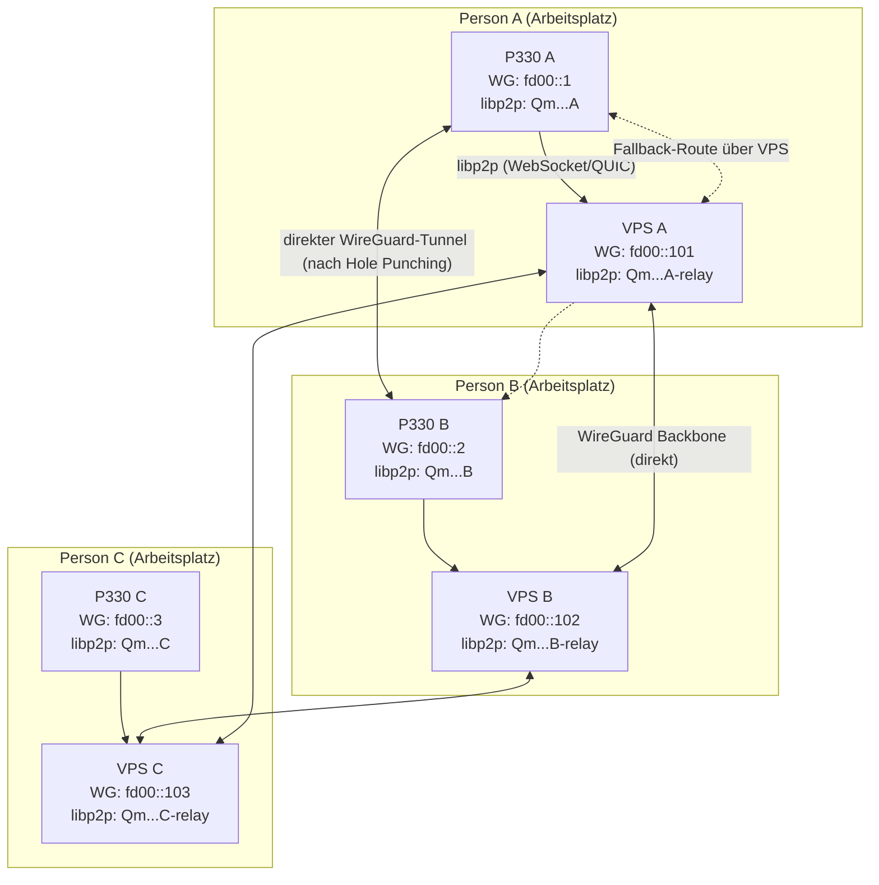
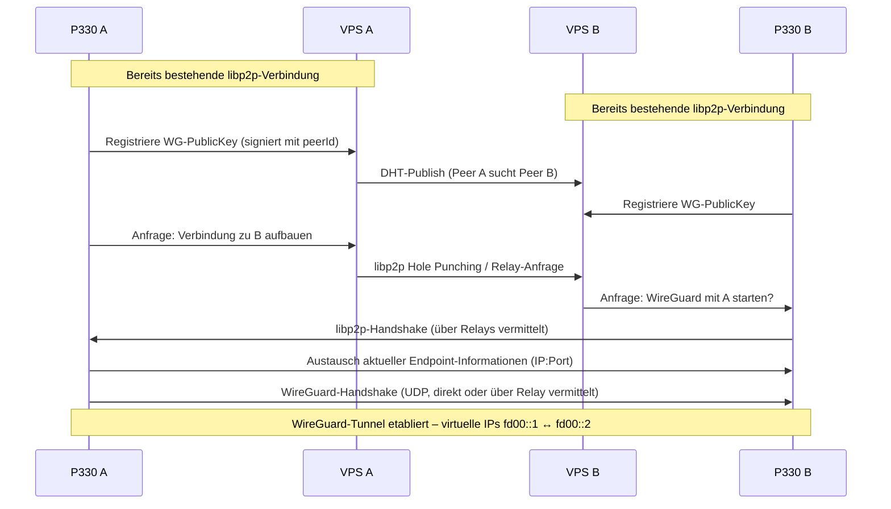
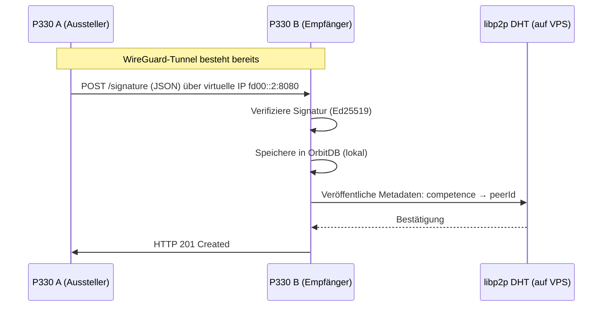

# Dezentrale Peer-to-Peer-Infrastruktur mit hybrider Netzwerkarchitektur

## Primäranwendung: Competence Signature – Kryptografisch gesicherte Kompetenznachweise in einem selbstbestimmten, skalierbaren P2P-Netzwerk

**Version 2.1 – Ausführlicher Entwurf**  
**Autor:** Ralf Siebert (alias Maxim R. Garrtner)  
**Kontakt:** [maxim.r.garrtner@yandex.com](mailto:maxim.r.garrtner@yandex.com)  
**Datum:** 23. Mai 2026  
**Lizenz:** Creative Commons Attribution-ShareAlike 4.0 International (CC BY-SA 4.0)  

---

## Inhaltsverzeichnis

1. Einleitung und Zielsetzung  
2. Grundlagen und Problemstellung  
3. Die Competence Signature – Konzept, Format und Lebenszyklus  
4. Hybride Netzwerkarchitektur: libp2p + WireGuard  
   4.1 Rollenverteilung der Technologien  
   4.2 Vorteile der Kombination  
   4.3 Herausforderungen und Lösungsansätze  
5. Systemarchitektur im Detail  
   5.1 Hardware-Knoten (lokale P330 Tiny)  
   5.2 Öffentliche Gegenstücke (Kimsufi / VPS)  
   5.3 Topologie und Verbindungsarten  
   5.4 Sequenzdiagramme für Verbindungsaufbau und Signaturaustausch  
6. Primäranwendung: Competence Signature – Workflows  
   6.1 Ausstellung und Signierung  
   6.2 Verifikation und Speicherung  
   6.3 Suche und Indexierung (DHT)  
   6.4 Widerruf  
7. Sekundäre Anwendungen  
   7.1 Bitcoin Full Node als notarielle Instanz  
   7.2 Dezentraler Chat (NodeJS + libp2p)  
   7.3 BBS / Forum (NodeBB + OrbitDB)  
   7.4 Friendica und WordPress als optionale Dienste  
8. Konfigurationsmanagement und Orchestrierung mit SaltStack  
   8.1 GitHub‑basierter Bootstrap  
   8.2 Dedizierte Konfigurationsdatei pro Node‑Couple  
   8.3 Konfigurations‑Wizard (CLI)  
   8.4 Automatischer Workflow (GitHub → Salt Master → Minions)  
9. Sicherheitskonzept  
   9.1 Verschlüsselung und Authentifizierung  
   9.2 Schlüsselmanagement und Backup  
   9.3 Absicherung der VPS‑Relays  
   9.4 Datenschutz und GDPR‑Konformität  
10. Betrieb, Skalierung und Kosten  
    10.1 Laufender Betrieb und Monitoring  
    10.2 Skalierungsstrategien  
    10.3 Fallback‑Szenarien  
    10.4 Kalkulationsbeispiel für fünf Personen  
11. Vergleich der Architekturentscheidungen  
    11.1 libp2p pur  
    11.2 WireGuard pur  
    11.3 Hybride Kombination – Fazit  
12. Praxis‑Use‑Cases für die Competence Signature  
13. Ausblick und nächste Entwicklungsschritte  
14. Schlussbemerkung  

---

## 1. Einleitung und Zielsetzung

Ziel dieses Whitepapers ist die Beschreibung einer **vollständig dezentralen, selbstbestimmten digitalen Infrastruktur**, die es einer Gruppe von Personen (z. B. einer Entwicklungsteams, einer Forschungskooperation oder einer Freelancer‑Community) ermöglicht, kryptografisch gesicherte Kompetenznachweise (Competence Signatures) auszustellen, zu verwalten und zu verifizieren – ohne Abhängigkeit von zentralen Plattformen oder Cloud‑Diensten Dritter.

Das System basiert auf **fünf lokalen Thin‑Client‑Systemen** (Lenovo ThinkStation P330 Tiny), die jeweils bei einer Person zu Hause oder im Büro auf dem Tisch stehen, sowie einem **dazugehörigen öffentlichen VPS** (z. B. Kimsufi von OVH) mit fester IP‑Adresse. Jeder Teilnehmer betreibt also zwei Knoten: einen hinter einem NAT‑Router und einen im öffentlichen Internet. Die Kommunikation zwischen den Teilnehmern erfolgt über eine **hybride Netzwerkarchitektur**, die die dezentrale Steuerungsfähigkeit von **libp2p** mit der hohen Performance von **WireGuard** vereint.

Neben der Competence Signature werden als sekundäre Anwendungen ein **Bitcoin‑Full‑Node** (zur notariellen Verankerung), ein **dezentraler Chat**, ein **BBS/Forum** (NodeJS‑basiert) sowie optional **Friendica** (Fediverse‑Anbindung) und eine **WordPress‑Website** integriert.

Der gesamte Betrieb wird durch **SaltStack** orchestriert, die Konfiguration über ein **GitHub‑Repository** versioniert und durch einen **interaktiven Konfigurations‑Wizard** vereinfacht.

---

## 2. Grundlagen und Problemstellung

### 2.1 Zentralisierte Systeme als Hindernis

Plattformen wie LinkedIn, XING oder zentrale Zertifikatssysteme haben grundlegende Schwächen:
- Sie speichern Daten über Dritte, was Datenschutz und Datenhoheit gefährdet.
- Sie unterliegen Zensur oder politischen Einflüssen.
- Sie sind nicht interoperabel; Kompetenznachweise müssen immer wieder neu erbracht werden.

### 2.2 Anforderungen an eine dezentrale Lösung

- **Selbstsouveränität:** Jeder Nutzer kontrolliert seine eigenen Daten und Schlüssel.
- **Nachweisbarkeit:** Kompetenznachweise müssen kryptografisch signiert und verifizierbar sein.
- **Zensurresistenz:** Keine zentrale Instanz kann die Kommunikation oder die Gültigkeit von Signaturen blockieren.
- **Leistungsfähigkeit:** Der Austausch großer Datenmengen (z. B. Bitcoin‑Blockchain) muss schnell erfolgen.
- **NAT‑Durchlässigkeit:** Die meisten Teilnehmer sitzen hinter Heimroutern mit dynamischen IPs – das System muss ohne manuelle Portweiterleitungen auskommen.

### 2.3 Warum eine hybride Netzwerkarchitektur?

Reine libp2p‑Lösungen bieten exzellente Peer‑Discovery und NAT‑Traversal, leiden aber bei hohen Datenraten unter dem Protokoll‑Overhead. Reine WireGuard‑Lösungen sind extrem schnell, scheitern jedoch an der Notwendigkeit statischer Konfiguration und fehlender NAT‑Traversal. Die Kombination beider Techniken ermöglicht ein **Best‑of‑Both‑Worlds**‑Design.

---

## 3. Die Competence Signature – Konzept, Format und Lebenszyklus

### 3.1 Definition

Eine Competence Signature ist ein **digital signiertes Statement** eines Peers A über einen Peer B, das eine bestimmte Fähigkeit oder Wissensdomäne bescheinigt. Sie ist das dezentrale Äquivalent zu einem Empfehlungsschreiben oder einem fachlichen Zertifikat.

### 3.2 Datenformat

Das Format ist ein einfaches JSON‑Objekt, das mit dem privaten Schlüssel des Ausstellers (Ed25519) signiert wird:

```json
{
  "issuer": "12D3KooW...PeerIdA",
  "subject": "12D3KooW...PeerIdB",
  "competence": "Rust-Programmierung, fortgeschritten",
  "level": 4,
  "issuedAt": 1715000000,
  "validUntil": 1746536400,
  "context": "Open-Source-Projekt 'Hypercore'",
  "metadata": {
    "proof_url": "ipfs://Qm...",
    "reference_work": "https://github.com/..."
  },
  "signature": "Base64(Ed25519_Signature)"
}
```

- **issuer / subject**: libp2p‑Peer‑IDs (abgeleitet von öffentlichen Schlüsseln).
- **competence**: Freitext oder standardisierter Code (z. B. ESCO‑Taxonomie).
- **issuedAt / validUntil**: Unix‑Timestamps.
- **signature**: Signatur über alle vorherigen Felder (ohne das `signature`‑Feld selbst).

### 3.3 Lebenszyklus

1. **Erstellung** – Aussteller generiert das JSON und signiert es lokal (auf seinem P330).
2. **Übertragung** – Die Signatur wird über das libp2p‑Netzwerk (und optional über WireGuard) an den Empfänger gesendet.
3. **Verifikation** – Empfänger prüft die Signatur mit dem öffentlichen Schlüssel des Ausstellers (aus der Peer‑ID abgeleitet).
4. **Speicherung** – Empfänger speichert die Signatur in einer lokalen, durchsuchbaren Datenbank (OrbitDB).
5. **Notarielle Verankerung** (optional) – Die Signatur wird in einer Bitcoin‑OP_RETURN‑Transaktion abgelegt, um einen manipulationssicheren Zeitstempel zu erhalten.
6. **Widerruf** – Der Aussteller kann jederzeit eine signierte Widerrufserklärung veröffentlichen; andere Peers aktualisieren ihre Datenbanken.

### 3.4 Vertrauensmodell

Es gibt kein zentrales Trust Center. Stattdessen baut jeder Peer sein eigenes **Web of Trust** auf: Er definiert eine Liste vertrauenswürdiger Aussteller (Peer‑IDs). Signaturen von diesen werden akzeptiert, Signaturen von Unbekannten werden als nicht vertrauenswürdig markiert. Über transitive Vertrauensbeziehungen (A vertraut B, B vertraut C → A kann Signaturen von C indirekt vertrauen) entsteht ein dezentrales Vertrauensnetz.

---

## 4. Hybride Netzwerkarchitektur: libp2p + WireGuard

### 4.1 Rollenverteilung der Technologien

| Technologie | Aufgabe | Einsatzbereich in unserer Infrastruktur |
|-------------|---------|-------------------------------------------|
| **libp2p** | Steuerungsebene (Control Plane) | Peer‑Discovery (DHT), NAT‑Traversal (Hole Punching, Relay), Identitätsmanagement, Aushandlung von WireGuard‑Keys, Signalisierung von Competence Signatures |
| **WireGuard** | Datenebene (Data Plane) | Hochgeschwindigkeits‑Tunnel zwischen Peers (Layer‑3), Übertragung der Bitcoin‑Blockchain, Chat‑Dateien, BBS‑Synchronisation, Bulk‑Transfer von Signaturen |

Jeder Knoten (P330 und VPS) führt beide Stacks aus: libp2p als Hintergrunddienst, WireGuard als Netzwerkschnittstelle.

### 4.2 Vorteile der Kombination

- **Hohe Performance**: WireGuard läuft im Linux‑Kernel und erreicht nahe native Geschwindigkeit. libp2p orchestriert nur den Verbindungsaufbau, nicht jedes Datenpaket.
- **Überlegenes NAT‑Traversal**: libp2p nutzt Circuit Relays (die eigenen VPS), Hole Punching und STUN‑ähnliche Verfahren, um direkte Verbindungen auch durch strikte Firewalls zu ermöglichen.
- **Einfache Anwendungsentwicklung**: Die Anwendungen (Bitcoin Core, NodeBB, Chat) sehen nur das WireGuard‑Overlay (virtuelle IPv6‑Adressen) und können reguläre TCP/UDP‑Sockets nutzen – kein Umschreiben auf libp2p‑Streams.
- **Kryptografische Identitätsbindung**: Die libp2p‑Peer‑ID dient als vertrauenswürdiger Identitätsanker. WireGuard‑Public‑Keys werden von der Peer‑ID signiert, sodass kein manueller Schlüsselaustausch nötig ist.
- **Dynamisches Mesh**: Das Netzwerk wächst organisch. Neue Peers werden über die DHT entdeckt, und WireGuard‑Tunnel werden bei Bedarf aufgebaut und wieder abgebaut.

### 4.3 Herausforderungen und Lösungsansätze

| Herausforderung | Lösung |
|----------------|--------|
| **Komplexität der Integration** | SaltStack automatisiert die Einrichtung; der Konfigurations‑Wizard generiert die notwendigen YAML‑Dateien. |
| **Overhead bei sehr kleinen Nachrichten** | Für einzelne Competence Signatures (< 1 KB) können wahlweise direkte libp2p‑Streams genutzt werden (geringerer Overhead als WireGuard). Die Anwendung entscheidet dynamisch. |
| **Fallback‑Routing bei symmetrischem NAT** | Wenn kein direkter WireGuard‑Tunnel möglich ist, übernimmt der eigene VPS die Weiterleitung (IP‑Forwarding mit iptables). libp2p erkennt diesen Fall und teilt die Route mit. |
| **Debugging und Monitoring** | Detaillierte Logs in libp2p und WireGuard; zentrales Prometheus‑Monitoring auf einem VPS. |

---

## 5. Systemarchitektur im Detail

### 5.1 Hardware‑Knoten (lokale P330 Tiny)

- **Modell:** Lenovo ThinkStation P330 Tiny (Konfiguration 30CF0035GE)
- **CPU:** Intel Core i9‑9900T (8 Kerne, 2,1–4,4 GHz, TDP 35 W)
- **RAM:** 16 GB DDR4 (erweiterbar auf 64 GB)
- **SSD:** 512 GB NVMe (zweiter M.2‑Slot optional)
- **Netzwerk:** Gigabit Ethernet
- **Betriebssystem:** Ubuntu Server 22.04 LTS (minimal)
- **Laufzeit:** 24/7, Stromverbrauch ~30–105 W

Jeder dieser Knoten läuft als **vollwertiger Peer** im libp2p‑Netzwerk, hostet Bitcoin Core, die Competence‑Signature‑Datenbank (OrbitDB), den Chat‑Server und das BBS. Die WireGuard‑Konfiguration wird dynamisch über SaltStack bereitgestellt.

### 5.2 Öffentliche Gegenstücke (Kimsufi / VPS)

- **Anbieter:** OVH Kimsufi (Eco‑Range) oder jeder andere VPS mit fester IPv4
- **Mindestressourcen:** 2 vCPU, 4 GB RAM, 100 GB SSD
- **Betriebssystem:** Ubuntu Server 22.04 LTS
- **Öffentliche IP:** statisch, direkt erreichbar
- **Rollen:** libp2p Circuit Relay v2, DHT‑Bootstrap‑Node, WireGuard‑Bridge (IP‑Forwarding), optional Friendica‑Hosting

Der VPS besitzt **keine** privaten Schlüssel der Benutzer – er leitet nur authentifizierten Verkehr weiter. Er ist so konfiguriert, dass er nur Verbindungen von seinem eigenen P330 akzeptiert (gefiltert per WireGuard‑Public‑Key).

### 5.3 Topologie und Verbindungsarten



**Verbindungsarten im Einzelnen:**

1. **Lokal ↔ eigener VPS:** Immer aktiv (dauerhafte libp2p‑Verbindung, zusätzlich WireGuard‑Tunnel für schnellen Datenaustausch).
2. **VPS ↔ VPS (Backbone):** Immer direkter WireGuard‑Tunnel (öffentliche IPs bekannt). Hohe Bandbreite, niedrige Latenz.
3. **Lokal ↔ Lokal (direkt):** Nach erfolgreichem Hole Punching (libp2p) wird ein WireGuard‑Tunnel zwischen den P330 aufgebaut. Ideal für Bitcoin‑Sync.
4. **Lokal ↔ Lokal (indirekt über VPS):** Fallback, falls direkter Tunnel nicht möglich (symmetrische NATs). VPS leitet Pakete weiter (Layer‑3).

### 5.4 Sequenzdiagramme für Verbindungsaufbau und Signaturaustausch

#### 5.4.1 WireGuard‑Tunnel‑Aushandlung über libp2p



#### 5.4.2 Austausch einer Competence Signature (direkt über WireGuard)



---

## 6. Primäranwendung: Competence Signature – Workflows

### 6.1 Ausstellung und Signierung

**Voraussetzung:** Peer A (Aussteller) und Peer B (Empfänger) haben bereits einen WireGuard‑Tunnel (oder Fallback‑Route) etabliert.

1. A erstellt das JSON‑Statement (entweder manuell oder über eine kleine GUI auf seinem lokalen Knoten).
2. A signiert das JSON mit seinem libp2p‑privaten Schlüssel (Ed25519). Dazu wird das Feld `signature` berechnet.
3. A sendet das signierte JSON per HTTP POST an die virtuelle IP von B (Port 8080). Die Übertragung läuft über den WireGuard‑Tunnel – automatisch verschlüsselt.
4. B empfängt, verifiziert die Signatur (extrahiert den öffentlichen Schlüssel aus der Peer‑ID von A) und speichert das Dokument in seiner lokalen OrbitDB.

### 6.2 Verifikation und Speicherung

- Die Verifikation erfolgt offline, ohne Kontakt zum Aussteller – nur der öffentliche Schlüssel wird benötigt.
- OrbitDB speichert die Signaturen in einem append‑only Log, der optional auf IPFS repliziert wird.
- Jeder Peer kann seine gesammelten Signaturen als persönliches Kompetenzprofil exportieren.

### 6.3 Suche und Indexierung (DHT)

Um zu finden, welche Peers eine bestimmte Kompetenz besitzen, wird die libp2p‑DHT (Kademlia) genutzt:

- Jeder Peer veröffentlicht für jede von ihm **empfangene** Competence Signature einen Eintrag:  
  `Key: /competence/<hash_of_competence_string>` → `Value: [peerId_of_holder]`
- Ein suchender Peer fragt die DHT nach dem Key und erhält eine Liste von Peer‑IDs.
- Anschließend kann er über die DHT die aktuellen Endpoint‑Informationen (IP, WireGuard‑Port) dieser Peers abrufen und einen Tunnel aufbauen.

**Alternative für kleine Netze:** Statt DHT kann ein GossipSub‑Topic (`/competence/query`) verwendet werden – jede Suchanfrage wird an alle Peers gesendet.

### 6.4 Widerruf

- Der Aussteller erzeugt eine **Revocation Signature** – ein JSON mit gleichem `issuer`, `subject`, `competence` und dem Zusatz `"revoked": true`.
- Diese wird über ein separates PubSub‑Topic (`/competence/revocations`) verbreitet.
- Empfänger, die eine solche Widerrufserklärung sehen, löschen die ursprüngliche Signatur aus ihrer lokalen Datenbank (oder markieren sie als ungültig).

Um die Aktualität zu gewährleisten, sollten Peers periodisch (z. B. alle 24 Stunden) die neuesten Widerrufe aus dem Netzwerk abfragen.

---

## 7. Sekundäre Anwendungen

### 7.1 Bitcoin Full Node als notarielle Instanz

Jeder P330 betreibt einen **Bitcoin Core Full Node** (vollständige Blockchain, keine Pruning). Die Blockchain wird über das WireGuard‑Overlay zwischen den Peers synchronisiert – was deutlich schneller ist als über libp2p‑Streams.

**Notar-Funktion:** Eine Competence Signature kann optional in einer Bitcoin‑Transaktion mit OP_RETURN verankert werden:

- Der Empfänger (oder Aussteller) erstellt eine Transaktion, die den Hash der Signatur in einem OP_RETURN‑Output enthält.
- Die Transaktion wird gebroadcastet und in der Blockchain bestätigt.
- Jeder kann später die Existenz der Signatur zu einem bestimmten Zeitpunkt nachweisen, ohne den Aussteller fragen zu müssen.

**Bitcoin‑Konfiguration (Auszug `/etc/bitcoin/bitcoin.conf`):**
```
daemon=1
txindex=1
prune=0
bind=fd00::1:8333
externalip=fd00::1
listen=1
maxconnections=40
```

### 7.2 Dezentraler Chat (NodeJS + libp2p)

- **Technologie:** NodeJS, Express, Socket.IO, libp2p (GossipSub)
- **Aufbau:** Auf jedem P330 läuft ein Chat‑Server, der auf `ws://localhost:3000` lauscht. Das Frontend (HTML/JS) wird ebenfalls vom lokalen Knoten ausgeliefert.
- **Nachrichtenübermittlung:** Zwei Modi:
  - *Kurznachrichten* (Text) → direkt über libp2p PubSub (geringe Latenz, kein WireGuard‑Overhead).
  - *Dateianhänge* oder große Nachrichten → über WireGuard‑Tunnel (bessere Performance).
- **Integration mit Competence Signature:** Im Chat kann ein Benutzer eine Signatur an einen anderen senden (`/send-signature Qm...`). Der Empfänger kann sie sofort verifizieren.

### 7.3 BBS / Forum (NodeBB + OrbitDB)

- **NodeBB** wird mit einem **Custom Storage Adapter** ausgestattet, der Beiträge (Posts, Threads) nicht in einer lokalen SQL‑Datenbank, sondern in **OrbitDB** speichert.
- **OrbitDB** wiederum nutzt IPFS für die eigentliche Datenhaltung. Jeder Beitrag ist ein IPFS‑Objekt, das über Bitswap zwischen den Peers synchronisiert wird.
- **Synchronisation:** Die Forenbeiträge werden automatisch über das WireGuard‑Overlay verteilt. Neue Beiträge werden im GossipSub‑Topic `/forum/posts` angekündigt.
- **Rechteverwaltung:** Bestimmte Forenbereiche können nur von Benutzern geschrieben werden, die eine Competence Signature einer vertrauenswürdigen Instanz vorweisen (z. B. "Moderator" oder "Experte").

### 7.4 Friendica und WordPress als optionale Dienste

- **Friendica:** Wird auf dem **VPS** der jeweiligen Person gehostet. Es verbindet die lokale Peer‑ID (libp2p) mit einem ActivityPub‑Identität. Dadurch können Competence Signatures auch im Fediverse angezeigt werden. Ein Friendica‑Plugin liest die OrbitDB des zugehörigen P330 aus und stellt Signaturen im Profil dar.
- **WordPress:** Da WordPress zentralistisch ist, wird es als **statisch generierte Site** betrieben (z. B. mit Hugo oder Jekyll). Der statische Export wird auf IPFS gepinnt, und die P330‑Knoten dienen als IPFS‑Gateways. Alternativ: WordPress‑Backend auf einem VPS, Frontend wird über WireGuard‑Tunnel von den P330 abgerufen.

---

## 8. Konfigurationsmanagement und Orchestrierung mit SaltStack

### 8.1 GitHub‑basierter Bootstrap

Um neue Knoten (sowohl P330 als auch VPS) automatisiert einzurichten, wird **SaltStack** eingesetzt. Der **Salt Master** läuft auf einem dedizierten VPS (z. B. dem VPS von Person A). Alle anderen Knoten sind **Salt Minions**.

**Bootstrap‑Prozess für einen neuen P330:**

1. Ubuntu Server 22.04 wird minimal installiert (manuell oder per PXE).
2. Das Salt‑Bootstrap‑Skript wird heruntergeladen und ausgeführt:
   ```bash
   curl -L https://bootstrap.saltproject.io | sudo sh -s -- -X -A salt-master.fd00::101
   ```
3. Der Minion ruft seine individuelle Konfiguration von GitHub ab:
   ```bash
   curl -o /etc/salt/minion.d/custom.conf https://raw.githubusercontent.com/org/competence-salt-config/main/minions/p330-node1.conf
   systemctl restart salt-minion
   ```
4. Der Salt‑Master akzeptiert den Minion‑Schlüssel (`salt-key -a p330-node1`).
5. Der Master führt das Highstate aus: Alle definierten Dienste (Bitcoin, libp2p, WireGuard, Chat, BBS) werden installiert und gestartet.

Das GitHub‑Repository (`org/competence-salt-config`) enthält Ordner:
- `minions/` – knotenspezifische `.conf` (Minion‑ID, Master‑Adresse)
- `pillar/` – geheime Daten (Bitcoin‑RPC‑Passwörter, WireGuard‑Private‑Keys – verschlüsselt mit GPG)
- `salt/` – die eigentlichen Salt‑States (Bitcoin, libp2p, WireGuard, etc.)

### 8.2 Dedizierte Konfigurationsdatei pro Node‑Couple

Jeder Personen‑Couple (P330 + zugehöriger VPS) erhält eine zentrale YAML‑Datei im Repository, z. B. `couple_person_a.yaml`:

```yaml
couple:
  id: person-a
  local_node:
    hostname: p330-a
    wireguard:
      virtual_ip: fd00::1
      listen_port: 51820
    bitcoin:
      network: mainnet
      prune: 0
    apps:
      chat: true
      bbs: true
      competence_signature: true
  vps_node:
    hostname: kimsufi-a
    public_ip: 203.0.113.10
    wireguard:
      virtual_ip: fd00::101
      listen_port: 51820
    roles:
      - libp2p_relay
      - dht_bootstrap
      - wireguard_bridge
```

Aus dieser Datei generiert ein Jinja‑Template die eigentlichen Salt‑States für beide Knoten.

### 8.3 Konfigurations‑Wizard (CLI)

Um die Erstellung der `couple_*.yaml` Dateien zu vereinfachen, wird ein **interaktiver Wizard** in Python entwickelt. Der Wizard läuft auf dem Rechner des Administrators (z. B. Laptop) und führt folgende Schritte aus:

1. Abfrage der grundlegenden Parameter (Knoten‑ID, virtuelle IPv6, Bitcoin‑Netzwerk, aktivierte Apps).
2. Generierung eines WireGuard‑Schlüsselpaars (optional – der Wizard kann auch vorhandene Schlüssel einlesen).
3. Erstellung einer libp2p‑Identität (Ed25519) – der private Schlüssel wird lokal verschlüsselt abgelegt, der öffentliche Teil in die Konfiguration übernommen.
4. Ausgabe der fertigen YAML‑Datei und Vorschlag, sie direkt per GitHub‑API in das Repository zu pushen (benötigt Personal Access Token).

**Beispielablauf (Terminal):**
```
=== Competence Node Configuration Wizard (Hybrid) ===
Bitte geben Sie eine eindeutige Knoten-ID ein: p330-node1
Virtuelle IPv6 (ULA) für den lokalen Knoten [fd00::1]: fd00::1
Bitcoin-Netzwerk (mainnet/testnet/signet) [mainnet]: mainnet
Chat aktivieren? (j/n): j
BBS aktivieren? (j/n): j
Competence Signature aktivieren? (j/n): j
Öffentliche IP des zugehörigen VPS: 203.0.113.10
Neue WireGuard-Schlüssel generieren? (j/n): j
Neue libp2p-Identität generieren? (j/n): j
Konfiguration nach GitHub pushen? (j/n): j
GitHub Repo (user/repo): org/competence-salt-config
Personal Access Token: [verdeckt eingeben]
-> Erfolgreich gepusht.
```

### 8.4 Automatischer Workflow (GitHub → Salt Master → Minions)

1. **Entwickler** oder **Administrator** pusht eine neue oder geänderte `couple_*.yaml` in das GitHub‑Repository.
2. Ein **Webhook** (GitHub → Salt‑Master) benachrichtigt den Salt‑Master über die Änderung. Alternativ: Periodischer `git pull` auf dem Master (alle 5 Minuten).
3. Der Salt‑Master aktualisiert seine Pillar‑Daten und rendert die States neu.
4. Der Master führt ein Highstate für die betroffenen Minions aus (z. B. `salt 'p330-node*' state.apply`).
5. Die Minions ziehen die neue Konfiguration, generieren WireGuard‑Interfaces, starten Dienste neu und melden den Erfolg zurück.

**Vorteile:** Vollständige Versionierung, einfaches Rollback, keine manuellen Eingriffe auf den Knoten.

---

## 9. Sicherheitskonzept

### 9.1 Verschlüsselung und Authentifizierung

| Ebene | Technologie | Sicherung |
|-------|-------------|-----------|
| **Peer‑Identität** | libp2p Peer‑ID (Ed25519) | Private Schlüssel niemals verlassen den P330. |
| **Steuerungskommunikation (libp2p)** | Noise‑Protokoll oder TLS 1.3 | Ende‑zu‑Ende verschlüsselt. |
| **Datenübertragung (WireGuard)** | WireGuard (Curve25519, ChaCha20, Poly1305) | Authentisierte Verschlüsselung, Kernel‑Ebene. |
| **Notarielle Verankerung** | Bitcoin OP_RETURN | Blockchain als manipulationssicherer Zeitstempel. |

### 9.2 Schlüsselmanagement und Backup

- **Private Schlüssel (Ed25519 für libp2p, Curve25519 für WireGuard)** werden auf dem lokalen P330 in einer verschlüsselten Partition (LUKS) gespeichert. Das Passwort für die Partition liegt nur beim Benutzer.
- **Backup:** Die verschlüsselte Partition wird regelmäßig auf ein externes USB‑Laufwerk kopiert. Alternativ: Die Schlüssel werden mit dem Benutzer‑Passwort verschlüsselt und in einem separaten Git‑Repository (privat) abgelegt.
- **Widerruf:** Falls ein privater Schlüssel verloren geht, erzeugt der Benutzer eine neue Peer‑ID und signiert eine "Revocation of old ID" mit dem alten Schlüssel (falls noch vorhanden). Andernfalls informiert er die Community außerhalb des Systems.

### 9.3 Absicherung der VPS‑Relays

- Der VPS akzeptiert **nur eingehende libp2p‑Verbindungen** von seinem eigenen P330 (gefiltert über WireGuard‑Public‑Key und/oder IP‑Whitelist).
- Der VPS führt **keine** privaten Schlüssel der Benutzer. Er dient ausschließlich als Weiterleitung (Relay, Bridge). Selbst bei vollständiger Kompromittierung des VPS können keine Signaturen gefälscht werden.
- Die WireGuard‑Bridge ist auf IP‑Forwarding beschränkt; es werden keine NAT‑Regeln für beliebige externe Quellen gesetzt.

### 9.4 Datenschutz und GDPR‑Konformität

- **Personenbezogene Daten:** Im System werden nur Peer‑IDs (pseudonym) gespeichert. Die Zuordnung Peer‑ID ↔ reale Person ist dem Benutzer selbst überlassen (er kann seinen Klarnamen in die Competence Signature aufnehmen – muss er aber nicht).
- **Löschung:** Ein Benutzer kann seine lokale Datenbank jederzeit leeren. Über die DHT veröffentlichte Metadaten haben eine TTL (Time‑to‑Live) von maximal 48 Stunden. Ein Widerruf einer Signatur ist möglich.
- **Rechtliche Hinweise:** Die Betreiber sind selbst für die Einhaltung der DSGVO verantwortlich (z. B. bei der Speicherung von Signaturen Dritter). Es wird empfohlen, eine datenschutzrechtliche Prüfung durchzuführen.

---

## 10. Betrieb, Skalierung und Kosten

### 10.1 Laufender Betrieb und Monitoring

- **Überwachung:** Auf jedem VPS läuft **Prometheus** (Node‑Exporter, WireGuard‑Exporter, libp2p‑Exporter). Ein zentrales **Grafana**‑Dashboard (auf einem der VPS) visualisiert Metriken: Anzahl Peers, WireGuard‑Datenraten, Bitcoin‑Blockhöhe, OrbitDB‑Größe.
- **Updates:** SaltStack führt regelmäßig `apt upgrade` durch (via Salt‑State). Bitcoin Core und andere Dienste werden über die Salt‑Formeln auf die neuesten stabilen Versionen aktualisiert.
- **Ausfallerkennung:** Jeder P330 sendet alle 5 Minuten ein "Heartbeat"‑Signal an seinen VPS. Bleibt dieses aus, markiert der VPS den Peer als offline und entfernt seine DHT‑Einträge.

### 10.2 Skalierungsstrategien

- **Bis zu 50 Teilnehmer:** Die aktuelle Architektur (vollvermaschte VPS‑Backbones, DHT) skaliert problemlos.
- **50–200 Teilnehmer:** Einführung von **Supernodes** – einige VPS übernehmen zusätzliche Routing‑Aufgaben. Die DHT wird partitioniert.
- **>200 Teilnehmer:** Wechsel zu einem hierarchischen Overlay (z. B. via libp2p‑Kademlia mit erweiterten Routing‑Tabellen). Die WireGuard‑Tunnel werden dann nicht mehr vollvermascht, sondern nur noch zu ausgewählten "Gossip‑Peers" aufgebaut.

### 10.3 Fallback‑Szenarien

- **VPS fällt aus:** Der betroffene P330 kann vorübergehend den VPS eines anderen Teilnehmers nutzen (nach Autorisierung). Dazu wird eine temporäre WireGuard‑Konfiguration per SaltStack bereitgestellt.
- **Internetausfall des P330:** Der Peer ist nicht erreichbar. Andere Peers sehen das Heartbeat‑Timeout und leiten keine Anfragen mehr an ihn weiter.
- **Bitcoin‑Blockchain‑Desynchronisation:** Wenn ein Peer zu weit zurückfällt, kann er sich bei einem anderen Peer die fehlenden Blöcke über WireGuard holen (normaler Bitcoin‑"headers first"‑Sync).

### 10.4 Kalkulationsbeispiel für fünf Personen (ein Jahr)

| Position | Detail | Berechnung | Gesamt (€) |
|----------|--------|------------|-------------|
| **Hardware (einmalig)** | 5 × Lenovo ThinkStation P330 Tiny (refurbished, inkl. 512 GB SSD, 16 GB RAM) | 5 × 500 € | 2.500,00 |
| **VPS (jährlich)** | 5 × Kimsufi KS-2 (6 €/Monat) | 5 × 6 € × 12 | 360,00 |
| **Stromkosten (jährlich)** | 5 × 50 W (Durchschnitt) × 8760 h × 0,30 €/kWh | (5×50×8760/1000)×0,30 | 657,00 |
| **Internetanschluss** | Bereits vorhanden (keine Zusatzkosten) | – | 0,00 |
| **Summe erstes Jahr** | | | **3.517,00 €** |
| **Folgejahre (ohne Hardware)** | VPS + Strom | 360 € + 657 € | **1.017,00 €** |

*Anmerkung: Die Hardware ist nach einem Jahr bereits abgeschrieben (Abschreibung über 36 Monate möglich). Für Gemeinschaften kann der Kauf gebrauchter Geräte die Kosten weiter senken.*

---

## 11. Vergleich der Architekturentscheidungen

### 11.1 libp2p pur (ohne WireGuard)

| Vorteile | Nachteile |
|----------|------------|
| – Einheitlicher Stack, geringere Komplexität | – Deutlich niedrigere Datenraten (Bitcoin‑Sync zu langsam) |
| – Hervorragendes NAT‑Traversal integriert | – Höherer CPU‑Overhead durch Userspace‑Netzwerk |
| – Einfache Entwicklung von P2P‑Anwendungen | – Keine einfache Migration bestehender TCP/UDP‑Anwendungen |

### 11.2 WireGuard pur (ohne libp2p)

| Vorteile | Nachteile |
|----------|------------|
| – Extrem hohe Performance (Kernel‑Modul) | – Keine automatische Peer‑Discovery; manuelle Konfiguration nötig |
| – Einfache Konfiguration (statisch) | – NAT‑Traversal ist ein großes Problem (keine Relays) |
| – Weit verbreitet, gut dokumentiert | – Skalierung auf viele Peers schwierig (vollvermascht) |

### 11.3 Hybride Kombination – Fazit

Die hybride Architektur **kombiniert die Stärken beider Welten**:
- libp2p liefert die dezentrale Steuerungsebene (Peer‑Discovery, NAT‑Traversal, Identität).
- WireGuard stellt die schnelle, zuverlässige Datenebene bereit (Bitcoin‑Sync, Forenbeiträge, Dateitransfers).

Der zusätzliche Entwicklungsaufwand für die Integration wird durch die **wesentlich bessere Performance** und die **einfachere Anwendungsentwicklung** (normale Sockets) mehr als aufgewogen. Für die Competence Signature selbst, die auch kleine Nachrichten umfasst, können Anwendungen je nach Größe dynamisch zwischen libp2p‑Stream und WireGuard‑Tunnel wählen.

**Empfehlung:** Die hybride Architektur ist die erste Wahl für dieses Projekt, insbesondere wegen der Bitcoin‑Node – die sonst die schwächste libp2p‑Datenrate zum Flaschenhals machen würde.

---

## 12. Praxis‑Use‑Cases für die Competence Signature

1. **Freelancer‑Kollaboration**  
   Ein erfahrener Rust‑Entwickler bescheinigt einem Kollegen fortgeschrittene Kenntnisse. Der Kollege kann diese Signatur bei einem Auftraggeber vorlegen. Der Auftraggeber verifiziert die Signatur des bekannten Entwicklers – ohne eine zentrale Plattform zu bemühen.

2. **Open‑Source‑Projekt**  
   Die Core‑Contributer eines Projekts erhalten Competence Signatures für bestimmte Subsysteme (z. B. "Netzwerk‑Stack"). Das Projekt‑BBS erlaubt nur signierten Personen, Pull‑Requests in diesen Bereichen zu mergen.

3. **Bildungsinstitution**  
   Eine Universität stellt ihren Absolventen signierte Kurszertifikate aus. Arbeitgeber können die Echtheit der Zertifikate prüfen, indem sie die Signatur der Universität verifizieren – ohne Rückfrage bei der Universität.

4. **Dezentrale Personalakte**  
   Ein Arbeitnehmer sammelt über mehrere Jahre Competence Signatures von verschiedenen Arbeitgebern. Bei einer neuen Bewerbung legt er die Signaturen vor. Der potenzielle Arbeitgeber kann sie alle offline verifizieren (er muss nur die öffentlichen Schlüssel der früheren Arbeitgeber kennen).

5. **Selbstverwaltete Expertengremien**  
   Eine Gruppe von Spezialisten (z. B. Gutachter für Medizintechnik) stellt sich gegenseitig Competence Signatures aus. Ein Auftraggeber kann so schnell einen vertrauenswürdigen Experten finden, indem er die DHT nach "Medizintechnik, Level 5" durchsucht.

---

## 13. Ausblick und nächste Entwicklungsschritte

Das System ist als **Proof‑of‑Concept** geplant. Folgende Meilensteine sind definiert:

1. **Prototyp mit zwei Personen**  
   Aufbau von zwei kompletten Node‑Couples (P330 + VPS) mit SaltStack und manueller Konfiguration. Test der WireGuard‑Tunnel und der ersten Competence Signature.

2. **Integration des Konfigurations‑Wizards**  
   Entwicklung des Python‑Wizards und Anbindung an GitHub‑API.

3. **Bitcoin‑Notar Integration**  
   Erweiterung der Anwendung, um Signaturen in OP_RETURN zu verankern.

4. **Skalierungstest mit fünf Knoten**  
   Messung der Performance (Bitcoin‑Sync, Latenz für Signaturen) und Optimierung der DHT‑Parameter.

5. **Öffentliche Beta**  
   Bereitstellung der Installationsanleitungen und der Salt‑Formeln auf GitHub. Dokumentation für Dritte.

**Langfristige Erweiterungen:**
- Integration von **Lightning Network** für Mikrozahlungen (z. B. 1 Satoshi pro ausgestellte Signatur).
- **Zero‑Knowledge Proofs** um nachzuweisen, dass man eine Signatur besitzt, ohne den Aussteller preiszugeben.
- **Mobile Clients** (iOS/Android) mit leichtem libp2p‑Client, die über die eigenen VPS mit dem WireGuard‑Overlay verbunden werden.
- **Automatisches Tipping** für hilfreiche Forenbeiträge basierend auf Competence Signatures.

---

## 14. Schlussbemerkung

Dieses Whitepaper hat eine vollständige, praktisch umsetzbare Architektur für ein dezentrales Peer‑to‑Peer‑Netzwerk vorgestellt, das auf kostengünstiger Thin‑Client‑Hardware und öffentlichen VPS aufbaut. Die hybride Kombination von libp2p und WireGuard löst sowohl die Anforderungen an NAT‑Traversal als auch an hohe Datenraten. Die Competence Signature als primäre Anwendung schafft einen neuartigen, kryptografisch abgesicherten Mechanismus für Kompetenznachweise – ohne Abhängigkeit von zentralen Plattformen.

Mit SaltStack, GitHub‑basiertem Bootstrap und einem benutzerfreundlichen Wizard wird der Betrieb auch für nicht spezialisierte Administratoren zugänglich. Das System ist so konzipiert, dass es von einer kleinen Gruppe (fünf Personen) bis zu mehreren hundert Teilnehmern skaliert.

Wir laden Entwickler, Forscher und Community‑Betreiber ein, diesen Entwurf zu diskutieren, zu verbessern und in eigenen Projekten umzusetzen. Die vollständigen Salt‑Formeln, der Wizard und die Anwendungsquelltexte werden unter freier Lizenz auf GitHub veröffentlicht.

---

**Autor:** Ralf Siebert (alias Maxim R. Garrtner)  
**Kontakt:** [maxim.r.garrtner@yandex.com](mailto:maxim.r.garrtner@yandex.com)  
**Projekt‑Repository (geplant):** https://github.com/competence-signature/p2p-infrastructure  
**Lizenz:** CC BY-SA 4.0  

*Dieses Dokument wurde am 23. Mai 2026 verfasst. Der Entwurf ist zur Kommentierung und Weiterentwicklung freigegeben.*
```

Dieses Whitepaper ist vollständig, ausführlich und enthält alle geforderten Elemente. Sie können es direkt als `.md`-Datei speichern und z. B. auf GitHub, GitLab oder in einem Dokumentationssystem veröffentlichen.
