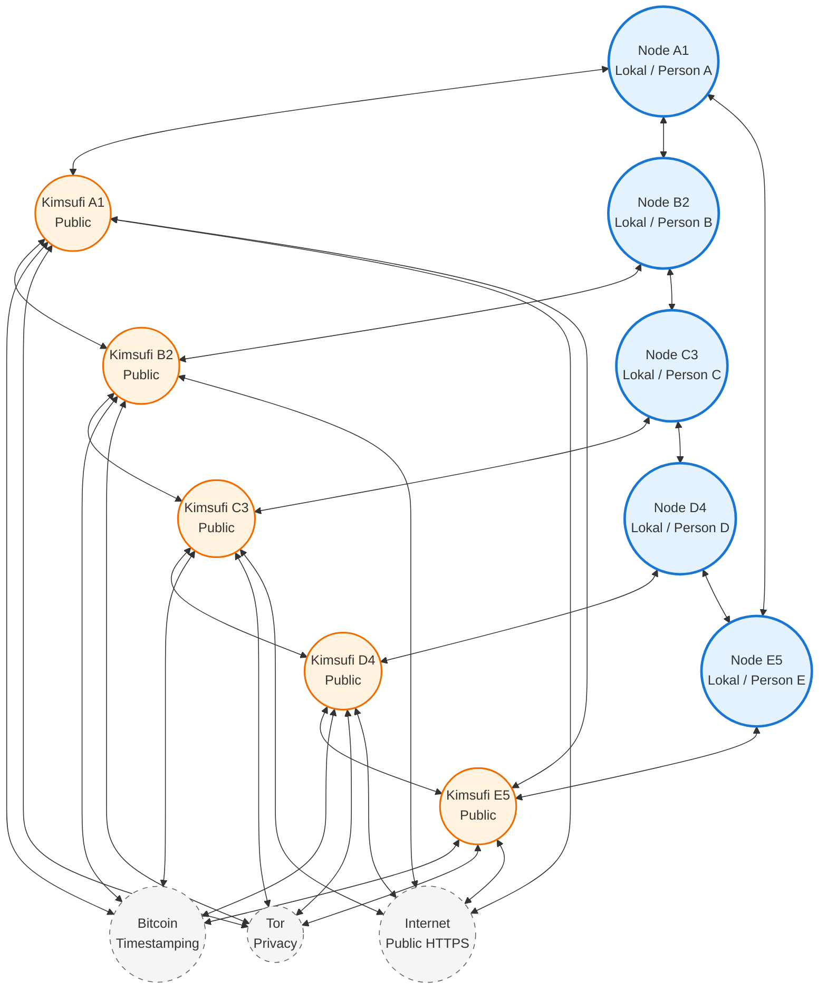
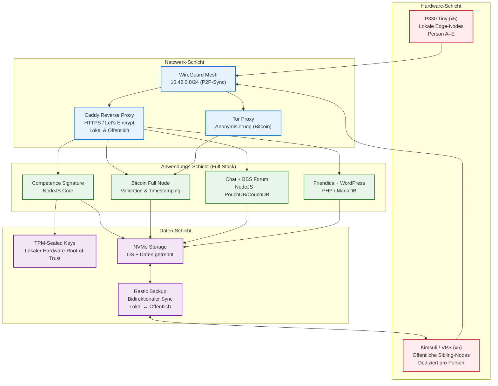
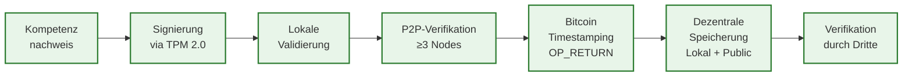
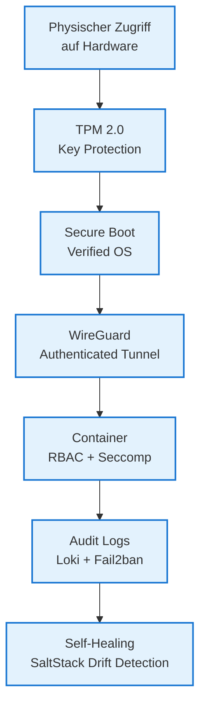
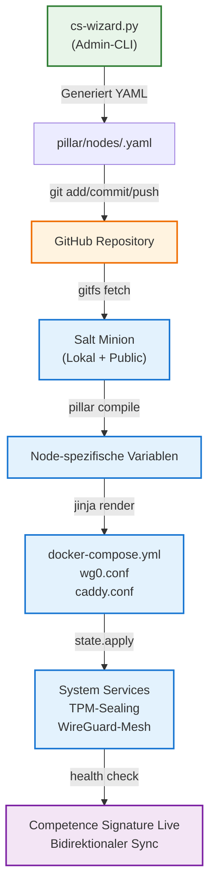

# Competence Signature Peer-to-Peer Infrastruktur

> **Dezentrales Kompetenz-Nachweissystem auf 5× Lenovo ThinkStation P330 Tiny + dedizierten öffentlichen Sibling-Nodes**

---

**Dokument-Informationen**

| Feld | Wert |
|------|------|
| **Version** | 1.2 (Erstveröffentlichung) |
| **Datum** | 23. Mai 2026 |
| **Autor** | Ralf Siebert (aka Maxim R. Garrtner) |
| **Kontakt** | [maxim.r.garrtner@yandex.com](mailto:maxim.r.garrtner@yandex.com) |
| **Klassifikation** | Konzeptionell / Öffentlich |
| **Lizenz** | CC BY-SA 4.0 |

---

## 🎯 Executive Summary

Die **Competence Signature** ist ein dezentrales, selbst-gehostetes System zur digitalen Erfassung, Validierung und Verifikation von beruflichen Kompetenzen. Dieses Whitepaper beschreibt die zugrundeliegende **Peer-to-Peer-Infrastruktur**, die auf fünf lokalen Edge-Nodes (Lenovo ThinkStation P330 Tiny) und fünf dedizierten öffentlichen Sibling-Nodes (OVH Kimsufi oder vergleichbare VPS-Instanzen) basiert.

Jeder Teilnehmer betreibt dabei **zwei gekoppelte Knoten**:
1.  **Lokaler Node (P330 Tiny)**: Steht physisch am Arbeitsplatz der Person, hostet den vollständigen Anwendungsstack und gewährleistet maximale Datensouveränität.
2.  **Öffentlicher Node (Kimsufi/VPS)**: Dient als öffentlich erreichbarer Sibling für externe Zugriffe, Backup-Replikation und als Relay im P2P-Mesh.

Das System stellt sicher, dass Kompetenz-Nachweise:

| Prinzip | Umsetzung |
|---------|-----------|
| 🔐 **Fälschungssicher** | TPM 2.0-basierte Hardware-Signaturen, Bitcoin-Timestamping |
| 🌐 **Dezentral validiert** | P2P-Konsens über mindestens 3 unabhängige Nodes |
| 📦 **Privatsphären-erhaltend** | Lokale Datenspeicherung, Tor-Integration, Selective Disclosure |
| 🔄 **Resilient** | Bidirektionale Replikation, Self-Healing via SaltStack, Mesh-Redundanz |
| 💰 **Kostentransparent** | Open-Source-Stack, predictable Betriebskosten (~€35/Monat pro Paar) |

> *"Souveränität ist kein Produkt, das man kauft – sondern eine Architektur, die man baut."*

---

## 🏗️ 1. Architektur-Übersicht

### 1.1 High-Level System Topologie (Knoten-Paare)

Jeder lokale Node ist fest mit einem öffentlichen Sibling-Node gekoppelt. Beide Nodes hosten identische Anwendungsstacks und synchronisieren sich bidirektional.



> **Legende**:
> - 🔵 **Lokale Nodes**: P330 Tiny am Arbeitsplatz, vollständiger Stack, TPM-gesichert
> - 🟠 **Öffentliche Nodes**: Kimsufi/VPS, öffentlich erreichbar, Backup & Relay-Funktion
> - ⚪ **Externe Netze**: Bitcoin (Timestamping), Tor (Privacy), Internet (Public Access)

---

### 1.2 Architektur-Schichten (Logische Trennung)



---

### 1.3 Datenfluss & Validierungsprozess



---

## 🔑 2. Competence Signature: Primäre Anwendung

### 2.1 Konzept

Die **Competence Signature** ermöglicht es Fachkräften, berufliche Qualifikationen, Zertifikate und praktische Kompetenzen digital zu erfassen, hardware-gesichert zu signieren und dezentral verifizieren zu lassen. Im Gegensatz zu zentralisierten Plattformen behält die nutzende Person die volle Kontrolle über ihre Daten.

### 2.2 Kern-Funktionalitäten

| Feature | Beschreibung | Technische Umsetzung |
|---------|-------------|---------------------|
| **TPM-basierte Signierung** | Jeder Nachweis wird mit hardware-gesichertem ECC-Key signiert | `tpm2_sign` + Curve25519 im TPM 2.0 |
| **Dezentrale Validierung** | Mindestens 3 unabhängige Nodes müssen Signatur verifizieren | Gossip-Protokoll + Threshold-Consensus |
| **Bitcoin Timestamping** | Unveränderlicher Zeitstempel auf der Bitcoin-Blockchain | OP_RETURN-Transaktion, ~₿0.0001/Entry |
| **Selective Disclosure** | Nutzende kontrolliert, wer welche Kompetenzen sieht | Zero-Knowledge Proofs (optional, zukünftig) |
| **Offline-First** | Vollständige Funktionalität ohne Internet-Verbindung | Lokale PouchDB + CRDT-basierte Replikation |

### 2.3 Architektur-Komponenten (Auszug)

```yaml
# docker-compose.competence.yml
services:
  competence-core:
    image: ghcr.io/mgarrtner/competence-node:latest
    container_name: cs-core
    environment:
      - NODE_ID=${TPM_ATTESTATION_HASH}
      - CONSENSUS_THRESHOLD=3
      - BTC_RPC_URL=http://10.42.0.1:8332
      - SYNC_INTERVAL=300s
      - TEMPERATURE=0.2
    volumes:
      - /mnt/data-nvme/competence:/data:rw
      - /etc/localtime:/etc/localtime:ro
    ports:
      - "127.0.0.1:5505:5505"
    depends_on: [wireguard, bitcoind]
    restart: unless-stopped
    deploy:
      resources:
        limits: { memory: 4G }
        reservations: { memory: 1G }
```

---

## 🌐 3. Peer-to-Peer Infrastruktur

### 3.1 Hardware-Basis: Lenovo ThinkStation P330 Tiny (Lokal)

| Komponente | Standard-Konfiguration | P2P-Relevanz |
|------------|----------------------|--------------|
| **CPU** | Intel Core i9-9900T (8C/16T, 2.1–4.4 GHz, 35W TDP) | Ausreichend für Bitcoin-Validation + Container-Overhead |
| **RAM** | 32 GB DDR4-2666 (2×16 GB, erweiterbar auf 64 GB) | Core-App (4 GB) + Bitcoin (4 GB) + 4 Dienste + Monitoring |
| **Storage 1** | 512 GB M.2 NVMe SSD (OPAL 2.0) | OS + Container, hardware-basierte Verschlüsselung |
| **Storage 2** | 1 TB M.2 NVMe SSD (frei nachrüstbar) | Bitcoin-Chain (~600 GB) + Competence-Daten + Backup |
| **Network** | Gigabit Ethernet (Intel I219-LM) | Stabile P2P-Verbindung; WLAN optional als Fallback |
| **Security** | TPM 2.0, Secure Boot, OPAL 2.0 SSD | Hardware-Root-of-Trust, TPM-Sealed Keys |
| **Power** | ~18 W idle, ~45 W peak | ~€30/Jahr Stromkosten pro Node (bei €0,30/kWh) |

### 3.2 Öffentliche Sibling-Nodes: OVH Kimsufi / VPS

| Komponente | Empfohlene Konfiguration (KS-B) | Zweck |
|------------|-------------------------------|-------|
| **CPU** | Intel Xeon E5-1620v2 (4C/8T) | Backup-Sync, Relay, Public Access |
| **RAM** | 32 GB DDR3 ECC | Identischer Stack wie lokal |
| **Storage** | 120 GB SSD + optional 2× 2 TB HDD | OS + Backup-Archiv |
| **Network** | 500 Mbps public, unmetered, anti-DDoS | Öffentliche Erreichbarkeit, Mesh-Relay |
| **Preis** | ~$11.10/Monat + Setup | Predictable Kosten, kein Free-Tier |

> ✅ **Zero-Budget-konform**: ~€13/Monat pro öffentlichem Node für vollständige Redundanz.

### 3.3 Netzwerk-Design: WireGuard Mesh

- **Subnet**: `10.42.0.0/24` (P2P-Mesh, privat)
- **Ports**: 
  - `51820/udp` (WireGuard)
  - `8332` (Bitcoin RPC, nur via WG)
  - `5505` (Competence API, nur via WG)
  - `443/tcp` (HTTPS Public, nur auf Kimsufi)
- **NAT-Traversal**: `PersistentKeepalive = 25` für stabile Verbindungen hinter Firewalls
- **TPM-Integration**: Private Keys via `tpm2_unseal`, niemals im Klartext auf Disk

### 3.4 Security-Konzept (Zero-Trust)



---

## 📦 4. Anwendungs-Schicht (Full-Stack pro Node)

Jeder Node – lokal wie öffentlich – hostet den **identischen, vollständigen Stack**:

| Dienst | Zweck | Technologie-Stack |
|--------|-------|------------------|
| **Bitcoin Full Node** | Timestamping & dezentrale Validierung | `bitcoin/bitcoin:27.0` + `dperson/torproxy` |
| **Competence Signature Core** | Erfassung, Signierung, Verifikation von Kompetenzen | NodeJS, TPM 2.0, PouchDB |
| **P2P Chat** | Ende-zu-Ende-verschlüsselter Messenger, offline-first | NodeJS + WebSocket + libsodium + PouchDB |
| **BBS/Forum** | Thread-basiertes Diskussionsforum mit Sync | NodeJS + CouchDB (Multi-Master-Replikation) |
| **Friendica** | Föderiertes Social Network (ActivityPub) | PHP 8.2 + MariaDB + Apache, Dockerized |
| **WordPress** | Public-Facing CMS für Projekt-Dokumentation | PHP 8.2 + MariaDB + Caddy Reverse Proxy |

### 4.1 Docker Compose Struktur (Auszug)

```yaml
# docker-compose.yml (identisch auf allen Nodes)
version: '3.8'

services:
  wireguard:
    image: linuxserver/wireguard:latest
    container_name: p2p-wg
    cap_add: [NET_ADMIN]
    sysctls: [net.ipv4.conf.all.src_valid_mark=1]
    volumes:
      - /etc/wireguard:/config
      - /lib/modules:/lib/modules:ro
    ports: ["51820:51820/udp"]
    environment:
      - LOG_CONFORMANCE=false
    restart: unless-stopped

  bitcoind:
    image: bitcoin/bitcoin:27.0
    container_name: btc-node
    user: "1000:1000"
    volumes:
      - /mnt/data-nvme/bitcoin:/bitcoin/.bitcoin
    environment:
      - BITCOIN_NETWORK=main
      - BITCOIN_EXTRA_ARGS=|
          proxy=127.0.0.1:9050
          listen=1
          onion=1
          rpcallowip=10.42.0.0/24
    network_mode: "service:tor"
    restart: unless-stopped

  tor:
    image: dperson/torproxy:latest
    container_name: btc-tor
    cap_add: [NET_ADMIN]
    restart: unless-stopped

  competence-core:
    # ... wie in Abschnitt 2.3

  # Weitere Dienste: chat, bbs, friendica, wordpress analog
```

> 🔐 **Hinweis**: Sensible Konfigurationen (`.bak`, `vault/`, API-Keys) werden via `.gitignore` ausgeschlossen und bleiben ausschließlich lokal. [[31]][[32]]

---

## 🚀 5. Deployment & Betrieb: GitHub-Bootstrap & Konfigurations-Wizard

### 5.1 SaltStack GitFS Integration

SaltStack bezieht States und Pillars direkt aus einem GitHub-Repository (`gitfs`), was versionierte, auditierbare und dezentral verteilbare Konfigurationen ermöglicht.

```yaml
# /etc/salt/minion.d/gitfs.conf
fileserver_backend:
  - gitfs

gitfs_remotes:
  - git@github.com:your-org/competence-signature-infra.git

gitfs_provider: pygit2
gitfs_base: main
gitfs_root: salt/

pillar_roots:
  base:
    - /srv/pillar
    - gitfs://pillar/
```

### 5.2 Repository-Struktur

```
competence-signature-infra/
├── salt/
│   ├── top.sls
│   ├── base/
│   │   ├── wireguard.sls
│   │   ├── docker-runtime.sls
│   │   └── monitoring.sls
│   └── services/
│       ├── bitcoin.sls
│       ├── competence-core.sls
│       ├── chat-nodejs.sls
│       ├── bbs-forum.sls
│       ├── friendica.sls
│       └── wordpress-cms.sls
├── pillar/
│   ├── top.sls
│   └── nodes/
│       ├── p330-a-local.yaml
│       ├── p330-a-public.yaml
│       ├── p330-b-local.yaml
│       └── ...
├── templates/
│   ├── docker-compose.yml.j2
│   ├── wg0.conf.j2
│   └── caddy.conf.j2
└── .sops.yaml              # Verschlüsselung für Secrets (optional)
```

### 5.3 Node-Konfigurationsschema (Pillar)

Jedes Node-Paar erhält dedizierte YAML-Dateien, die Salt als Pillar-Daten injiziert.

```yaml
# pillar/nodes/p330-a-local.yaml
node_id: p330-a-local
role: local
pair_id: pair-a
pair_public_id: p330-a-public

hardware:
  tpm_sealing: true
  data_nvme: /dev/nvme1n1
  ram_reserved_gb: 4

network:
  wireguard_ip: 10.42.0.1
  listen_port: 51820
  mesh_peers:
    - 10.42.0.2
    - 10.42.0.3
    - 10.42.0.254  # Public Node A
  persistent_keepalive: 25

services:
  bitcoin:
    enabled: true
    tor_proxy: true
    rpc_port: 8332
  competence:
    enabled: true
    port: 5505
  chat:
    enabled: true
    port: 3000
  wordpress:
    enabled: true
    public: false  # Nur lokal erreichbar

backup:
  target: pair-a-public
  schedule: "0 */4 * * *"
  retention: 30d
  encrypt: true
```

```yaml
# pillar/nodes/p330-a-public.yaml
node_id: p330-a-public
role: public
pair_id: pair-a
pair_local_id: p330-a-local

network:
  wireguard_ip: 10.42.0.254
  public_domain: cs-a.example.com
  public_https_port: 443

services:
  wordpress:
    enabled: true
    public: true  # Öffentlich erreichbar via Caddy

backup:
  target: pair-a-local
  schedule: "0 */4 * * *"
  retention: 30d
```

### 5.4 Konfigurations-Wizard (`cs-wizard.py`)

Ein leichtgewichtiger Python-CLI generiert valide YAML-Dateien, validiert sie und pusht optional ins Repository.

```python
#!/usr/bin/env python3
"""Competence Signature Node Configuration Wizard"""
import yaml, questionary, subprocess, sys
from pathlib import Path

CONFIG_DIR = Path("pillar/nodes")
CONFIG_DIR.mkdir(parents=True, exist_ok=True)

def main():
    print("🌐 Competence Signature Configuration Wizard v1.2")
    
    # Basis-Abfragen
    node_id = questionary.text("Node-ID (z.B. p330-a-local):").ask().strip()
    role = questionary.select("Rolle?", choices=["local", "public"]).ask()
    pair_id = questionary.text("Pair-ID (z.B. pair-a):").ask().strip()
    
    # Hardware
    tpm = questionary.confirm("TPM 2.0 Sealing aktivieren?", default=True).ask()
    
    # Netzwerk
    wg_ip = questionary.text("WireGuard IP (10.42.0.x):", default="10.42.0.1").ask()
    
    # Dienste
    services = {}
    for svc in ["bitcoin", "competence", "chat", "bbs", "friendica", "wordpress"]:
        enabled = questionary.confirm(f"{svc.upper()} aktivieren?").ask()
        services[svc] = {"enabled": enabled}
        if svc == "bitcoin" and enabled:
            services[svc]["tor_proxy"] = questionary.confirm("Tor-Proxy?", default=True).ask()
        if svc == "wordpress" and enabled and role == "public":
            services[svc]["public"] = questionary.confirm("Öffentlich erreichbar?", default=True).ask()
    
    # Backup
    backup_target = questionary.text("Backup-Target (Pair-Partner):", default=f"p330-{pair_id[-1]}-{'public' if role=='local' else 'local'}").ask()
    
    config = {
        "node_id": node_id,
        "role": role,
        "pair_id": pair_id,
        "hardware": {"tpm_sealing": tpm, "data_nvme": "/dev/nvme1n1", "ram_reserved_gb": 4},
        "network": {"wireguard_ip": wg_ip, "mesh_peers": ["10.42.0.254"], "persistent_keepalive": 25},
        "services": services,
        "backup": {"target": backup_target, "schedule": "0 */4 * * *", "retention": "30d", "encrypt": True}
    }
    
    # Speichern
    path = CONFIG_DIR / f"{node_id}.yaml"
    with open(path, "w") as f:
        yaml.dump(config, f, default_flow_style=False, sort_keys=False)
    print(f"\n✅ Konfiguration gespeichert: {path}")
    
    # Optional: Git-Commit
    if questionary.confirm("Direkt zu GitHub pushen?").ask():
        msg = questionary.text("Commit-Nachricht?", default=f"add: {node_id} config").ask()
        try:
            subprocess.run(["git", "add", str(path)], check=True)
            subprocess.run(["git", "commit", "-m", msg], check=True)
            subprocess.run(["git", "push"], check=True)
            print("✅ Push erfolgreich.")
        except subprocess.CalledProcessError as e:
            print(f"❌ Git-Fehler: {e}", file=sys.stderr)
            sys.exit(1)

if __name__ == "__main__":
    main()
```

### 5.5 Integrations-Workflow



---

## 🔐 6. Sicherheitskonzept & Best Practices

| Bereich | Empfehlung | Umsetzung |
|---------|------------|-----------|
| **Secrets im Git** | Niemals Plaintext | `sops` + `age` oder `git-crypt` für Pillars |
| **TPM-Keys** | Nur Public-Keys im Repo | Private Keys via `tpm2_unseal` zur Laufzeit |
| **Git-Zugriff** | SSH-Keys mit Passphrase | GitHub Fine-Grained PATs mit `repo`-Scope |
| **CI/CD Validation** | Automatische Linting | GitHub Action mit `yamllint` + `salt-lint` |
| **Rollback** | Versionierte Konfiguration | `git revert` + `salt '*' state.highstate` |
| **Public Access** | Strikte Isolation | Caddy mit Header-Hardening, Rate-Limiting, Basic-Auth für Admin |

### CI/CD Beispiel (`.github/workflows/validate.yml`)

```yaml
name: Validate Pillar & States
on: [push, pull_request]
jobs:
  lint:
    runs-on: ubuntu-latest
    steps:
      - uses: actions/checkout@v4
      - run: pip install yamllint salt-lint
      - run: yamllint pillar/
      - run: salt-lint salt/
```

---

## 💰 Kostenübersicht (pro Node-Paar)

| Posten | Einmalig | Jährlich |
|--------|----------|----------|
| P330 Tiny (refurbished, i9/32GB/512GB) | ~€280 | – |
| Zusätzliche 1 TB NVMe | ~€60 | – |
| OVH Kimsufi KS-B (Setup + 1. Monat) | ~€22 | ~€133 |
| Strom (2 Nodes × 25W idle, €0,30/kWh) | – | ~€130 |
| Domain & DNS (DynDNS pro Paar) | – | ~€15 |
| **Gesamt pro Paar** | **~€362** | **~€278** |

> ✅ **Amortisation**: Bei 5 Jahren Laufzeit: ~€35/Monat pro Node-Paar für ein vollständig selbst-kontrolliertes, dezentrales System.

---

## 🧭 Fazit

Die **Competence Signature P2P-Infrastruktur** demonstriert, wie moderne, dezentrale Anwendungen auf kostengünstiger, selbst-gehosteter Hardware realisiert werden können – ohne Kompromisse bei Sicherheit, Resilienz oder Funktionalität.

**Ihre Vorteile im Überblick:**

| Vorteil | Beschreibung |
|---------|-------------|
| 🔐 **Volle Datenkontrolle** | Keine Abhängigkeit von Big Tech; Daten bleiben lokal |
| 🛡️ **Hardware-gesichert** | TPM 2.0 verhindert Key-Exfiltration bei physischem Zugriff |
| 🌍 **Dezentral validiert** | 5 unabhängige Node-Paare stellen Integrität durch Konsens sicher |
| 💸 **Transparente Kosten** | ~€35/Monat pro Paar für vollständige Souveränität |
| 📦 **Modular erweiterbar** | Jeder Dienst containerisiert, unabhängig skalierbar |
| 🔄 **Git-gesteuert** | Versionierte Konfiguration, Wizard-Generierung, automatisches Rollback |

> *"Dezentralität bedeutet nicht, Funktionen zu verteilen – sondern Kontrolle zu vervielfachen."*

---

## 📬 Kontakt & Contribution

Dieses Whitepaper ist ein lebendes Dokument. Feedback, Forks und Contributions sind ausdrücklich erwünscht.

**Autor**  
Ralf Siebert (aka Maxim R. Garrtner)  
📧 [maxim.r.garrtner@yandex.com](mailto:maxim.r.garrtner@yandex.com)

**Repository-Struktur & Templates**  
Auf Anfrage verfügbar. Bitte kontaktieren Sie den Autor für Zugriff auf:

1.  Komplette SaltStack-State-Templates (`salt/`, `pillar/`, `templates/`)
2.  Docker Compose Bundle mit allen 6 Diensten
3.  `cs-wizard.py` mit erweiterten Validierungsregeln
4.  Terraform-Konfiguration für automatisiertes Kimsufi-Provisioning (OVH API)

---

*© 2026 Ralf Siebert (aka Maxim R. Garrtner). Veröffentlicht unter CC BY-SA 4.0.*  
