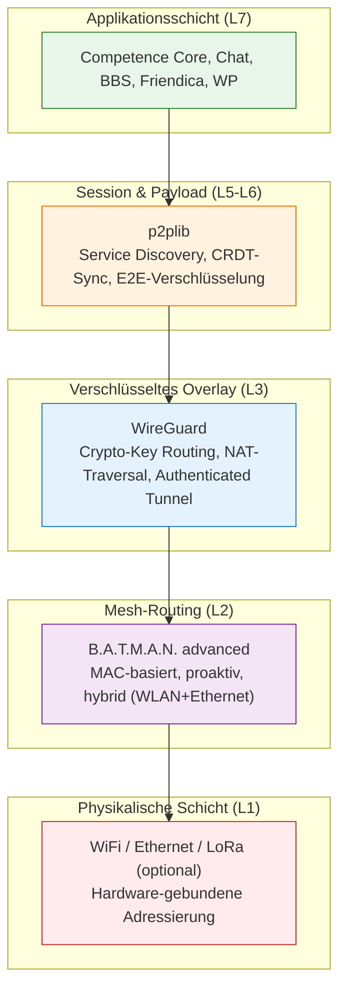
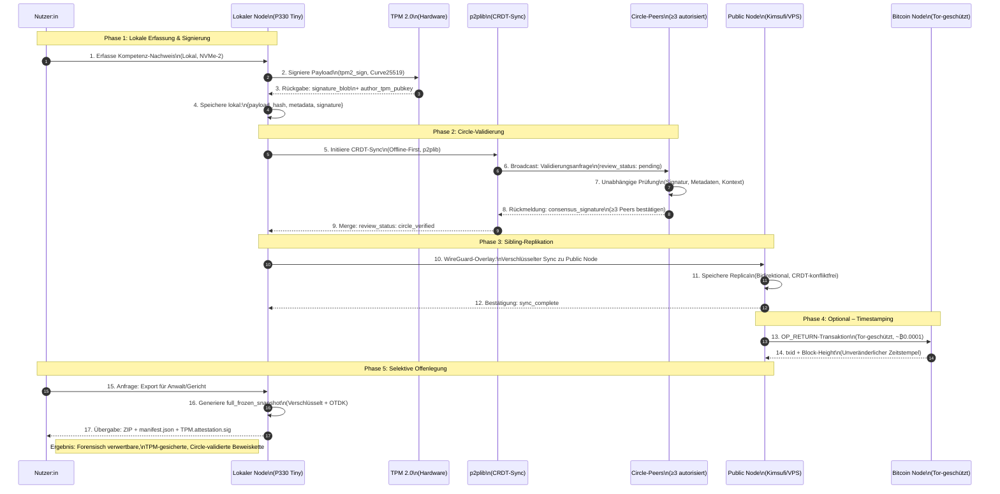
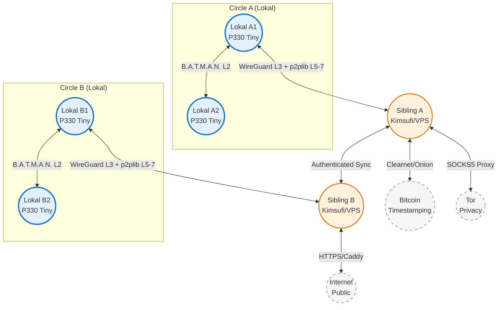
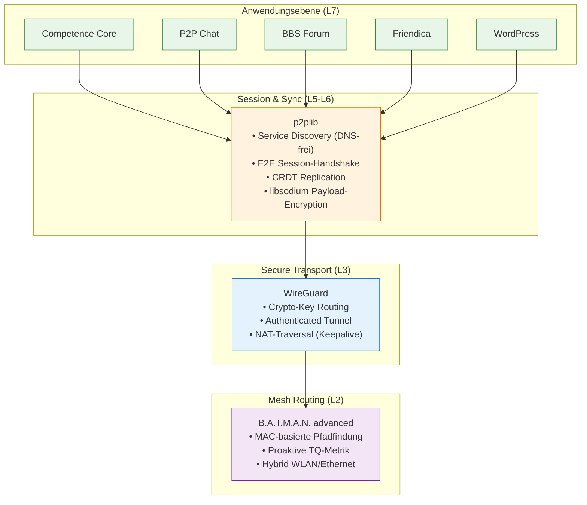
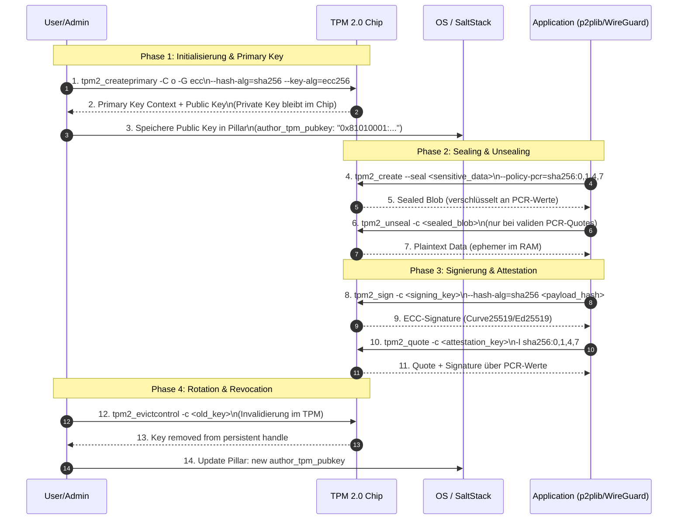
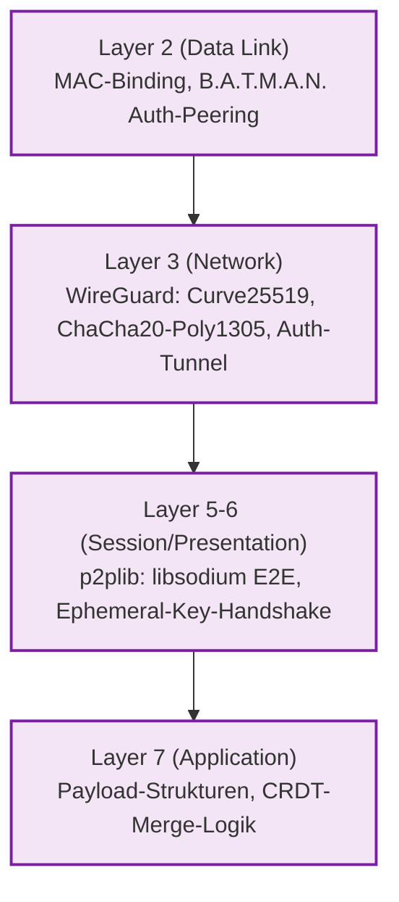
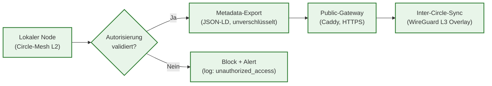
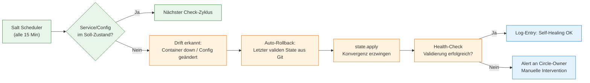
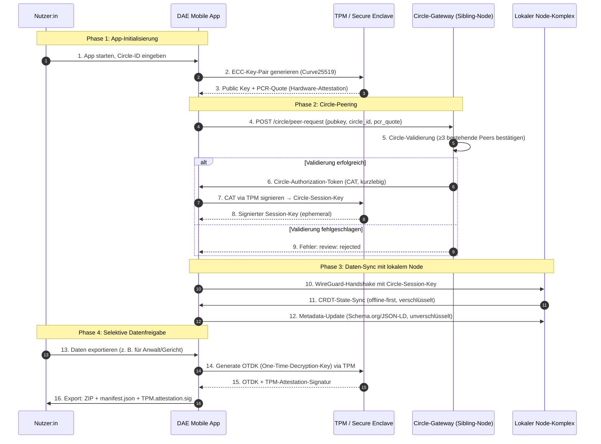

# Decentralized Autonomous Ecosystem Architecture
## Infrastruktur für digitale Souveränität durch echtes Peer-to-Peer

**Whitepaper v0.5.1 (DRAFT)**

---

**Dokument-Informationen**

| Feld | Wert |
|------|------|
| **Version** | 0.5.1 (DRAFT) |
| **Datum** | 23. Mai 2026 |
| **Autor** | Ralf Siebert (aka Maxim R. Garrtner) |
| **Kontakt** | [maxim.r.garrtner@yandex.com](mailto:maxim.r.garrtner@yandex.com) |
| **Klassifikation** | Konzeptionell / Öffentlich / Technisch |
| **Lizenz** | CC BY-SA 4.0 |
| **Sprache** | Deutsch |
| **Bezug** | Positionspapier: *„Digitale Souveränität durch Echtes Peer-to-Peer"* (DAE-PP-2026-001-v0.5.1) |

---

## Executive Summary

Die Architektur des Internets ist keine technische Neutralität – sie ist eine politische und ökonomische Entscheidung. Seit der Ablösung direkter Computer-zu-Computer-Verbindungen durch zentralisierte Rechenzentren hat sich das World Wide Web von einem offenen Kommunikationsraum zu einer Infrastruktur des **Überwachungskapitalismus** entwickelt. Persönliche Daten werden extrahiert, Verhaltensvorhersagen trainiert und Aufmerksamkeit algorithmisch optimiert – ohne informierte Einwilligung und ohne echte Kontrolle der Nutzenden.

Dieses Whitepaper beschreibt die Architektur eines **Decentralized Autonomous Ecosystems (DAE)**, das digitale Souveränität nicht verspricht, sondern **technisch erzwingt**. Im Gegensatz zu applikatorischen „Pseudo-P2P"-Modellen (z. B. ActivityPub/Mastodon, Matrix, Web3), die weiterhin auf zentralisierten Servern und Vermittlungsdiensten auf OSI-Layer 7 operieren, ermöglicht das DAE autonome, autorisierte und verschlüsselte Direktverbindungen zwischen Endgeräten auf den unteren Netzwerkschichten (Layer 2–4).

Das DAE basiert auf einer komplementären **Protokoll-Triade**:
- **`B.A.T.M.A.N. advanced`** (Layer 2): Offline-fähiges, MAC-basiertes Mesh-Routing für lokale Circles
- **`WireGuard`** (Layer 3): Authentifizierte, kryptographische Overlay-VPN für sicheren Transit über unsichere Netze
- **`p2plib`** (Layer 5–7): DNS-freie Service-Discovery, CRDT-basierte Offline-First-Synchronisation und applikations-agnostische E2E-Kommunikation

Jeder Peer im DAE betreibt einen **vollständigen, lokal autarken Anwendungsstack**, gekoppelt mit einem öffentlichen Sibling-Node für resiliente Replikation und optionale öffentliche Erreichbarkeit. Hardware-gesicherte Identitäten (TPM 2.0), Circle-basierte Autorisierung und dezentrale Konsensvalidierung eliminieren Single Points of Failure, algorithmische Manipulation und intransparente Datenextraktion.

Als **exemplarische Anwendung** wird die *Competence Signature* vorgestellt – ein dezentrales System zur Erfassung, Signierung und Verifikation beruflicher Kompetenzen. Sie demonstriert, wie Applikationen auf der DAE-Infrastruktur Datensouveränität, Authentizität und Resilienz operationalisieren können. Das DAE selbst ist jedoch applikations-agnostisch und kann beliebige Dienste hosten: Chat, Forum, Social Federation, CMS, KI-Inferenz oder kooperative Compute-Workflows.

Bei prädiktiven Betriebskosten von ca. **23 €/Monat pro Node-Paar** transformiert das DAE global ungenutzte Rechenkapazitäten (~26,8 Mrd. idle CPU-Cores) in eine kooperative, zensurresistente und compliant-by-design Infrastruktur. Es ist keine alternative Plattform – sondern die infrastrukturelle Wiederherstellung von Eigentum, Privatsphäre und authentischer Zusammenarbeit im digitalen Raum.

> *„Dezentralität ist kein technisches Feature. Sie ist die Wiederherstellung von Eigentum, Privatsphäre und Kooperation im digitalen Raum."*

---

## Metadaten

| Feld | Wert |
|------|------|
| **Dokument-ID** | `DAE-WP-2026-001-v0.5.1` |
| **Versionierung** | Semantic Versioning (Major.Minor.Patch) |
| **Primärer Fokus** | Infrastruktur-Architektur des Decentralized Autonomous Ecosystems (DAE) |
| **Sekundärer Fokus** | Anwendungsbeispiel: Competence Signature (eine von vielen möglichen Applikationen) |
| **Zielgruppe** | Infrastruktur-Architekten, Open-Source-Entwickler, Datenschutzbeauftragte, Community-Netzwerk-Betreiber, IT-Entscheider, Forschung |
| **Schlagwörter** | Decentralized Autonomous Ecosystem, True Peer-to-Peer, WireGuard, B.A.T.M.A.N. advanced, p2plib, TPM 2.0, SaltStack GitFS, Datensouveränität, Circle-Topologie, OSI-Layer 2–4 |
| **Referenzprotokolle** | `B.A.T.M.A.N. advanced` (OSI L2), `WireGuard` (OSI L3), `p2plib` (OSI L5–7), Bitcoin OP_RETURN (optional), Tor (optional), ActivityPub (kompatibel) |
| **Hardware-Referenz** | Lenovo ThinkStation P330 Tiny (lokal), OVH Kimsufi KS-B / VPS (öffentlich) |
| **Betriebssystem** | DietPi / Debian 12 Bookworm (minimal) |
| **Orchestrierung** | SaltStack (GitFS), Docker Compose, Caddy Reverse Proxy, Restic Backup |
| **Zitierempfehlung** | Siebert, R. (2026). *Decentralized Autonomous Ecosystem Architecture: Infrastruktur für digitale Souveränität durch echtes Peer-to-Peer* (Whitepaper v0.5.1). Verfügbar unter: [maxim.r.garrtner@yandex.com] |

---

## 1. Einleitung & Problemstellung

### 1.1 Historische Evolution der Netzwerk-Architekturen

Die grundlegende Idee von Peer-to-Peer findet sich in den Anfängen der Vernetzung von Computern wieder: Zwei Rechner werden durch ein Kabel direkt verbunden. Vor rund 30 Jahren entstand daraus das Internet durch die Standardisierung von Protokollen, die unterschiedliche Computertypen, Betriebssysteme und Software-Produkte zu einem normalisierten, interoperablen Netzwerk zusammenschlossen [[PDF]].

Diese Evolution lässt sich in fünf Phasen unterteilen, die jeweils neue Abhängigkeiten und strukturelle Schwächen etablierten:

| Phase | Zeitraum | Charakteristik | Strukturelle Konsequenz |
|-------|----------|----------------|------------------------|
| **Single Server** | Bis 1990 | Direkte Kabelverbindung, namentlich bekannte Teilnehmer | Vertrauensbasiert, lokal begrenzt, keine Skalierung |
| **Internet Service Providing** | 1990–1999 | ISPs stellen Rechenleistung in Rechenzentren bereit | Anonymisierung der Nutzer, Daten verlassen lokale Kontrolle |
| **Virtualisierung & Cloud** | 2000–2010 | Effizientere Nutzung durch VMs, bedarfsorientierte Abrechnung | Vollständige Auslagerung von Speicher & Compute an Dritte |
| **API Service Providing** | 2015–heute | Applikative Vernetzung via APIs, Hybrid-Cloud-Architekturen | Daten fließen über fremde Schnittstellen, intransparente Weiterverarbeitung |
| **Sidekick Peer-to-Peer** | 2005–heute | Echte P2P-Netzwerke auf Hardware- und Applikationsebene | Autonome Vernetzung möglich, aber noch Nischenphänomen |

Die konsequente Logik dieser Entwicklung ist die Entstehung einer **Client-Server-Infrastruktur**, die das Internet zu einem quasi-öffentlichen Raum macht: Ein zentrales Rechenzentrum bietet Applikationen anonymen Teilnehmern an. Die Verbindung erfolgt anonym; persönliche Daten werden zentral gespeichert und ohne explizite, nachvollziehbare Autorisierung von Dritten genutzt.

---

### 1.2 Die Diagnose: Überwachungskapitalismus als Architektur-Problem

Der Überwachungskapitalismus, geprägt durch Shoshana Zuboff, beschreibt ein Wirtschaftssystem, das menschliche Erfahrung als kostenlosen Rohstoff für kommerzielle Extraktion, Vorhersage und Verhaltensbeeinflussung beansprucht. Diese Logik ist kein Nebenprodukt des Internets – sie ist **strukturell in seiner Architektur verankert**.

#### 1.2.1 Die vier Mechanismen der Extraktion

| Mechanismus | Umsetzung in zentralisierten Systemen | Konsequenz für Nutzende |
|-------------|--------------------------------------|------------------------|
| **Datenextraktion** | Tracking von Klicks, Standort, Sozialgraphen, Verweildauer | Verlust der Kontrolle über eigene Informationen |
| **Verhaltensvorhersage** | KI-Modelle prognostizieren zukünftiges Nutzerverhalten | Manipulation durch personalisierte Inhalte |
| **Verhaltensbeeinflussung** | Nudging, algorithmische Filterblasen, Engagement-Optimierung | Erosion von Autonomie und kritischer Urteilsfähigkeit |
| **Monetarisierung** | Verkauf von Profilen an Werbetreibende, politische Akteure, Dritte | Nutzende werden zum Produkt, nicht zum Kunden |

Die Anonymität des Zugangs wird durch die **Transparenz des Verhaltens** kompensiert. Niemand muss wissen, wer Sie sind, solange das System präzise vorhersagen kann, was Sie als Nächstes tun werden. Dieser Prozess ist kein technischer Unfall, sondern ein strukturelles Merkmal der Client-Server-Infrastruktur.

#### 1.2.2 Das Versagen regulatorischer Ansätze

Verträge, Nutzungsbedingungen und Datenschutzregulierungen (wie die DSGVO) versuchen, dieser Macht Grenzen zu setzen. Sie bleiben jedoch oft wirkungslos, wenn die technische Architektur selbst die Extraktion, Replikation und Fremdnutzung von Daten standardisiert. Datenhoheit wird zur Illusion, sobald die Infrastruktur physisch und logisch außerhalb der Reichweite der datenerzeugenden Person liegt.

> **Kernthese**: Solange Kommunikation über vermittelnde Server läuft, entsteht zwangsläufig eine Kontrollinstanz, die Datenfluss, Zugriff, Speicherung und Metadaten-Analyse regelt. Datenschutz durch AGBs ist ein Widerspruch in sich.

---

### 1.3 Die Illusion applikatorischer Dezentralisierung

Angesichts der wachsenden Kritik an zentralisierten Plattformen entstand eine neue Welle vermeintlich dezentraler Lösungen: **ActivityPub (Mastodon/Fediverse)**, **Matrix/Element**, **Nostr**, **IPFS** oder **Web3-Applikationen**. Diese Systeme werben mit Offenheit, Föderation, Nutzerkontrolle und Zensurresistenz.

Technisch operieren sie jedoch fast ausschließlich auf der **Anwendungsschicht (OSI Layer 7)**:

```
Client → Server → (Server-zu-Server) → Server → Client
```

Im Falle von ActivityPub beispielsweise tauschen Server auf Applikationsebene Daten aus; der Client ist niemals direkt mit einem anderen Client verbunden. Matrix nutzt Ende-zu-Ende-Verschlüsselung, bleibt aber auf zentrale Home-Server oder Relay-Dienste angewiesen, um Nachrichten zu speichern und weiterzuleiten.

#### 1.3.1 Definition: Pseudo-P2P vs. Echtes P2P

| Merkmal | **Pseudo Peer-to-Peer** | **Echtes Peer-to-Peer** |
|---------|------------------------|------------------------|
| **OSI-Layer** | Schicht 7 (Applikation) | Schicht 2–4 (Data Link, Network, Transport) |
| **Verbindungspfad** | Client → Server → Client | Peer ↔ Peer (direkt) |
| **Vermittlung** | Zentrale oder föderierte Server-Instanz | Algorithmus-basierte direkte Adressierung |
| **Autorisierung** | Plattformseitig (Nutzerkonto, AGB) | Gegenseitig, explizit, widerrufbar |
| **Datenfluss** | Durch Server relayt, gespeichert oder analysiert | Ende-zu-Ende verschlüsselt, kein Transit durch Dritte |
| **Internet-Abhängigkeit** | Zwingend erforderlich | Optional; autonomes Mesh möglich |

Diese Ansätze werden hier als **Pseudo-Peer-to-Peer** bezeichnet. Sie reduzieren zwar die Abhängigkeit von einzelnen Monopolisten, bewahren aber das grundlegende Vermittlungsparadigma: Eine Server-Instanz (oder ein Server-Cluster) autorisiert, speichert, relayt oder validiert die Kommunikation. Die Datenextraktion wird lediglich dezentralisiert oder fragmentiert, nicht aber eliminiert.

---

### 1.4 Das Paradigma des Echten Peer-to-Peer

Echtes P2P nutzt die Netzwerktechnologie direkt auf der Ebene des **Transports (TCP/UDP, Layer 4)**, des **Internets (IP, Layer 3)** oder der **Sicherungsschicht (MAC-Adressen, Layer 2)**. Damit entfällt die Nutzung von Servern oder Vermittlungssystemen in Rechenzentren vollständig. Die Verbindung wird autonom, algorithmisch und hardwarenah etabliert.

#### 1.4.1 Das Circle-Prinzip & Identitätsbekanntgabe

Ein zentrales Merkmal echter P2P-Netzwerke ist die **Aufhebung der Anonymität zugunsten authentischer Sozialität**. Im klassischen Internet interagieren Teilnehmende pseudonym oder anonym in einem öffentlichen Raum. Echtes P2P ersetzt dieses Modell durch das **Circle-Konzept**:

- **Kreise statt Plattformen**: Peers organisieren sich in sozialen oder geo-lokalen Einheiten (Familie, Freundeskreis, Verein, Nachbarschaft, Grätzl).
- **Persönliche Bekanntschaft**: Innerhalb eines Circle kennen sich die Eigentümer der Peers persönlich oder sind über vertrauenswürdige Mitglieder verknüpft.
- **Explizite Autorisierung**: Jede Verbindung erfordert gegenseitige Bestätigung. Autorisierung kann jederzeit widerrufen werden.
- **Identitätsbekanntgabe**: Quellen sind namentlich bekannt. Verantwortung für veröffentlichte Informationen liegt klar beim jeweiligen Peer.

Dieses Modell stellt die **Verantwortung für Inhalte und Daten** wieder her. Desinformation wird durch ein neuartiges Konsens-Modell eingedämmt: Informationen werden nicht algorithmisch verstärkt, sondern durch peer-basierte Validierung und persönliche Verifikation gefiltert.

#### 1.4.2 Autonomie & Gateway-Struktur

Echte P2P-Mesh-Netzwerke sind **inhärent autonom**. Sie benötigen keinen expliziten Zugang zum Internet, um zu funktionieren. Die Verbindung wird vollständig durch die angeschlossenen Geräte selbst hergestellt. Das Internet ist lediglich eine ergänzende Struktur, die über **Gateway-Peers** angebunden wird.

```
[Circle-Mesh] ←→ [Gateway-Peer] ←→ [Internet / andere Circles]
```

- **Offline-Fähigkeit**: Bei Internetausfall, Zensur oder Infrastrukturstörungen bleibt das lokale Circle-Netzwerk voll funktionsfähig.
- **Resilientes Routing**: Datenpakete finden alternative Pfade über verfügbare Peers (Multi-Path-Routing).
- **Kontrollierte Externalisierung**: Nur autorisierte Daten werden über Gateways nach außen geleitet. Der Datenfluss bleibt granular steuerbar.

---

### 1.5 Das ungenutzte globale Potential

Eine Analyse der weltweit verfügbaren IT-Infrastruktur (Stand Dezember 2023) zeigt das enorme, bisher weitgehend ungenutzte Potenzial für echte P2P-Architekturen [[PDF]]:

| Maschinentyp | Anzahl (Mio.) | Ø CPU-Cores | Gesamt-Cores (Mio.) |
|--------------|---------------|-------------|---------------------|
| **Server** | 17,5 | 64 | 1.120 |
| **Personal Computer** | 350,0 | 8 | 2.800 |
| **Mobile Endgeräte** | 6.000,0 | 4 | 24.000 |
| **Gesamt** | **6.367,5** | – | **~27.920** |

Davon stehen schätzungsweise **~26.800 Millionen Prozessor-Kerne** im überdurchschnittlichen Leerlauf zur Verfügung. Diese verteilte Kapazität repräsentiert kein technisches Defizit, sondern ein **gesellschaftliches Infrastruktur-Potenzial**. Echtes P2P nutzt diesen Leerlauf für:
- Lokale Validierung und Konsensbildung
- Dezentrale Datenspeicherung und Replikation
- Verteilte Berechnung und Arbeitslast-Balancierung
- Resiliente Kommunikationswege

Im Gegensatz zu Cloud-Modellen, die Rechenleistung zentral bündeln und extern vermarkten, bleibt die Wertschöpfung im P2P-Netzwerk bei den Teilnehmenden. Kooperation ersetzt Extraktion.

> *„Jeder weiß ein wenig, jeder muss nicht alles wissen, jeder gibt sein Wissen in die Kooperation."*

---

### 1.6 Motivation für das Decentralized Autonomous Ecosystem

Die vorangegangene Diagnose macht deutlich: Der Überwachungskapitalismus ist kein bloßes Geschäftsmodell, sondern das direkte Ergebnis einer Infrastruktur, die Zentralisierung als Standard setzt. Die Wiederherstellung von Datensouveränität, authentischer Sozialität und resilienter Kommunikation erfordert daher keine bessere Applikation, sondern eine fundamentale Neugestaltung der Vernetzung selbst.

Das **Decentralized Autonomous Ecosystem (DAE)** operationalisiert dieses Paradigma durch:
1. **Protokoll-basierte Souveränität**: `B.A.T.M.A.N. advanced` (L2), `WireGuard` (L3) und `p2plib` (L5–7) eliminieren Vermittler auf Netzwerk- und Transportschicht.
2. **Hardware-gesicherte Identität**: TPM 2.0 siegelt private Keys; `tpm2_unseal` zur Laufzeit, niemals im Git oder auf Disk.
3. **Full-Stack Autonomie**: Jeder Peer hostet den kompletten Anwendungs- und Validierungsstack lokal – keine funktionale Abhängigkeit von anderen Nodes.
4. **Circle-basierte Topologie**: Peers organisieren sich in sozial oder geo-lokal definierten Kreisen; Gateways verbinden Circles föderiert, ohne zentrale Kontrollinstanz.

Als **exemplarische Anwendung** wird im Verlauf dieses Whitepapers die *Competence Signature* vorgestellt – ein dezentrales System zur Erfassung, Signierung und Verifikation beruflicher Kompetenzen. Sie demonstriert, wie Applikationen auf der DAE-Infrastruktur Datensouveränität, Authentizität und Resilienz operationalisieren können. Das DAE selbst ist jedoch **applikations-agnostisch** und kann beliebige Dienste hosten: Chat, Forum, Social Federation, CMS, KI-Inferenz oder kooperative Compute-Workflows.

---

### 1.7 Aufbau des Kapitels & Ausblick

Dieses Kapitel hat die historische Evolution der Netzwerk-Architekturen nachgezeichnet, die strukturellen Schwächen zentralisierter Infrastrukturen diagnostiziert und das Paradigma echten Peer-to-Peer als technische und ethische Alternative begründet.

Die folgenden Kapitel operationalisieren diese Prinzipien:
- **Kapitel 2** detailliert die Protokoll-Triade (`B.A.T.M.A.N. advanced`, `WireGuard`, `p2plib`) und ihre komplementäre Synergie.
- **Kapitel 3** beschreibt das Systemdesign: Hardware-Basis, 1:1 Sibling-Paarung, Datenfluss und Validierungskette.
- **Kapitel 4–7** behandeln Anwendungs-Schicht, Sicherheit, Betrieb und Ökonomie des DAE.

Das Ziel ist nicht die Beschreibung einer alternativen Plattform, sondern die Spezifikation einer Infrastruktur, die digitale Souveränität **technisch erzwingt** – nicht vertraglich verspricht.

---

## 2. Architektur-Grundlagen & Protokoll-Stack

Die Diagnose zentralisierter Extraktionsmodelle und die Prinzipien echter Peer-to-Peer-Vernetzung bleiben abstrakt, solange sie nicht durch eine präzise, schichtenübergreifende Protokoll-Architektur operationalisiert werden. Das Decentralized Autonomous Ecosystem (DAE) nutzt nicht ein einzelnes Protokoll, sondern eine komplementäre Triade, die gezielt auf unterschiedlichen Ebenen des OSI-Referenzmodells (Open Systems Interconnection) arbeitet. Diese Schichtung ist kein technischer Overhead, sondern das strukturelle Fundament, das digitale Souveränität, Resilienz und Privatsphäre durch Design erzwingt.

---

### 2.1 Das OSI-Modell als Fundament für echtes P2P

Das OSI-Layer-Modell unterteilt Netzwerkkommunikation in sieben definierte Schichten, wobei jede Schicht spezifische Funktionen erfüllt und Dienste für die darüberliegende Ebene bereitstellt. In der heutigen Internet-Architektur findet der Großteil der „Dezentralisierung" auf der **Anwendungsschicht (Layer 7)** statt. Applikationen wie ActivityPub, Matrix oder Web3-Frontends kommunizieren über Server, die als Vermittler fungieren. Der Client ist niemals direkt mit einem anderen Client verbunden; Daten werden relayt, gespeichert oder applikatorisch synchronisiert [[PDF]].

Echtes P2P durchbricht dieses Vermittlungsparadigma, indem es die Netzwerkkommunikation auf tieferen Schichten etabliert:

| OSI-Schicht | Funktion im klassischen Internet | Funktion im echten P2P (DAE) |
|-------------|--------------------------------|------------------------------|
| **Layer 7 (Application)** | Browser, APIs, Social Media, Cloud-Apps | Service-Discovery, E2E-Payload, CRDT-Sync (`p2plib`) |
| **Layer 6 (Presentation)** | TLS/SSL, Komprimierung | Applikatorische Verschlüsselung (libsodium), Zero-Trust-Auth |
| **Layer 5 (Session)** | HTTP-Keepalives, WebSockets | Persistente Peer-Sessions, zustandslose Handshakes |
| **Layer 4 (Transport)** | TCP/UDP, Port-basiertes Routing | Stateless UDP-Tunnel, NAT-Durchdringung (`WireGuard`) |
| **Layer 3 (Network)** | IP-Routing, DNS-Abhängigkeit | Crypto-Key Routing, kryptographische Identität (`WireGuard`) |
| **Layer 2 (Data Link)** | Switch-basierte MAC-Weiterleitung | Proaktives Mesh-Routing, MAC-Adress-Verifikation (`B.A.T.M.A.N.`) |
| **Layer 1 (Physical)** | Kabel, Funk, Sendeantennen | Standard-Hardware (WiFi/Ethernet), LoRa (optional) |

> **Kernprinzip**: Solange Datenpakete physisch durch fremdverwaltete Rechenzentren fließen, bleibt Überwachung möglich. Echte Souveränität entsteht dort, wo Verbindungen bereits auf Ebene der Sicherungsschicht (MAC) oder Vermittlungsschicht (IP) autorisiert, verschlüsselt und direkt zwischen Endgeräten etabliert werden [[PDF]].

---

### 2.2 Die Protokoll-Triade im Detail

#### 2.2.1 `B.A.T.M.A.N. advanced` (OSI Layer 2) – Das autonome lokale Nervensystem

`B.A.T.M.A.N. advanced` (Better Approach To Mobile Adhoc Networking) ist ein proaktives Routing-Protokoll, das direkt im Linux-Kernel integriert ist und auf der Sicherungsschicht operiert. Im Gegensatz zu proprietären WiFi-Mesh-Chipsätzen (wie sie historisch im OLPC-Projekt unter IEEE 802.11s zum Einsatz kamen) ist `B.A.T.M.A.N.` vollständig Open Source und hardware-agnostisch [[PDF]].

**Technische Charakteristika:**
- **MAC-basierte Adressierung**: Verbindungen werden auf Hardware-Ebene etabliert. Jede Netzwerkkarte identifiziert sich über ihre eindeutige MAC-Adresse, was die Verbindungssicherheit bereits vor der IP-Ebene erhöht.
- **Proaktives Routing**: Jeder Peer sendet regelmäßig *Originator Messages* (OGMs). Die Verbindungsqualität (*Transmission Quality, TQ*) wird dezentral gemessen. Jeder Node kennt stets die beste Richtung zum Ziel, ohne zentrale Routing-Tabellen.
- **Hybrid-Fähigkeit**: Unterstützt kabellose (WLAN) und kabelgebundene (Ethernet) Verbindungen im selben Mesh. Ermöglicht *Mesh-over-Internet*, wenn Peers geografisch verteilt sind.
- **Keine Internet-Abhängigkeit**: Das Mesh funktioniert vollständig autonom. Das klassische Internet wird nur über autorisierte Gateway-Peers angebunden.

**Rolle im DAE**: `B.A.T.M.A.N.` bildet das lokale Circle-Netzwerk. Es garantiert Offline-Fähigkeit, findet alternative Pfade bei Link-Ausfällen und ermöglicht die direkte, vermittelungsfreie Kommunikation innerhalb eines bekannten Teilnehmerkreises.

---

#### 2.2.2 `WireGuard` (OSI Layer 3) – Das kryptographische Overlay

Während `B.A.T.M.A.N.` lokale Pfade findet, adressiert `WireGuard` die Sicherheit des Datentransits über unsichere oder fremdverwaltete Netze. Es operiert auf der Vermittlungsschicht und nutzt moderne Kryptographie für authentifizierten, verschlüsselten Transit.

**Technische Charakteristika:**
- **Crypto-Key Routing**: IP-Adressen werden an öffentliche ECC-Keys (Curve25519) gebunden. Die Verbindung wird nicht über DNS oder zentrale Zertifizierungsstellen hergestellt, sondern über kryptographische Identitäten.
- **Minimaler Codebase**: Mit unter 4.000 Zeilen Code ist `WireGuard` deutlich auditierbarer als IPsec oder OpenVPN. Geringere Komplexität bedeutet geringere Angriffsfläche und höhere Performance.
- **NAT & Firewall Durchdringung**: Integrierte *Persistent-Keepalive*-Mechanismen und UDP-basierter Transport ermöglichen stabile Verbindungen hinter restriktiven Routern, ohne manuelle Portfreigaben.
- **Stateless & Kernel-Integriert**: Läuft direkt im OS-Netzwerkstack, nutzt Hardware-Beschleunigung und verursacht minimalen CPU-Overhead.

**Rolle im DAE**: `WireGuard` bildet das sichere Rückgrat für geografisch verteilte Nodes. Es verbindet lokale `B.A.T.M.A.N.`-Meshes mit öffentlichen Sibling-Nodes und ermöglicht verschlüsselten Transit über das öffentliche Internet, ohne dass Provider oder Zwischenknoten Metadaten oder Payload einsehen können.

---

#### 2.2.3 `p2plib` (OSI Layer 5–7) – Die applikatorische Direktkommunikation

Applikationen benötigen eine Schicht, die auf den gesicherten Netzwerkprotokollen aufsetzt, ohne wieder auf Server-Relays, zentrale APIs oder proprietäre Frameworks zurückzugreifen. `p2plib` (konzeptionell als moderne P2P-Kommunikationsbibliothek) schließt diese Lücke und implementiert die Anforderungen an echte Applikations-P2P: direkte End-to-End-Kanäle, dezentrale Dienstesuche und offline-fähige Synchronisation.

**Technische Charakteristika:**
- **Service Discovery ohne DNS**: Peers melden eigene Dienste (Chat, BBS, Competence Core, CMS) im Mesh an. Discovery erfolgt über lokale Broadcasts oder DHT-ähnliche Strukturen innerhalb des `WireGuard`-Subnets.
- **CRDT-basierte Replikation**: Zustandsänderungen (Nachrichten, Kompetenz-Nachweise, Foren-Posts) werden als konfliktfreie replizierte Datentypen (Conflict-Free Replicated Data Types) synchronisiert. Offline-First-Design garantiert Datenkonsistenz ohne zentrale Sequenzierung.
- **Session-Management & E2E-Payload**: Sitzungen werden über temporäre Key-Pairs ausgehandelt. Verschlüsselung erfolgt applikatorisch (z. B. libsodium) zusätzlich zur Transportverschlüsselung (Defense-in-Depth).
- **Framework-Agnostisch**: Bindet sich nahtlos in NodeJS, Python oder Go-Dienste ein, ohne Vendor-Lock-in oder zentrale Identity-Provider.

**Rolle im DAE**: `p2plib` ist die Brücke zur Anwendungslogik. Sie stellt sicher, dass Dienste direkt zwischen Peers kommunizieren, Daten lokal persistieren und nur autorisierten Teilnehmern zugänglich sind. Sie operationalisiert das kooperative Prinzip: *„Jeder weiß ein wenig, jeder muss nicht alles wissen, jeder gibt sein Wissen in die Kooperation."* [[PDF]]

---

### 2.3 Die Multi-Layer-Souveränitätskette

Die drei Protokolle sind keine Alternativen, sondern komplementäre Schichten, die gemeinsam eine souveräne Infrastruktur erzwingen. Keine einzelne Schicht ist allein ausreichend; erst ihr Zusammenspiel eliminiert strukturelle Abhängigkeiten.



**Synergie-Effekte:**
1. **Redundante Sicherheit**: MAC-Filter (L2) + Crypto-Keys (L3) + E2E-Payload-Verschlüsselung (L5–7) schaffen eine Zero-Trust-Architektur.
2. **Graceful Degradation**: Fällt das Internet aus, bleibt `B.A.T.M.A.N.` + `p2plib` lokal funktionsfähig. Fällt ein lokaler Router aus, findet `WireGuard` alternative Pfade über andere Peers.
3. **Identität über Adresse**: Peers werden nicht über IPs oder Domains identifiziert, sondern über kryptographische und hardwaregebundene Keys. Das eliminiert DNS-Hijacking, CA-Abhängigkeiten und IP-Tracking.
4. **Kooperative Lastverteilung**: Arbeitslast wird dezentral verteilt; kein Peer muss die volle Rechenlast tragen, um valide Dienste bereitzustellen [[PDF]].

---

### 2.4 Graceful Degradation & Resilienz durch Schichtung

Ein echtes P2P-Ecosystem muss unter extremen Bedingungen funktionsfähig bleiben: Internetausfall, Zensur, Infrastrukturstörungen oder gezielte Angriffe auf einzelne Knoten. Das DAE adressiert dies durch **Graceful Degradation**:

| Ausfallszenario | Protokoll-Reaktion | Operative Konsequenz |
|-----------------|-------------------|----------------------|
| **WAN/Internet-Ausfall** | `B.A.T.M.A.N.` bleibt aktiv; `p2plib` puffert CRDT-Zustände lokal | Lokaler Circle bleibt voll funktionsfähig; Sync erfolgt asynchron bei Wiederverbindung |
| **WiFi-Interferenz/Link-Down** | `B.A.T.M.A.N.` erkennt TQ-Abfall, routed über Ethernet-Backup oder alternativen Peer | Kein Single Point of Routing; Multi-Path-Redundanz aktiv |
| **NAT/Firewall-Blockade** | `WireGuard` nutzt UDP-Keepalive (`PersistentKeepalive=25`) | Stabile Verbindungen auch hinter restriktiven Consumer-Routern |
| **Node-Absturz/Kompromittierung** | SaltStack + GitFS erkennt Konfigurations-Drift, setzt letzten validen State zurück | Self-Healing ohne manuelle Intervention; TPM-Keys bleiben geschützt |

Resilienz ist hier kein Marketing-Begriff, sondern eine engineering-getriebene Systemeigenschaft, die durch die gezielte Schichtung der Protokoll-Triade erreicht wird.

---

### 2.5 Konsens-Definition: Daten vs. Information & operative Architektur

Die technische Spezifikation des Decentralized Autonomous Ecosystems (DAE) erfordert eine präzise, implementierbare Abgrenzung zwischen Daten und Information. Während zentralisierte Systeme diese Begriffe oft synonym verwenden oder durch Applikationslogik vermischen, trennt das DAE sie **strikt nach Schichten, Provenenz und Validierungsstatus**. Diese Unterscheidung ist die Grundlage für CRDT-Synchronisation, TPM-basierte Non-Repudiation, GitOps-Drift-Detection und selektive juristische Disclosure.

##### 2.5.1 State-of-the-Art-Mapping auf den DAE-Stack
Die Definition wird aus multiplen Disziplinen abgeleitet und direkt auf die Protokoll- & Infrastruktur-Ebene des DAE übersetzt:

| Disziplin | Daten-Charakteristik im DAE | Informations-Charakteristik im DAE | Technische Enabler |
|-----------|----------------------------|-----------------------------------|-------------------|
| **Informatik / CRDT-Theorie** | Unstrukturierte/semi-strukturierte Zustände, konfliktbehaftet vor Merge | Konvergierte, idempotente Zustände nach `p2plib`-Sync & Circle-Validierung | Yjs/Automerge-Logik, Hash-Verknüpfung, Branch-Merging |
| **Recht / eIDAS & DSGVO** | Personenbezogene Rohdaten, unterliegen lokaler Hoheit & Verschlüsselung | Kontextualisierte, nachvollziehbare Aussagen mit Provenenz-Chain | `tpm2_sign`, `payload_hash`, `review_status`-Flags |
| **Kryptographie / TPM 2.0** | Private Keys, Sealing-Policies, lokale Zertifikate | Attestierte, hardware-verifizierte Signaturen & Git-Config-Hashes | PCR-Quotes, `tpm2_unseal`, Non-Repudiable Payloads |
| **Agnotologie / Transparenzforschung** | Rohmaterial, anfällig für Kontextentzug oder Framing | Validierte Zustände mit expliziten Metadaten, Code-Hashes & Audit-Logs | Schema.org/JSON-LD, Loki-Audit, `proactive_metadata_publish` |
| **P2P-Architektur / OSI 2–7** | Lokale NVMe-Blöcke, verschlüsselte Frames/Pakete | Consens-basierte, maschinenlesbare Graph-Knoten mit Circle-Review | `B.A.T.M.A.N.` (L2), `WireGuard` (L3), `p2plib` (L5–7) |

> 🔍 **Technische Implikation**: Der Übergang von Daten zu Information ist im DAE ein **deterministischer Prozess**, nicht ein subjektiver. Er wird durch Protokoll-Validierung, Metadaten-Anreicherung und Circle-Konsens automatisiert.

##### 2.5.2 Formale Konsens-Definition
Für alle Implementierungen, State-Files und Application-Integrations gilt:

📦 **Daten (Raw State)**  
Strukturierte oder unstrukturierte Byte-Sequenzen, CRDT-Zustände, Messwerte oder kryptographische Payloads, die ohne Kontext-Mapping keine semantische Handlungsrelevanz besitzen. Im DAE sind Daten per Default lokal persistiert (`NVMe-2`), hardware-verschlüsselt (`OPAL 2.0`) und unterliegen expliziter Sync-Freigabe. Daten sind neutral; ihre Interpretation erfolgt erst durch Validierungs-Logik.

🌐 **Information (Validated Context)**  
Daten, die durch Metadaten-Schema, Provenenz-Kette, Validierungsstatus (`review_status`) und Zweckbindung semantisch aufgelöst wurden. Information ist maschinenlesbar, konsensfähig (`circle_consensus: true`), architektonisch verifizierbar und unterliegt einer transparenten Entstehungshistorie. Im DAE gilt: Ein Datensatz wird erst dann als Information propagiert, wenn er ≥3 der folgenden Bedingungen erfüllt: `tpm_signed: true`, `metadata_complete: ≥80%`, `context_linked: true`, `consensus_reached: true`.

##### 2.5.3 Operative Übersetzung in die DAE-Architektur
Die Definition wird durch konkrete Infrastruktur-Komponenten operationalisiert:

| Schicht | Daten-Implementierung | Informations-Implementierung | Technischer Mechanismus |
|---------|----------------------|-----------------------------|------------------------|
| **Speicherung** | `NVMe-2:/data/raw/`, verschlüsselte JSON/Blobs | `NVMe-2:/data/validated/`, CRDT-Merge-Logs, Schema.org-Metadaten | `p2plib`-CRDT-Sync, `metadata_first_indexing` |
| **Identität & Signatur** | TPM-Private-Key (`0x81010001`), lokale Zertifikate | `author_tpm_pubkey`, `git_config_hash`, `attestation_quote` | `tpm2_sign`, `curve25519`, GitOps-Historie |
| **Validierung** | Ungeprüfte Entries, `status: draft` | `review_status: circle_verified`, `min_signers: 3` | CRDT-Merge-Logic, Circle-Governance-States |
| **Transparenz & Routing** | Verschlüsselte L2/L3-Pakete, selektive Disclosure | Maschinenlesbare Metadata-Payloads, `public_gateway_sync` | Caddy-Reverse-Proxy, JSON-LD-Pub, `proactive_metadata_pipeline` |
| **Forensik & Compliance** | Rohdokumente, lokale Audit-Logs | `payload_hash` + `btc_timestamp` + `immutability_violation: false` | OP_RETURN, Loki-Hash-Sync, eIDAS-Validation-Profile |

##### 2.5.4 Agnotologie-Resistenz durch technisches Design
Informationslücken oder produziertes Nicht-Wissen werden im DAE nicht durch KI-Filter oder manuelle Moderation behoben, sondern durch **architektonische Gap-Detection & Provenenz-Verifikation**:

| Agnotologisches Risiko | DAE-Gegenarchitektur | Implementierungs-Logik |
|------------------------|----------------------|------------------------|
| **Selektive Veröffentlichung** | `proactive_metadata_publish`-Daemon | Automatische Sync von Schema.org-Metadaten an Public-Gateways; Payload bleibt verschlüsselt |
| **Blackbox-Logik** | Open-Logic-by-Design | Jeder Validierungs-Algorithmus hat `source_code_hash`, `version_tag`, `circle_review: true` |
| **Kontextentzug** | `context_completeness_score` | Metadaten-Validation: `temporal_context`, `geographic_scope`, `actor_role` müssen ≥80% gefüllt sein |
| **Nachträgliche Manipulation** | `immutability_violation`-Alert | `primary_source_hash ≠ cited_payload_hash` → Trigger `conflict_branch`, Circle-Review |
| **Zentrale Kuratierung** | Decentralized Consensus-Routing | ≥3 autorisierte Peers müssen `consensus_signature` liefern; keine Single-Node-Override |

##### 2.5.5 Implementierungs-Leitlinie für Entwickler & Administratoren
Diese Definition ist **bindend für alle State-Files, Pillar-Konfigurationen und Application-Integrations**:
1. **Strikte Trennung**: Payloads (`/data/raw/`) und Metadaten (`/data/meta/`) müssen physisch & logisch getrennt persistiert werden.
2. **Metadata-First-Indexing**: Alle Query-, Filter- und Aggregations-Operationen arbeiten primär auf Metadaten-Ebene, nicht auf Payloads.
3. **Validation-Gates**: Kein Datensatz darf `status: validated` erreichen, ohne TPM-Signatur, Metadaten-Vollständigkeit & Circle-Konsens.
4. **Audit-Compliance**: `tpm2_pcrread` + Git-Commit-Historie müssen bei jeder State-Änderung logbar sein. Drift → Auto-Rollback.
5. **Selective Disclosure**: Export-Funktionen müssen granular `metadata_only`, `payload_hash_only` oder `full_frozen_snapshot` unterstützen.

##### 2.5.6 Fazit des Kapitels
Die Trennung von Daten und Information ist kein semantisches Detail, sondern **die technische Voraussetzung für digitale Souveränität, forensische Verwertbarkeit und Agnotologie-Resistenz**. Im DAE wird diese Trennung durch drei Engineering-Prinzipien erzwungen:
1. **Lokale Persistenz & Hardware-Sealing** für Daten
2. **Metadaten-Anreicherung, Provenenz-Verifikation & Circle-Konsens** für Information
3. **Proactive Transparency & Open-Logic** als Default-Verhalten

Damit wird Information nicht durch Applikationslogik simuliert, sondern durch Protokoll-Design, kryptographische Verifikation und kooperative Validierung **architektonisch garantiert**.

---

### 2.6 Das Gateway-Prinzip & Circle-Interkonnektivität

Ein Circle ist in sich geschlossen und vollständig autonom. Das Internet ist keine Voraussetzung für dessen Funktion, sondern eine optionale Erweiterung. Die Verbindung zwischen Circles oder zum klassischen Web erfolgt ausschließlich über **Gateway-Peers**.

```
[Circle-Mesh L2] ←→ [Gateway-Peer (L2/L3 Bridge)] ←→ [Internet / andere Circles]
```

- **Autorisierte Externalisierung**: Nur explizit freigegebene Dienste oder synchronisierte Datensätze passieren das Gateway. Keine Metadaten-Lecks, keine Tracking-Telemetrie.
- **Föderale Skalierung**: Mehrere Circles können über vertrauenswürdige Gateways verbunden werden, ohne eine zentrale Koordinationsinstanz zu etablieren. Jeder Circle behält seine Autonomie, seine Regeln und seine Datenhoheit.
- **Redundanz durch Sibling-Paare**: Fällt ein lokaler Edge-Node aus, übernimmt der öffentliche Sibling-Node die Gateway-Funktion und sichert die bidirektionale Synchronisation.
- **Compliance by Design**: Da Daten physisch lokal gespeichert und nur auf explizite Konfiguration repliziert werden, operationalisiert diese Struktur DSGVO/GDPR-Prinzipien standardmäßig.

Das Gateway-Prinzip transformiert das Internet von einem zentralen Kontrollraum zu einem **optionalen Transportmedium**. Die eigentliche Infrastruktur, die Validierung und die soziale Interaktion verbleiben im autonomen Circle-Netzwerk.

---

### 2.7 Ausblick auf die Implementierung

Die Protokoll-Triade (`B.A.T.M.A.N. advanced`, `WireGuard`, `p2plib`) bildet das technische Rückgrat des DAE. Sie eliminiert Vermittler auf Netzwerk- und Transportschicht, ersetzt anonymer Reichweite durch explizite Autorisierung und verwandelt ungenutzte Rechenkapazität in kooperative Infrastrukturen.

Im nächsten Kapitel wird gezeigt, wie diese Protokolle auf konkreter Hardware operationalisiert werden: die 1:1 Sibling-Paarung, die NVMe-Trennung von OS und Daten, die TPM-Integration und die physische Topologie, die jedes Node-Paar zu einer souveränen, vollständigen Einheit macht.

---

## 3. Systemdesign & Infrastruktur

Die Architektur eines Decentralized Autonomous Ecosystems (DAE) ist nur so robust wie die physische und logische Infrastruktur, auf der sie operiert. Während die Protokoll-Triade (`B.A.T.M.A.N. advanced`, `WireGuard`, `p2plib`) die kommunikative Souveränität definiert, stellt das Systemdesign sicher, dass diese Protokolle auf autonomen, voll ausgestatteten und hardware-gesicherten Knoten laufen. Im Gegensatz zu client-server-Modellen oder pseudo-dezentralen Architekturen, die Rollen fragmentieren und Thin-Clients erzwingen, folgt das DAE dem Prinzip der **physischen und logischen Vollständigkeit jedes Peers**.

---

### 3.1 Hardware-Referenz & Physische Topologie

Das DAE ist hardware-agnostisch, benötigt jedoch für Referenzimplementierungen Geräte, die TPM 2.0, sufficient RAM/CPU für Container-Orchestrierung und NVMe-Speicherung unterstützen. Die folgende Referenzarchitektur basiert auf bewährten, kosteneffizienten Komponenten, die das Verhältnis von Leistung, Energieverbrauch und Datensouveränität optimieren.

#### 3.1.1 Lokaler Edge-Node: Lenovo ThinkStation P330 Tiny
| Komponente | Spezifikation | DAE-Relevanz |
|------------|--------------|--------------|
| **CPU** | Intel Core i9-9900T (8C/16T, 35W TDP) | Ausreichend für Parallelbetrieb von Mesh-Daemons, Container-Runtime und Validierungslogik |
| **RAM** | 32 GB DDR4-2666 (2×16 GB, auf 64 GB erweiterbar) | Puffer für `B.A.T.M.A.N.`-Routing-Tabellen, Docker-Services, CRDT-State-Caches |
| **Storage 1 (OS)** | 512 GB M.2 NVMe SSD (OPAL 2.0) | Betriebssystem, Container-Images, Protokoll-Konfigurationen, hardwareverschlüsselt |
| **Storage 2 (Data)** | 1 TB M.2 NVMe SSD (nachrüstbar) | Applikationsdaten, Blockchain-Index, lokale Backups, CRDT-Replication-Logs |
| **Security** | TPM 2.0, Secure Boot, Intel vPro | Hardware-Root-of-Trust für Key-Sealing, Remote-Attestation, Drift-Detection |
| **Power** | ~18 W idle / ~45 W peak | ~€30/Jahr Stromkosten; ideal für 24/7-Betrieb im lokalen Circle |

#### 3.1.2 Öffentlicher Sibling-Node: OVH Kimsufi KS-B / VPS
| Komponente | Spezifikation | DAE-Relevanz |
|------------|--------------|--------------|
| **CPU** | Intel Xeon E5-1620v2 (4C/8T) | Backup-Sync, Gateway-Relay, öffentliche HTTPS/ActivityPub-Termination |
| **RAM** | 32 GB DDR3 ECC | Identischer Stack wie lokal; ECC-Fehlerkorrektur für Langzeitstabilität |
| **Network** | 500 Mbps public, unmetered, anti-DDoS | Öffentliche Erreichbarkeit, Circle-Gateway, Inter-Circle-Federation |
| **Kosten** | ~$11.10/Monat + einmaliges Setup | Predictable Kosten; kein Free-Tier-Abhängigkeitsrisiko |

> **Hinweis**: Diese Spezifikationen sind Referenzwerte. Das DAE läuft ebenso auf Raspberry Pi 4/5, x86-Mini-PCs oder alten Laptops, sofern TPM 2.0 und Linux-Kernel-Support gegeben sind. Die Architektur skaliert horizontal mit der verfügbaren Hardware.

---

### 3.2 Das Full-Stack-per-Node-Prinzip

Jeder Peer im DAE hostet einen **vollständigen, lokal autarken Anwendungs- und Infrastrukturstack**. Dieses Design eliminiert funktionale Abhängigkeiten, die in zentralisierten oder föderierten Modellen zwangsläufig entstehen.

| Schicht | Lokale Instanz (P330 Tiny) | Öffentliche Instanz (Kimsufi/VPS) |
|---------|---------------------------|-----------------------------------|
| **OS & Kernel** | Debian/DietPi, `batman-adv`, `wireguard`-Module | Identisch |
| **Netzwerk** | `B.A.T.M.A.N.`-Mesh, `WireGuard`-Client/Server | `WireGuard`-Server/Client, Caddy Reverse Proxy |
| **Container-Runtime** | Docker Compose, `p2plib`-Daemon, Restic | Identisch |
| **Anwendungen** | Competence Core, Chat, BBS, Friendica, WP, Bitcoin+Tor | Identisch (optional: Public-Facing-Only-Modus) |
| **Datenhaltung** | NVMe-2 (lokal), TPM-Sealed Keys | NVMe/SSD (Backup-Replica), Mirror-Keys |

**Operative Konsequenzen:**
- ✅ **Kein Single Point of Failure**: Fällt ein lokaler Node aus, bleibt der Sibling-Node operational und umgekehrt.
- ✅ **Graceful Degradation**: Bei WAN-Ausfall arbeiten lokale Dienste weiterhin; `p2plib` puffert Zustände asynchron.
- ✅ **Kooperative Lastverteilung**: Wie im KB-Konzept definiert: *„Jeder weiß ein wenig, jeder muss nicht alles wissen, jeder gibt sein Wissen in die Kooperation."* Validierung, Routing und Storage werden dezentral verteilt, ohne dass ein Peer die Volllast tragen muss.

---

### 3.3 1:1 Sibling-Paarung & Circle-Gateway-Architektur

Das DAE organisiert Peers in **Circles** (familiär, beruflich, geo-lokal, vereinsbasiert). Innerhalb eines Circle kennen sich die Eigentümer der Peers persönlich; Autorisierung ist explizit, kryptographisch verifiziert und jederzeit widerrufbar [[PDF]].

#### 3.3.1 Paarungslogik
```
[Lokaler Node A] ←→ [Öffentlicher Sibling A]
       ↕                         ↕
[Circle-Mesh L2]          [Circle-Gateway L3/L7]
```
- **Bidirektionale Replikation**: `p2plib` synchronisiert CRDT-Zustände verschlüsselt zwischen lokal und öffentlich.
- **Gateway-Funktion**: Der öffentliche Node terminiert HTTPS, federiert ActivityPub, und relayt autorisierte Daten zu anderen Circles oder ins klassische Internet.
- **Metadaten-Minimierung**: Gateways relayen keine Tracking-Telemetrie, keine unverschlüsselten Payloads und keine Applikations-Logs. Der Datenfluss bleibt granular steuerbar.

#### 3.3.2 Identitätsbekanntgabe & Autorisierung
Im Gegensatz zum anonymisierten Internet, das persönliche Daten zentral speichert und ohne Kontrolle des Eigentümers nutzt [[PDF]], erzwingt das DAE:
1. **Explizite Peering-Anfrage**: Jeder Node stellt eine kryptographische Autorisierungsanfrage.
2. **Circle-Bestätigung**: Bestehende Mitglieder verifizieren die Identität (physisch, telefonisch, über vertrauenswürdige Introducer).
3. **Key-Registrierung**: Öffentliche Keys werden im Mesh registriert; private Keys verbleiben TPM-gesiegelt.
4. **Widerrufbarkeit**: Jede Autorisierung kann durch den Circle-Owner oder den Peer selbst jederzeit zurückgezogen werden.

---

### 3.4 Datenfluss & Validierungskette im DAE

Ein Datenobjekt (z. B. Kompetenz-Nachweis, Forenbeitrag, Chat-Nachricht) durchläuft im DAE eine definierte, mehrstufige Validierungs- und Synchronisationskette:



**Protokoll-Zuordnung:**
- **L2/L3**: `B.A.T.M.A.N.` findet den optimalen Pfad im Circle; `WireGuard` verschlüsselt den Transit zum Sibling/anderen Circles.
- **L5–7**: `p2plib` handshakes die Session, synchronisiert CRDTs, verwaltet Service-Discovery ohne DNS.
- **Validierung**: Multi-Peer-Konsens ersetzt zentrale Zertifizierung. Jede Signatur ist hardwaregebunden und nicht abstreitbar (Non-Repudiation).

---

### 3.5 Logische Topologie & Protokoll-Mapping

Die folgende Mermaid-Visualisierung zeigt die physische und logische Anordnung der Nodes, der Circle-Meshes, der Sibling-Paare und der Gateway-Verbindungen.



> **Legende**:  
> 🔵 **Lokale Circle-Nodes**: Vollautonom, `B.A.T.M.A.N.`-Mesh, TPM-gesichert, Full-Stack lokal  
> 🟠 **Sibling-Gateways**: Bidirektionale Replikation, externe Federation, öffentliche Termination  
> ⚪ **Externe Netze**: Optionale Anbindung; Datenfluss nur über autorisierte, verschlüsselte Kanäle  

---

### 3.6 Skalierung, Ressourcenallokation & Offline-Resilienz

#### 3.6.1 Nutzung ungenutzter Rechenkapazität
Eine Analyse der globalen IT-Infrastruktur (Stand Dezember 2023) zeigt, dass weltweit schätzungsweise **~26.800 Millionen Prozessor-Kerne** in Personal Computern, Mobilgeräten und Servern im überdurchschnittlichen Leerlauf verfügbar sind [[PDF]]. Das DAE transformiert dieses Potenzial von einer passiven Infrastruktur in eine aktive, kooperative Ressource:
- **Edge-Compute**: Jeder Peer führt lokale Validierung, CRDT-Merge-Logik und Service-Hosting aus.
- **Load-Balancing**: Arbeitslast wird dynamisch über autorisierte Peers verteilt; kein zentrales Scheduling.
- **Ökonomie**: Predictable Kosten (~€23/Monat pro Paar) ersetzen nutzungsbasierte Cloud-Abrechnungen.

#### 3.6.2 Offline-First & Graceful Degradation
Das DAE ist nicht auf Internet-Konnektivität angewiesen. Bei Ausfall des WAN:
1. `B.A.T.M.A.N.` bleibt im lokalen Circle aktiv; Routing adaptiert sich an verfügbare Links.
2. `p2plib` speichert Zustandsänderungen lokal; CRDTs garantieren Konfliktfreiheit bei späterem Sync.
3. Applikationen (Chat, BBS, Competence Core, lokale WP-Instanz) bleiben uneingeschränkt nutzbar.
4. Bei Wiederverbindung erfolgt asynchroner, verschlüsselter Abgleich mit Sibling-Nodes und anderen Circles.

Diese Architektur macht das DAE nicht nur technisch robust, sondern auch geopolitisch und infrastrukturell resilient. Sie entkoppelt lokale Kommunikation und Datenhoheit von globalen Backbone-Monopolen.

---

### 3.7 Ausblick auf die Anwendungs-Schicht

Die physische und logische Infrastruktur ist nun definiert: autonome Nodes, 1:1 Sibling-Paarung, Circle-Meshes, Gateway-Federation und eine mehrschichtige Protokoll-Integration. Diese Basis ist applikations-agnostisch und kann beliebige Workloads hosten.

Im nächsten Kapitel wird gezeigt, wie konkrete Dienste auf dieser Infrastruktur operieren: Die *Competence Signature* als exemplarische Validierungs-Applikation, sowie Chat, BBS, Friendica und WordPress als interoperable, lokal gehostete Module. Alle Dienste teilen denselben Stack, nutzen dieselben Protokolle und unterliegen denselben Souveränitäts-Prinzipien.

---

## 4. Anwendungs-Schicht & Dienste

Die Infrastruktur eines Decentralized Autonomous Ecosystems (DAE) ist per Definition **anwendungs-agnostisch**. Sie stellt keinen zentralen App-Store, keine plattformspezifischen APIs und keine serververmittelte Laufzeitumgebung bereit. Stattdessen definiert sie einen souveränen, hardwaregesicherten und protokollgesteuerten Runtime-Space, in dem beliebige Dienste isoliert, lokal und peer-zu-peer betrieben werden können. Die *Competence Signature* ist lediglich eine exemplarische Applikation, die demonstriert, wie Geschäftslogik, Validierung und Datensouveränität auf dieser Infrastruktur operationalisiert werden.

---

### 4.1 Das Prinzip der Anwendungs-Agnostizität

Im klassischen Client-Server- oder Pseudo-P2P-Modell (Layer 7) sind Applikationen strukturell an Vermittlungsinstanzen gebunden: DNS-Server, API-Gateways, Identity-Provider oder föderierte Relay-Knoten. Jede Anwendung muss eigene Authentifizierungs-, Synchronisations- und Routing-Logik implementieren [[KB]]. Das DAE kehrt dieses Paradigma um:

| Merkmal | Pseudo-P2P (Layer 7) | DAE-Anwendungslaufzeit (Layer 2–7) |
|---------|----------------------|-----------------------------------|
| **Verbindungsweg** | Client → Server/Relay → Client | Peer ↔ Peer (direkt über verschlüsselte Tunnel) |
| **Service-Discovery** | DNS, API-Registry, zentrale Verzeichnisse | `p2plib`-Broadcast/DHT innerhalb des WireGuard-Subnets |
| **Datenpersistenz** | Server-Datenbanken, Cloud-Storage | Lokale NVMe, CRDT-basierte Replikation, explizite Freigabe |
| **Authentifizierung** | Nutzername/Passwort, OAuth, JWT | TPM-gesiegelte Key-Pairs, Circle-Autorisierung, MAC/IP-Key-Binding |
| **Abhängigkeit** | Framework-Lock-in, Provider-Abhängigkeit | Container-Isolation, standardisierte Protokolle, vollständige Migration möglich |

Jeder Peer im DAE hostet denselben vollständigen Dienst-Stack. Es gibt keine „Thin Clients", keine funktional fragmentierten Knoten und keine zentrale Instanz, die Dienste orchestriert. Die Koordination erfolgt dezentral über Protokolle, nicht über Plattformlogik.

---

### 4.2 Exemplarische Anwendung: Competence Signature

Die *Competence Signature* dient im Whitepaper als **Referenzimplementierung**, um zu zeigen, wie eine anspruchsvolle Validierungs-Applikation auf der DAE-Infrastruktur operiert. Sie ist keine Plattform, sondern ein lokaler Dienst mit folgenden Eigenschaften:

| Funktion | Umsetzung im DAE |
|----------|------------------|
| **Erfassung** | Lokale Erstellung von Kompetenz-Nachweisen, Zertifikaten oder Projektverifikationen |
| **Signierung** | Hardware-basierte ECC-Signatur via `tpm2_sign` (Curve25519/SHA-256); Non-Repudiation durch TPM-Attestation |
| **Validierung** | Multi-Peer-Konsens: ≥3 autorisierte Circle-Mitglieder bestätigen die Signatur via `p2plib`-Sync |
| **Persistenz** | Lokale Speicherung auf NVMe-2; asynchrone, verschlüsselte CRDT-Replikation zu Sibling & autorisierten Peers |
| **Timestamping** | Optional: OP_RETURN-Transaktion über lokalen Bitcoin Full Node (Tor-geschützt) für unveränderliche Zeitstempel |

Die Anwendung nutzt ausschließlich die Protokoll-Triade des DAE. Sie benötigt keine externen Identity-Provider, keine Cloud-Datenbanken und keine serververmittelte Kommunikation. Die Datensouveränität bleibt vollständig beim Eigentümer des Peers.

---

### 4.3 Der interoperable Dienst-Stack

Neben der *Competence Signature* demonstriert der folgende Stack, wie verschiedene Anwendungsklassen dieselbe Infrastruktur nutzen, ohne sich gegenseitig zu blockieren oder zentrale Abhängigkeiten zu erzeugen:

| Dienst | Zweck | Technologie-Stack | DAE-Integration |
|--------|-------|-------------------|-----------------|
| **Bitcoin Full Node + Tor** | Dezentrale Validierung, Timestamping, Privacy | `bitcoin/bitcoin`, `dperson/torproxy` | L3-Overlay via WireGuard; RPC nur im Mesh erreichbar; Tor für Onion-Propagation |
| **P2P Chat** | Ende-zu-Ende-Messenger, Offline-First | NodeJS, WebSocket, libsodium, PouchDB | `p2plib` für Discovery & CRDT-Sync; E2E-Verschlüsselung auf L6; kein Relay |
| **BBS / Forum** | Thread-basierte Diskussionen, kooperative Wissensbasis | NodeJS, CouchDB (Multi-Master) | `p2plib` synchronisiert Änderungen; CouchDB-Replication über WireGuard-IPs |
| **Friendica** | Föderiertes Social Network (ActivityPub-kompatibel) | PHP 8.2, MariaDB, Apache | ActivityPub-Adapter; Public-Facing nur via Caddy auf Sibling-Node; Circle-Only-Modus möglich |
| **WordPress** | CMS für Dokumentation, Portale, Public-Präsenz | PHP 8.2, MariaDB, Caddy Reverse Proxy | Statische Inhalte lokal; Dynamic-Content nur für autorisierte Peers; Public-Gateway optional |

Alle Dienste laufen in isolierten Containern, teilen sich dieselbe Netzwerkschnittstelle (`10.42.0.0/24`), nutzen dieselbe CRDT-Synchronisationslogik und unterliegen denselben Zero-Trust-Richtlinien.

---

### 4.4 Protokoll-Integration auf Anwendungsebene

Applikationen im DAE kommunizieren nicht über HTTP-APIs an zentrale Endpunkte, sondern nutzen die **komplementäre Protokoll-Triade** als native Laufzeitumgebung:



**Funktionsweise:**
1. **Discovery**: Ein neuer Dienst (z. B. `competence-core`) meldet sich via `p2plib` im lokalen Subnet an. Kein DNS, keine Registry. Peers erkennen ihn über Broadcast/DHT innerhalb des WireGuard-Mesh.
2. **Session-Handshake**: Bei Verbindungsaufbau werden temporäre Ephemeral-Key-Pairs ausgetauscht. Die Session ist zustandslos und hardware-verifizierbar (TPM-Attestation optional).
3. **Payload-Sync**: Zustandsänderungen (Nachrichten, Zertifikate, Foren-Posts) werden als CRDTs serialisiert, applikatorisch verschlüsselt (libsodium) und über `p2plib` an autorisierte Peers gesendet.
4. **Transport**: Die Pakete durchlaufen `WireGuard` (L3-Verschlüsselung, NAT-Durchdringung) und werden von `B.A.T.M.A.N. advanced` (L2-Routing) zum optimalen nächsten Hop geleitet.

Im Gegensatz zu Layer-7-Implementierungen, bei denen jede Anwendung eigene Verschlüsselung, Authentifizierung und Routing-Logik nachrüsten muss [[KB]], bietet das DAE diese Schichten **infrastrukturell standardisiert**. Applikationen konzentrieren sich auf Fachlogik, nicht auf Infrastruktur-Sicherheit.

---

### 4.5 Container-Architektur & Datenisolation

Die physische und logische Trennung von Betriebssystem, Container-Laufzeit und Anwendungsdaten ist ein Kernprinzip des DAE. Sie verhindert lateralen Zugriff, minimiert Angriffsflächen und gewährleistet Compliance-by-Design.

| Laufwerk | Inhalt | Sicherheitseigenschaft |
|----------|--------|------------------------|
| **NVMe-1 (512 GB)** | OS (DietPi/Debian), Docker-Images, Kernel-Module, Protokoll-Konfigurationen | OPAL 2.0 Hardware-Verschlüsselung, Read-Only-Mounts für Container |
| **NVMe-2 (1 TB)** | Anwendungsdaten, Blockchain-Index, CRDT-State-Logs, lokale Backups | ext4/XFS, TPM-gesiegelte Backup-Keys, isolierte Volume-Mounts pro Container |
| **TPM 2.0** | Private Keys, Sealing-Policies, Attestation-Quotes | Hardware-Root-of-Trust, Keys verlassen niemals den Chip, Unsealing nur zur Laufzeit |

**Zero-Trust Container-Richtlinien:**
- Ausführung als non-root User (`USER 1000:1000`)
- Seccomp/AppArmor-Profile zur Einschränkung von Syscalls
- Read-only Root-Filesysteme; `/data` als einziges writable Volume
- Keine privilegierten Container, außer für `wireguard`/`batman-adv` (CAP_NET_ADMIN)
- Netzwerk-Policies: Container kommunizieren nur über `10.42.0.0/24`; kein direkter WAN-Zugriff

Diese Architektur stellt sicher, dass selbst bei Kompromittierung eines einzelnen Dienstes keine lateral movement möglich ist und sensible Daten hardwaregebunden geschützt bleiben.

---

### 4.6 Konsens, Validierung & kooperative Arbeitslastverteilung

Das DAE operationalisiert das im KB beschriebene Prinzip:  
> *„Jeder weiß ein wenig, jeder muss nicht alles wissen, jeder gibt sein Wissen in die Kooperation."*

Im Kontext der Anwendungsschicht bedeutet dies:

| Mechanismus | Umsetzung | Vorteil gegenüber zentralen Systemen |
|-------------|-----------|--------------------------------------|
| **Lokale Validierung zuerst** | Jeder Peer prüft Signaturen, Hashes und CRDT-Zustände lokal | Keine Abhängigkeit von externer Validierungsinfrastruktur |
| **Multi-Peer-Konsens** | Kritische Einträge erfordern Bestätigung durch ≥3 autorisierte Peers | Ersetzt zentrale Zertifizierungsstellen; verhindert Single-Point-of-Trust |
| **CRDT-Konfliktlösung** | Zustandsänderungen sind kommutativ, assoziativ und idempotent | Keine zentrale Sequenzierung (z. B. kein Leader/Quorum-Server) nötig |
| **Kooperative Lastverteilung** | Routing, Sync und Validierung werden dezentral über autorisierte Peers verteilt | Kein Peer trägt die Volllast; Skalierung erfolgt horizontal durch Circle-Erweiterung |
| **Graceful Degradation** | Bei WAN-Ausfall bleibt lokale Validierung & CRDT-Cache aktiv | Anwendungen funktionieren offline; Sync erfolgt asynchron bei Reconnect |

Konsens entsteht hier nicht durch algorithmische Amplifikation oder zentrale Moderation, sondern durch **transparente, hardware-verifizierte und kooperativ getragene Validierung**. Identitäten sind bekannt, Autorisierung ist explizit, und Verantwortung liegt klar beim Eigentümer des Peers [[KB]].

---

### 4.7 Ausblick auf Sicherheit & Betrieb

Die Anwendungsschicht des DAE demonstriert, dass digitale Souveränität nicht durch bessere AGBs oder plattforminterne Datenschutz-Features erreicht wird, sondern durch eine Infrastruktur, die Extraktion, Manipulation und Fremdkontrolle **technisch unmöglich macht**. Dienste laufen isoliert, kommunizieren direkt, speichern lokal und synchronisieren nur auf explizite Autorisierung.

Im nächsten Kapitel wird gezeigt, wie diese Architektur durch eine mehrschichtige Sicherheitsstrategie (Zero-Trust), TPM-Key-Lifecycle-Management, Audit-Logging und Caddy-basierte Reverse-Proxy-Hardening gegen Angriffe, Kompromittierung und Metadaten-Lecks geschützt wird.

---

## 5. Sicherheit, Zero-Trust & Datenschutz

Die Architektur eines Decentralized Autonomous Ecosystems (DAE) ist nicht darauf ausgelegt, Sicherheit nachträglich durch Firewalls, VPN-Gateways oder plattforminterne Datenschutzeinstellungen zu gewährleisten. Stattdessen wird Sicherheit **architektonisch erzwungen**. Jede Verbindung, jeder Datenzugriff und jede Zustandsänderung unterliegt einem Zero-Trust-Modell, das auf kryptographischer Identität, hardwaregebundenem Root-of-Trust und expliziter Circle-Autorisierung basiert. Im Gegensatz zum klassischen Internet, das persönliche Daten in anonymisierten, zentralen Rechenzentren speichert und ohne Kontrolle des Eigentümers Dritter zugänglich macht [[KB]], operationalisiert das DAE Privatheit und Integrität durch Design.

---

### 5.1 Das Zero-Trust-Paradigma im DAE

Traditionelle Netzwerksicherheit basiert auf dem Perimeter-Modell: Innerhalb eines vertrauenswürdigen Netzwerks gelten Ressourcen als sicher, außerhalb als gefährlich. Diese Annahme ist im modernen Internet obsolet. Das DAE eliminiert das Konzept eines implizit vertrauenswürdigen Netzwerks vollständig.

| Zero-Trust-Prinzip | Umsetzung im DAE |
|--------------------|------------------|
| **Explizite Verifikation** | Jede Session erfordert kryptographische Authentifizierung via TPM-gesiegelter Keys. Keine implizite Vertrauensstellung durch IP-Adresse oder Netzwerkzone. |
| **Prinzip der geringsten Rechte** | Container laufen als non-root, mit read-only Root-Filesystem und minimalen `CAP_*`-Capabilities. Nur Netzwerk-Daemons erhalten `CAP_NET_ADMIN`. |
| **Implizite Annahme von Kompromittierung** | Jede Verbindung wird verschlüsselt (L2/L3/L5–7), jedes Log auditierbar, jede Konfiguration versioniert und bei Drift automatisch zurückgesetzt. |
| **Dauerhafte Überwachung & Validierung** | Health-Checks, CRDT-Konsistenzprüfungen und Hardware-Attestation laufen kontinuierlich. Anomalien triggeren automatische Isolierung. |

Zero-Trust im DAE ist keine Software-Funktion, sondern eine **strukturelle Eigenschaft des Protokoll-Stacks**.

---

### 5.2 Hardware-Root-of-Trust & TPM 2.0 Key-Lifecycle

Der Trusted Platform Module (TPM 2.0) bildet das unveränderliche Vertrauensanker des DAE. Private Keys verlassen niemals den Hardware-Chip. Sie werden nur zur Laufzeit für kryptographische Operationen entsiegelt und nach Gebrauch sofort wieder im geschützten Speicher abgelegt.

#### 5.2.1 Key-Lifecycle-Phasen
| Phase | Mechanismus | Sicherheitsgarantie |
|-------|-------------|---------------------|
| **Generierung** | ECC-Key-Pair (Curve25519/Ed25519) direkt im TPM erzeugt | Keys sind nie im RAM oder auf Disk im Plaintext |
| **Sealing** | Binding an PCR-Werte (Secure Boot, Kernel-Hash, Konfig-Integrität) | Key ist nur nutzbar, wenn Systemstate unverändert ist |
| **Unsealing** | Zur Boot-Zeit via `tpm2_unseal` in ephemeren Speicher geladen | Automatische Verweigerung bei Manipulationsversuch |
| **Nutzung** | Signierung (`tpm2_sign`), Entschlüsselung, WireGuard-Auth | Hardware-beschleunigt, auditierbar, non-repudiable |
| **Rotation/Revocation** | Neuer Key wird generiert, alter im TPM invalidiert | Sofortige Widerrufbarkeit ohne Datenverlust |

**Integration in den Stack:**
- `WireGuard`: Private Keys werden aus TPM entsiegelt, Public Keys dienen als Routing-Identität.
- `Competence Signature`: Kompetenz-Nachweise werden via `tpm2_sign` hardware-signiert.
- `System-Attestation`: SaltStack prüft PCR-Quotes vor Provisioning; bei Abweichung wird State zurückgerollt.

---

### 5.2.2 TPM 2.0: Technische Spezifikation & DAE-Integration

Der Trusted Platform Module (TPM) 2.0 ist kein optionales Sicherheits-Add-on, sondern das **unveränderliche Vertrauensanker** des Decentralized Autonomous Ecosystems (DAE). Er operationalisiert die Prinzipien Non-Repudiation, Immutability und Hardware-basierte Access-Control durch kryptographische Primitive, die physisch vom Hauptprozessor isoliert sind. Dieser Abschnitt vertieft die TPM 2.0-Architektur, den Key-Lifecycle, PCR-basierte Systemattestation und die konkrete Integration in die DAE-Protokoll-Triade.

#### 5.2.2.1 TPM 2.0-Architektur & Kryptographische Primitive

TPM 2.0 ist ein dedizierter Mikrocontroller (ISO/IEC 11889:2015), der kryptographische Operationen in einer abgeschotteten, manipulationssicheren Umgebung ausführt. Im DAE werden folgende Primitive genutzt:

| Primitive | Algorithmus | DAE-Anwendung |
|-----------|-------------|---------------|
| **RSA / ECC** | RSA-2048, Curve25519 / Ed25519 | Key-Generierung, Signierung (`tpm2_sign`), WireGuard-Auth |
| **Hash-Funktionen** | SHA-256, SHA-384 | Payload-Hashing, Merkle-DAG-Verkettung, PCR-Extension |
| **Symmetrische Verschlüsselung** | AES-128/256-CFB, XOR-Obfuscation | Sealing/Unsealing von Keys, lokale Datenverschlüsselung |
| **HMAC / KDF** | HMAC-SHA256, KDFa/KDFe | Key-Derivation, Session-Authentifizierung |
| **Attestation** | Quote + Signature über PCR-Werte | Remote-Attestation, Drift-Detection, Compliance-Nachweis |

**Wichtige TPM-Objekttypen im DAE:**
- **Primary Keys**: Root-of-Trust, direkt im TPM erzeugt (`tpm2_createprimary`), niemals exportierbar.
- **Sealing Keys**: Binden sensible Daten an PCR-Werte (`tpm2_create --seal`).
- **Signing Keys**: Hardware-gesiegelte ECC-Keys für `tpm2_sign`-Operationen.
- **NV-Indices**: Persistente, TPM-interne Speicherbereiche für Konfig-Hashes, Circle-ACLs.

> 🔐 **Kerngarantie**: Private Keys verlassen **niemals** den TPM-Chip. Alle kryptographischen Operationen erfolgen innerhalb des geschützten Hardware-Enclaves.

---

#### 5.2.2.2 Key-Lifecycle im DAE: Von der Generierung zur Revocation

Der TPM-Key-Lifecycle im DAE folgt einem strikten, auditierbaren Prozess, der Datenhoheit und forensische Nachvollziehbarkeit gewährleistet:



**Operative Sicherheitsgarantien:**
- ✅ **Kein Plaintext-Exposure**: Private Keys existieren nur innerhalb des TPM; Unsealing erfolgt nur zur Laufzeit in ephemeren RAM-Bereichen.
- ✅ **PCR-Binding**: Keys sind an Systemzustände gebunden (Secure Boot, Kernel-Hash, Config-Integrität). Manipulation → Unsealing verweigert.
- ✅ **Non-Repudiation**: Jede Signatur ist hardwaregebunden und forensisch einem spezifischen TPM-Chip zuordenbar.
- ✅ **Revocability**: Keys können durch `tpm2_evictcontrol` sofort invalidiert werden, ohne Datenverlust.

---

#### 5.2.2.3 PCR-Quotes & Systemattestation im DAE

Platform Configuration Registers (PCRs) sind 24 hash-basierte Register im TPM, die den Systemzustand kryptographisch abbilden. Im DAE werden PCRs für **Drift-Detection**, **Remote-Attestation** und **Compliance-Nachweise** genutzt:

| PCR-Index | Typischer Inhalt im DAE | Relevanz |
|-----------|-------------------------|----------|
| **PCR 0** | TPM Firmware / Boot ROM | Hardware-Integrität, Supply-Chain-Verification |
| **PCR 1** | TPM Firmware Config | Konfigurations-Integrität des TPM selbst |
| **PCR 2** | Option ROMs / External Code | Firmware-Erweiterungen, NIC-Boot-Code |
| **PCR 4** | Bootloader (GRUB/systemd-boot) | Boot-Integrität, Secure-Boot-Validierung |
| **PCR 7** | Secure Boot Policy / UEFI Variables | Policy-Integrität, Key-Enrollment-Status |
| **PCR 8-15** | Kernel, Initramfs, Kernel-Params | OS-Integrität, Kernel-Parameter-Validierung |
| **PCR 16+** | Userspace-Apps, Config-Hashes (DAE-spezifisch) | Application-Integrität, GitOps-Config-Hashes |

**Attestation-Workflow im DAE:**
1. **Quote-Erstellung**: `tpm2_quote -c <key> -l sha256:0,1,4,7,10` generiert eine signierte Zusammenfassung relevanter PCR-Werte.
2. **Remote-Verifikation**: Ein autorisierter Peer (z. B. Circle-Mitglied, Audit-Service) prüft die Quote gegen eine bekannte Baseline.
3. **Drift-Erkennung**: Abweichungen in PCR 10+ (DAE-Config-Hashes) triggeren automatischen Rollback via SaltStack.
4. **Compliance-Nachweis**: TPM-Quotes + Git-Commit-Historie bilden eine forensisch verwertbare Kette für eIDAS/DSGVO-Audits.

> 📋 **Praktisches Beispiel**: Ein Circle-Mitglied möchte verifizieren, dass ein Peer nicht manipuliert wurde:
> ```bash
> # Auf dem zu attesting Node:
> tpm2_quote -c 0x81010001 -l sha256:0,1,4,7,10 -q <nonce> -o quote.dat -s sig.dat
> 
> # Auf dem verifizierenden Peer:
> tpm2_checkquote -u <public_key.pem> -m quote.dat -s sig.dat -f <pcr_values.json> -n <nonce>
> # → Output: "Quote valid" oder "PCR mismatch detected"
> ```

---

#### 5.2.2.4 Integration mit DAE-Protokollen & Diensten

TPM 2.0 ist kein isoliertes Security-Modul, sondern tief in die DAE-Architektur integriert:

| DAE-Komponente | TPM-Integration | Operativer Nutzen |
|----------------|-----------------|-------------------|
| **WireGuard** | Private Keys via `tpm2_unseal` entsiegelt; Public Keys als Routing-Identität | Key-Exfiltration unmöglich; Auth via Hardware-Identität |
| **p2plib CRDT-Sync** | Payload-Signaturen via `tpm2_sign`; Review-Status hardwaregebunden | Non-Repudiable Zustandsänderungen; Circle-Konsens forensisch nachvollziehbar |
| **GitOps / SaltStack** | Config-Hashes in PCR 16+; TPM-Quote vor `state.apply` | Drift-Detection auf Hardware-Ebene; Auto-Rollback bei Manipulation |
| **Competence Signature** | Kompetenz-Nachweise hardware-signiert; Timestamping via TPM-Quote + OP_RETURN | Forensisch verwertbare Beweiskette; eIDAS-konforme Qualifizierte Signatur-Äquivalenz |
| **Audit-Logging (Loki)** | Log-Chunk-Hashes TPM-signiert; nur Hashes synchronisiert | Integritätsnachweis ohne Payload-Exposition; Privacy-preserving Audit |

**Beispiel: WireGuard-Integration mit TPM**
```bash
# 1. ECC-Key im TPM erzeugen (persistent handle 0x81010001)
tpm2_createprimary -C o -G ecc256:ecdh_sha256 \
  --key-alg=ecc256 --hash-alg=sha256 \
  -c primary.ctx -u wg_pub.pem

# 2. WireGuard Private Key aus TPM entsiegeln (nur zur Laufzeit)
tpm2_unseal -c 0x81010001 -o wg_priv.key

# 3. WireGuard konfigurieren (Private Key nur im RAM)
wg setconf wg0 <(cat <<EOF
[Interface]
PrivateKey = $(cat wg_priv.key)  # ephemeral, never written to disk
ListenPort = 51820
EOF
)

# 4. Private Key sofort aus RAM löschen
shred -u wg_priv.key
```

---

#### 5.2.2.5 Sicherheitsgarantien & Threat Model

Das TPM 2.0 im DAE adressiert folgende Angriffsvektoren:

| Bedrohung | TPM-Gegenmaßnahme | DAE-Operationalisierung |
|-----------|-------------------|------------------------|
| **Key-Exfiltration** | Private Keys verlassen Chip nie; alle Ops im Enclave | `tpm2_sign`/`tpm2_unseal` nur via autorisierte Sessions |
| **Boot-Time Manipulation** | PCR 0-7 binden Keys an Secure Boot / Kernel-Hash | Unsealing verweigert bei PCR-Mismatch; Auto-Rollback |
| **Runtime-Tampering** | PCR 10+ für App/Config-Hashes; Quote-basierte Drift-Detection | SaltStack prüft Quote vor `state.apply`; Alert bei Abweichung |
| **Physical Access Attack** | TPM Rate-Limiting, Dictionary-Attack Protection, Physical Presence Required | Brute-Force auf TPM-PIN/Policy praktisch unmöglich |
| **Side-Channel Attacks** | TPM 2.0 implementiert Countermeasures gegen Timing/Power-Analysis | DAE nutzt zusätzlich OPAL 2.0 für NVMe-Verschlüsselung (Defense-in-Depth) |

**Restrisiken & Mitigation:**
- ⚠️ **TPM Firmware Vulnerabilities**: Regelmäßige Firmware-Updates via `fwupd`; PCR 0/1-Attestation für Supply-Chain-Verification.
- ⚠️ **Cold-Boot Attacks auf RAM**: Ephemere Keys nur kurz im RAM; `mlock()` + `shred` für sofortiges Löschen.
- ⚠️ **Social Engineering / Admin-Kompromittierung**: Circle-basierte Multi-Sig für kritische TPM-Operationen (z. B. Key-Rotation).

---

#### 5.2.2.6 Implementierungs-Leitfaden für Entwickler & Administratoren

**Voraussetzungen:**
- TPM 2.0-fähige Hardware (Intel PTT, AMD fTPM, discrete TPM-Chip)
- Linux-Kernel ≥ 4.12 mit `tpm2-tools` ≥ 4.1.1
- `tpm2-abrmd` (Resource Manager) für parallele TPM-Zugriffe

**Empfohlene TPM-Konfiguration für DAE-Nodes:**
```yaml
# pillar/tpm_config.yaml
tpm:
  primary_key:
    handle: 0x81010001
    algorithm: ecc256
    hash_alg: sha256
  pcr_policy:
    sealed_keys: [0, 1, 4, 7]  # Boot-Integrität
    config_keys: [10, 11, 12]   # DAE-Config-Hashes
  attestation:
    enabled: true
    interval_minutes: 15
    alert_on_drift: true
  rotation:
    key_lifetime_days: 365
    auto_renew: true
    circle_approval_required: true
```

**Wichtige `tpm2-tools`-Kommandos im DAE-Betrieb:**
```bash
# Primary Key erzeugen (einmalig)
tpm2_createprimary -C o -G ecc256 -c primary.ctx -u pub.pem

# Sealed Blob erstellen (sensitiver Config-Wert)
echo "circle_secret" | tpm2_create -C primary.ctx -u seal.pub -r seal.priv \
  --seal - -p policy:sha256:0,1,4,7

# Unseal zur Laufzeit (nur bei validen PCRs)
tpm2_unseal -c seal.pub -r seal.priv -p policy:sha256:0,1,4,7

# Payload signieren (z. B. Kompetenz-Nachweis)
echo -n "competence_claim_v1" | sha256sum | cut -d' ' -f1 > payload.hash
tpm2_sign -c 0x81010001 --hash-alg=sha256 -g sha256 -o signature.dat payload.hash

# PCR-Quote für Remote-Attestation
tpm2_quote -c 0x81010001 -l sha256:0,1,4,7,10 -q <nonce> -o quote.dat -s sig.dat

# Key invalidieren (Revocation)
tpm2_evictcontrol -c 0x81010001
```

---

#### 5.2.2.7 Fazit des Abschnitts

TPM 2.0 ist im DAE nicht nur ein Security-Feature, sondern das **architektonische Fundament** für:
- 🔐 **Non-Repudiation**: Hardware-gebundene Signaturen ersetzen vertrauensbasierte Identitäten.
- 🛡️ **Immutability**: PCR-Binding macht nachträgliche Manipulation technisch nachweisbar.
- 🔄 **Auto-Recovery**: Drift-Detection auf Hardware-Ebene ermöglicht autonomes Self-Healing.
- ⚖️ **Compliance**: TPM-Quotes + GitOps-Historie bilden forensisch verwertbare Beweisketten.

Durch die tiefe Integration in WireGuard, p2plib, GitOps und die Anwendungs-Schicht wird digitale Souveränität nicht durch Richtlinien, sondern durch **Hardware-Design, kryptographische Primitive und protokollgesteuerte Abläufe** erzwungen.

> *„Der TPM-Chip ist kein Blackbox-Security-Modul. Er ist der kryptographische Anker, der Code, Konfiguration und Identität physisch verankert – und damit digitale Souveränität von einer vertraglichen Fiktion in eine engineering-getriebene Realität überführt."*

---

### 5.3 Verschlüsselungskaskade: Von Layer 2 bis Layer 7

Sicherheit im DAE folgt dem **Defense-in-Depth-Prinzip** über mehrere OSI-Schichten. Selbst bei Kompromittierung einer Ebene bleibt die Integrität und Vertraulichkeit der Daten geschützt.



| Schicht | Protokoll | Verschlüsselung & Authentifizierung |
|---------|-----------|-------------------------------------|
| **Layer 2** | `B.A.T.M.A.N. advanced` | MAC-Adress-Binding, OGM-Validierung, proaktive Pfadprüfung |
| **Layer 3** | `WireGuard` | State-of-the-Art Krypto (Curve25519, ChaCha20, Poly1305, BLAKE2s), Crypto-Key-Routing |
| **Layer 5–6** | `p2plib` | Temporäre Session-Keys, libsodium (XSalsa20-Poly1305), Replay-Schutz |
| **Layer 7** | Applikations-Logik | Datenstrukturen sind kryptographisch signiert (TPM), Hash-verkettet |

Diese Kaskade verhindert, dass ein einzelner Schwachpunkt (z. B. Router-Kompromittierung, DNS-Spoofing, Framework-Bug) zur vollständigen Datenexposition führt.

---

### 5.4 Circle-Autorisierung vs. Anonyme Plattformen

Das klassische Internet ist ein **implizit öffentlicher Raum**: Teilnehmer interagieren pseudonym oder anonym, persönliche Daten werden zentral gespeichert und ohne explizite Kontrolle des Eigentümers genutzt [[KB]]. Soziale Medien und Plattformen heben Privatheit durch Transparenz und algorithmische Verstärkung auf.

Das DAE ersetzt dieses Modell durch das **Circle-Prinzip**:
- **Identitätsbekanntgabe**: Peers sind namentlich bekannt. Quellen sind klar zuordenbar. Verantwortung liegt beim Eigentümer.
- **Explizite, gegenseitige Autorisierung**: Jede Verbindung erfordert kryptographische Peering-Anfrage und manuelle Bestätigung durch bestehende Circle-Mitglieder.
- **Widerrufbarkeit**: Autorisierung kann jederzeit zurückgezogen werden. Keys werden invalidiert, Replikation gestoppt.
- **Privatheit als Default**: Daten sind lokal gespeichert und nur für explizit autorisierte Peers sichtbar. Keine automatische Veröffentlichung oder Tracking-Telemetrie.

> *„Privatheit wird nicht durch öffentliche Transparenz aufgehoben, sondern durch selektive, autorisierte Sichtbarkeit geschützt."*

Gateways verbinden Circles föderiert, aber nur autorisierte, verschlüsselte Datensätze passieren die Grenze. Keine Metadaten-Lecks, keine impliziten Zugriffsrechte.

---

### 5.5 Audit, Non-Repudiation & Verifizierung

Im DAE wird Vertrauen nicht zentral zugesprochen, sondern **dezentral verifiziert**. Die Kombination aus Hardware-Signierung, Multi-Peer-Konsens und transparenten Audit-Logs stellt sicher, dass Informationen sauber von Desinformation getrennt werden können [[KB]].

| Mechanismus | Umsetzung | Wirkung |
|-------------|-----------|---------|
| **Non-Repudiation** | TPM-basierte Signierung jedes kritischen Eintrags | Ersteller kann Urheberschaft nicht abstreiten; Fälschung technisch ausgeschlossen |
| **Multi-Node-Validierung** | ≥3 autorisierte Peers bestätigen Konsistenz & Authentizität | Ersetzt zentrale Zertifizierungsstellen; verhindert Single-Point-of-Trust |
| **CRDT-Integritätsprüfung** | Hash-verkettete Zustandsänderungen, konfliktfreie Merge-Logik | Manipulation an einem Node wird bei Sync automatisch erkannt & abgelehnt |
| **Dezentrales Audit-Logging** | Loki + Prometheus im Mesh; Logs werden lokal gespeichert, nur Hashes synchronisiert | Vollständige Nachvollziehbarkeit ohne zentrale Log-Server |
| **Optionaler Blockchain-Timestamp** | OP_RETURN-Transaktion via Tor-geschützten Bitcoin-Node | Unveränderlicher, öffentlich verifizierbarer Zeitstempel für kritische Nachweise |

Konsens entsteht nicht durch algorithmische Filter oder Plattform-Moderation, sondern durch **transparente, hardware-verifizierte und kooperativ getragene Validierung**.

---

### 5.6 Compliance-by-Design (DSGVO/GDPR operationalisiert)

Datenschutzbestimmungen wie die DSGVO bleiben oft wirkungslos, wenn die technische Architektur die Extraktion und Fremdnutzung von Daten standardisiert. Das DAE löst dieses Dilemma, indem es regulatorische Anforderungen **architektonisch implementiert**:

| DSGVO-Recht | Zentrale Umsetzung (oft fragil) | DAE-Implementierung (technisch erzwungen) |
|------------|--------------------------------|------------------------------------------|
| **Datenminimierung** | Opt-out, Cookie-Banner, Metadaten-Sammlung | Standardmäßig deaktiviert; nur explizit autorisierte Sync-Streams |
| **Löschrecht (Art. 17)** | Serverseitige Löschung, Backups verbleiben oft | Lokale Löschung beendet sofort `p2plib`-Replikation; kein zentrales Archiv |
| **Datenportabilität (Art. 20)** | Proprietäre Exporte, API-Rate-Limits | Offene Formate, direkte Migration über autorisierte Peers |
| **Rechenschaftspflicht (Art. 5)** | Compliance-Berichte, Audits durch Dritte | TPM-Attestation, immutable Logs, GitOps-Historie als technischer Nachweis |
| **Jurisdiktion** | Daten in ausländischen Rechenzentren (CLOUD Act, FISA) | Physischer Speicherort beim Peer-Eigentümer → lokales Recht gilt |

Compliance ist im DAE kein nachträglicher Verwaltungsakt, sondern eine **inhärente Systemeigenschaft**.

---

### 5.7 Technische Operationalisierung von Informationsfreiheit, Transparenz & Agnotologie-Resistenz

Die im Positionspapier (Kap. 4) dargelegten gesellschaftlichen und rechtlichen Prinzipien der Informationsfreiheit, Transparenz und Agnotologie-Resistenz werden im Decentralized Autonomous Ecosystem (DAE) nicht durch Richtlinien oder manuelle Prozesse gewährleistet, sondern durch eine **deterministische, protokollgesteuerte Architektur**. Dieses Kapitel übersetzt die konzeptionellen Anforderungen in technische Spezifikationen, Implementierungslogiken und betriebliche Abläufe. Der Fokus liegt auf der operationalen Trennung von Daten und Information, kryptographischer Provenenz, GitOps-basierter Konfigurationstransparenz, selektiver Offenlegung sowie automatisierter Erkennung agnotologischer Anomalien.

---

### 5.7.1 Architekturelle Grundprinzipien: Metadaten-First & Payload-Isolation

Das DAE erzwingt Transparenz durch strikte logische und physische Trennung von **Payload (Daten)** und **Metadaten/Kontext (Information)**. Diese Trennung ist die technische Voraussetzung für `Compliance-by-Design`, forensische Nachvollziehbarkeit und Agnotologie-Resistenz.

| Ebene | Technische Umsetzung | Protokoll/Stack-Zuordnung |
|-------|---------------------|---------------------------|
| **Payload-Speicher** | `/data/raw/` (verschlüsselt, OPAL 2.0, non-exportable ohne Authorization-Key) | Lokale NVMe, `p2plib`-CRDT-States |
| **Metadaten-Speicher** | `/data/meta/` (JSON-LD/Schema.org, maschinenlesbar, indexierbar) | `p2plib`-Sync-Daemon, GraphQL/REST-Query-Interface |
| **Sync-Logik** | Metadaten werden standardmäßig synchronisiert; Payloads nur bei expliziter Freigabe (`sync_payload: false`) | `WireGuard` (L3-Transport), `B.A.T.M.A.N.` (L2-Routing) |
| **Indexierung** | Alle Query-, Filter- und Aggregationsoperationen arbeiten primär auf Metadaten-Ebene | `metadata_first_indexing: true` in Pillar-Konfiguration |

> **Technische Konsequenz**: Information entsteht im DAE nicht durch Inhaltsextraktion, sondern durch **Metadaten-Anreicherung, Provenenz-Verifikation und konsensfähige Kontextualisierung**. Der Payload bleibt lokal geschützt; die Verarbeitungslogik ist offen.

---

### 5.7.2 Kryptographische Provenenz & Non-Repudiation

Jeder kritische Datensatz, jede Konfigurationsänderung und jeder Validierungsentscheid wird hardwaregebunden signiert und in eine unveränderliche Verkettung eingebettet.

| Mechanismus | Implementierung | Forensische Wirkung |
|-------------|----------------|---------------------|
| **TPM 2.0 Sealing** | ECC-Key-Pair (`curve25519/ed25519`) wird direkt im TPM generiert; `tpm2_unseal` nur zur Laufzeit bei validen PCR-Quotes | Keys verlassen niemals den Chip; Physischer Zugriff ≠ Key-Extraktion |
| **Signatur-Workflow** | `tpm2_sign --hash=sha256 --key=0x81010001 <payload_hash>` → `author_tpm_pubkey` + `signature_blob` | Non-Repudiable Urheberschaft; eIDAS-konforme qualifizierte elektronische Signatur-Äquivalenz |
| **Merkle-DAG-Struktur** | Jeder Node/State wird als `hash(payload + metadata + prev_hash + config_version)` verkettet | Immutabilität; nachträgliche Änderungen erzeugen neuen Branch, Origin bleibt forensisch rekonstruierbar |
| **Timestamping (optional)** | `OP_RETURN`-Transaktion über lokalen Bitcoin-Node (Tor-geschützt, `~₿0.0001/Entry`) | Öffentlich verifizierbarer, unveränderlicher Zeitstempel für kritische Provenenzpunkte |

---

### 5.7.3 GitOps & Konfigurationstransparenz

Informationsfreiheit operationalisiert sich im DAE durch **versionierte, signierte und öffentlich einsehbare Konfigurationslogik**. Keine Regel, keine Validierungslogik und keine Sync-Policy bleibt eine Blackbox.

```yaml
# Beispiel: Pillar-Definition für transparente Circle-Regeln
transparency_rules:
  validation_logic:
    source_code_hash: "sha256:a1b2c3..."
    version_tag: "consensus-v3.2"
    circle_review: true
    public_readme: "https://gateway.circle.local/rules/validation"
  metadata_publish:
    proactive_sync: true
    schema_standard: "schema.org/Action & schema.org/ProvenanceActivity"
    sync_interval: 300s
    payload_exposure: false
  audit_trail:
    log_level: "info"
    hash_anchoring: true
    retention_days: 3650
    export_format: "jsonl+sig"
```

**Betriebslogik:**
- `salt-minion` bezieht States via `gitfs` aus einem signierten Repository.
- Jeder Commit wird mit GPG/TPM signiert. `git log --show-signature` dokumentiert die Entstehungshistorie.
- Änderungen an Validierungsregeln erfordern explizite Circle-Autorisierung (`min_approvals: 3`).
- Bei Konfigurations-Drift (`salt-run state.show_state_changes`) wird automatisch ein Rollback auf den letzten validen Commit ausgelöst.

---

### 5.7.4 Circle-basierte Zugriffssteuerung & Selektive Disclosure

Zugriff auf Informationen wird nicht über Rollenmodelle (RBAC/ABAC), sondern über **kryptographische Peering-Beziehungen** gesteuert. Das DAE implementiert selektive Offenlegung als standardisierte Export-Modes:

| Disclosure-Mode | Inhalt | Use-Case |
|-----------------|--------|----------|
| `metadata_only` | Schema.org-Metadaten, Kontext-Felder, `payload_hash`, `review_status` | Citizen Science, Journalisten, öffentliche Transparenz |
| `payload_hash_only` | Hash des Payloads, Signatur, TPM-Quote, Git-Config-Version | Forensische Prüfung, Integritätsverifikation ohne Inhaltspreisgabe |
| `full_frozen_snapshot` | Verschlüsseltes Payload-Archiv + One-Time-Decryption-Key (OTDK) | Gerichtliche Beweissicherung, Anwaltsprüfung, Entschädigungsverfahren |

**Gateway-Routing-Logik:**

Payloads verlassen den lokalen Node **niemals ohne explizite Freigabe und kryptographische Zweckbindung**.

---

### 5.7.5 Agnotologie-Resistenz durch technische Gap-Detection

Agnotologische Mechanismen (Selektion, Kontextentzug, Framing, nachträgliche Manipulation) werden im DAE nicht durch KI-Filter oder manuelle Moderation adressiert, sondern durch **automatisierte Anomalie-Erkennung auf Provenenz- und Kontextebene**.

| Agnotologisches Risiko | Technische Detektion | Systemreaktion |
|------------------------|---------------------|----------------|
| **Fehlende Provenenz** | `provenance_gap: true` wenn `prev_hash` fehlt oder TPM-Signatur ungültig | Branch-Markierung `review: incomplete`, Circle-Alert |
| **Kontextentzug** | `context_completeness_score < 0.8` (Felder: `temporal_context`, `geographic_scope`, `actor_role`, `causality_linked`) | Auto-Flag `context_gap`, Query-Filter markiert Eintrag |
| **Narrative Dominanz** | `branch_divergence_ratio > 0.7` (asymmetrische Quellenverknüpfung) | Circle-Review-Trigger, parallele Branches bleiben erhalten |
| **Nachträgliche Manipulation** | `immutability_violation: true` wenn `primary_source_hash ≠ cited_payload_hash` | `conflict_branch` erzeugt, Origin-Node unverändert |
| **Unverifizierte Kausalität** | `causality_unlinked: true` (Maßnahme → Wirkung ohne dokumentierte Decision-Basis) | Validierungsstatus `review: disputed`, kein `consensus_reached` |

Das System **löscht oder zensiert nicht**. Es markiert, versioniert und macht Anomalien maschinenlesbar nachvollziehbar. Die Historie bleibt vollständig rekonstruierbar.

---

### 5.7.6 Audit-Logging & Forensische Verwertbarkeit

Audit-Logs im DAE sind lokal, verschlüsselt und kryptographisch verankert. Nur Hashes und Metadaten werden synchronisiert, um Metadaten-Lecks zu vermeiden.

| Komponente | Funktion | Datenschutzkonformität |
|------------|----------|------------------------|
| **Loki (lokal)** | Aggregation von System-, Service- und Sync-Logs | Keine zentrale Log-Infrastruktur; Logs verbleiben auf NVMe-2 |
| **Hash-Anchoring** | `sha256(log_chunk)` wird alle 6h via `p2plib` an autorisierte Peers gesynced | Integritätsnachweis ohne Payload-Exposition |
| **TPM PCR-Quotes** | `tpm2_pcrread` bei Boot, Config-Change, Service-Restart | Hardware-verifizierter Systemstate; Drift-Erkennung |
| **eIDAS-Compliance** | `qualified_electronic_signature_equiv: true` via TPM + GitOps + OP_RETURN | Gerichtsfeste Beweiskette, anerkannt in EU-Verfahren |

**Query-Interface für Externe:**
- Read-only API (`/audit/query`)
- Filterbar nach `circle_id`, `timestamp`, `review_status`, `provenance_flag`
- Payload-Zugriff nur mit OTDK + Circle-Autorisierung
- Vollständiger Export als `ZIP + manifest.json + TPM-attestation.sig`

---

### 5.7.7 Implementierungs-Leitfaden & Referenz-States

#### 1. CRDT-Validation-Config (`pillar/nodes/circle-validation.yaml`)
```yaml
crdt_validation:
  merge_strategy: "last-writer-wins-with-timestamp"
  conflict_resolution: "manual_circle_review"
  metadata_required_fields:
    - source_type
    - temporal_context
    - geographic_scope
    - review_status
    - causality_linked
  thresholds:
    context_completeness: 0.8
    min_signers: 3
    max_sync_lag_s: 300
```

#### 2. Systemd-Service für Proactive Metadata Sync
```ini
[Unit]
Description=DAE Proactive Metadata Publisher
After=p2plib.service wireguard.service

[Service]
ExecStart=/usr/local/bin/dae-meta-sync --schema schema.org --interval 300 --encrypt false
Restart=on-failure
User=dae-sync
Group=dae

[Install]
WantedBy=multi-user.target
```

#### 3. Salt-State für Audit-Rotation & Hash-Anchoring
```yaml
# salt/states/dae-audit.sls
audit_log_rotation:
  logrotate.managed:
    - name: /var/log/dae/audit.log
    - weekly
    - rotate 52
    - compress
    - missingok
    - postrotate: /usr/local/bin/dae-hash-anchor.sh

audit_hash_anchor:
  cron.present:
    - name: /usr/local/bin/dae-hash-anchor.sh
    - user: root
    - minute: 0
    - hour: */6
    - require:
      - pkg: python3-pycryptodome
```

---

### 5.7.8 Integration & Querverweise zu anderen Kapiteln

| Kapitel | Bezug & technische Synergie |
|---------|-----------------------------|
| **Kap. 2 (Protokoll-Stack)** | `B.A.T.M.A.N.` (L2) findet lokale Pfade; `WireGuard` (L3) verschlüsselt Metadata-Sync; `p2plib` (L5–7) orchestriert CRDT-Merge & Disclosure-Logik |
| **Kap. 3 (Systemdesign)** | NVMe-Trennung (`/data/raw/` vs `/data/meta/`), TPM 2.0 Integration, 1:1 Sibling-Backup für Audit-Hashes |
| **Kap. 4 (Anwendungs-Schicht)** | Competence Signature, Chat, BBS nutzen `p2plib`-Metadata-Sync; Circle-Validierung ersetzt zentrale Moderation |
| **Kap. 5 (Sicherheit)** | TPM-Sealing, Zero-Trust-Container, Caddy-Hardening, Fail2ban schützen Audit-Pipeline & Disclosure-Endpoints |
| **Kap. 6 (GitOps/Betrieb)** | `gitfs`-Provisionierung, `cs-wizard.py` generiert `transparency_rules`, CI/CD validiert `yamllint`/`salt-lint`/Schema-Konformität |

---

### 5.8 Hardening & Verteidigungsschichten

Neben protokoll- und hardwarebasierten Sicherheitsmechanismen implementiert das DAE operative Verteidigungsschichten, um Angriffsflächen zu minimieren und Resilienz zu maximieren.

| Schicht | Maßnahme | Zweck |
|---------|----------|-------|
| **Container** | non-root Execution, read-only Root FS, Seccomp/AppArmor, `CAP_NET_ADMIN` isoliert | Laterale Bewegungen unterbinden, Syscall-Angriffe blockieren |
| **Netzwerk** | Caddy Reverse Proxy mit Auto-HTTPS, HSTS, CSP, Rate-Limiting, IP-Whitelisting für Admin | Public-Facing-Dienste härten, DDoS/Brute-Force abwehren |
| **Host** | `fail2ban`, `auditd`, `unattended-upgrades`, UFW mit strict Default-Deny | Automatisierte Angriffserkennung, Patch-Management, Host-Firewall |
| **Konfiguration** | SaltStack GitFS, `yamllint`/`salt-lint` CI/CD, Drift-Detection & Auto-Rollback | Konfigurationsfehler erkennen, unbefugte Änderungen rückgängig machen |
| **Backup** | `restic` mit TPM-gesiegeltem Repo-Key, bidirektional zu Sibling, verschlüsselt | Disaster-Recovery ohne Cloud-Provider, Integrität gewahrt |

Diese Schichten bilden ein **kohärentes Sicherheitsnetz**, das Angriffe bereits an der Perimeter-Ebene abfängt, im Kernel isoliert und auf Applikationsebene verifiziert.

---

### 5.9 Ausblick auf Betrieb & Provisioning

Die Sicherheitsarchitektur des DAE zeigt, dass digitale Souveränität und Datenschutz nicht durch Verträge oder Plattform-Policies gewährleistet werden, sondern durch eine Infrastruktur, die Extraktion, Manipulation und Fremdkontrolle **technisch unmöglich macht**. Hardware-gesicherte Keys, mehrschichtige Verschlüsselung, Circle-Autorisierung und Compliance-by-Design bilden das Fundament.

Im nächsten Kapitel wird gezeigt, wie diese Architektur operationalisiert wird: SaltStack + GitHub GitFS für versionierte Provisionierung, der `cs-wizard.py` CLI für Circle- und Node-Pair-Generierung, CI/CD-Validation und Self-Healing-Betrieb. Sicherheit wird hier nicht nur designed, sondern **automatisiert durchgesetzt**.

---

## 6. Betrieb, Provisioning & GitOps

Der Betrieb eines Decentralized Autonomous Ecosystems (DAE) widerspricht fundamental den etablierten Praktiken zentralisierter Cloud-Infrastrukturen. Während traditionelle Systeme auf Provider-Konsolen, API-Gateways und manuelle Skript-Ausführung setzen, operationalisiert das DAE den Betrieb durch **GitOps, versionierte Infrastruktur-as-Code (IaC) und autonome Selbstheilung**. Die Provisionierung erfolgt nicht durch externe Orchestrierungs-Dienste, sondern durch einen dezentralen, auditierbaren und kryptographisch verifizierten Konfigurationskreislauf. Dieser Ansatz stellt sicher, dass Kontrolle, Transparenz und Reproduzierbarkeit niemals an Dritte delegiert werden.

---

### 6.1 Das GitOps-Paradigma im DAE

GitOps transformiert Infrastruktur-Konfiguration von einem operativen Akt in einen deklarativen, versionierten Zustand. Im DAE bedeutet dies:
- **Konfiguration als Code**: Jede Netzwerkeinstellung, jedes Container-Layout und jede Circle-Regel ist in Git dokumentiert.
- **Single Source of Truth**: Das GitHub-Repository (oder eine selbst-gehostete Git-Instanz) ist die autoritative Quelle. Keine manuellen Änderungen auf Live-Systemen.
- **Automatische Konvergenz**: SaltStack-Minions pullen regelmäßig den gewünschten State und gleichen ihn mit dem Ist-Zustand ab. Abweichungen (Drift) werden automatisch korrigiert.
- **Vollständige Auditierbarkeit**: Jeder Commit, jeder Merge und jede Rollback-Operation ist nachvollziehbar, signiert und revisionssicher.

Im Gegensatz zu Cloud-Providern, bei denen Provisionierung über proprietäre APIs und Blackbox-Steuerungen erfolgt, bleibt im DAE die gesamte Betriebslogik offen, lokal ausführbar und unabhängig von externen Diensten.

---

### 6.2 SaltStack + GitHub GitFS: Versionierte Provisionierung

SaltStack dient als Orchestrierungs-Engine des DAE. Durch die `gitfs`-Backend-Integration bezieht jeder Minion seine States und Pillars direkt aus einem Git-Repository, ohne dass ein zentraler Salt-Master betrieben werden muss. Dies eliminiert Single Points of Failure und ermöglicht vollständig dezentrale Provisionierung.

**Minion-Konfiguration (`/etc/salt/minion.d/gitfs.conf`)**
```yaml
fileserver_backend:
  - gitfs

gitfs_remotes:
  - git@github.com:your-org/dae-infra.git

gitfs_provider: pygit2
gitfs_base: main
gitfs_root: salt/

pillar_roots:
  base:
    - /srv/pillar
    - gitfs://pillar/
```

**State-Assignment (`top.sls`)**
```yaml
base:
  'role:local':
    - match: grain
    - dae.local-stack
  'role:public':
    - match: grain
    - dae.public-gateway
  'circle:*':
    - match: pillar
    - dae.circle-sync
```

Der Workflow ist linear und deterministisch:
1. Admin erstellt/ändert Konfiguration lokal.
2. `git commit` + `git push` → Versionierung im Repository.
3. Salt Minion erkennt Änderung (via Scheduler oder Event-Trigger).
4. `gitfs` pullt neuen State/Pillar.
5. `state.apply` konvergiert das System zum deklarierten Zustand.

---

### 6.3 Der `cs-wizard.py` CLI: Circle- & Node-Pair-Generierung

Manuelle YAML-Erstellung ist fehleranfällig und skaliert schlecht. Der `cs-wizard.py` CLI automatisiert die Generierung von Circle-Definitionen, 1:1 Sibling-Paarungen und Service-Enablings, während er gleichzeitig Validierungsregeln durchsetzt.

```python
#!/usr/bin/env python3
"""DAE Circle & Node-Pair Configuration Wizard"""
import yaml, questionary, subprocess, sys
from pathlib import Path

PILLAR_DIR = Path("pillar/nodes")
PILLAR_DIR.mkdir(parents=True, exist_ok=True)

def main():
    print("🌐 DAE Configuration Wizard v1.0")
    circle_id = questionary.text("Circle-ID (z.B. circle-berlin):").ask().strip()
    pair_id = questionary.text("Pair-ID (z.B. pair-a):").ask().strip()
    role = questionary.select("Node-Rolle?", choices=["local", "public"]).ask()
    
    config = {
        "circle_id": circle_id,
        "pair_id": pair_id,
        "role": role,
        "network": {
            "wireguard_ip": questionary.text("WireGuard IP (10.42.0.x):", default="10.42.0.1").ask(),
            "persistent_keepalive": 25
        },
        "services": {svc: {"enabled": questionary.confirm(f"{svc} aktivieren?").ask()} for svc in ["competence", "chat", "bbs", "friendica", "wp"]},
        "backup": {"target": f"{pair_id}-{'public' if role=='local' else 'local'}", "schedule": "0 */4 * * *"}
    }
    
    path = PILLAR_DIR / f"{pair_id}-{role}.yaml"
    with open(path, "w") as f: yaml.dump(config, f, default_flow_style=False, sort_keys=False)
    print(f"✅ Gespeichert: {path}")
    
    if questionary.confirm("Git-Commit & Push?").ask():
        subprocess.run(["git", "add", str(path)], check=True)
        subprocess.run(["git", "commit", "-m", f"feat: add {pair_id}-{role} to {circle_id}"], check=True)
        subprocess.run(["git", "push"], check=True)

if __name__ == "__main__": main()
```

Der Wizard operationalisiert das im KB beschriebene **Circle-Prinzip**: Explizite Identitätsbekanntgabe, gegenseitige Autorisierung und klare Rollen-Zuordnung (lokal vs. öffentlich) werden direkt in die Infrastruktur-Konfiguration übersetzt.

---

### 6.4 Pillar-Schema & Konfigurations-Management

Pillars speichern node-spezifische, sensitivere Konfigurationen, die nicht im allgemeinen State-Tree liegen. Im DAE sind Pillars strikt nach **Circle, Pair und Rolle** strukturiert.

| Pillar-Key | Typ | Beschreibung | DAE-Funktion |
|------------|-----|--------------|--------------|
| `circle_id` | String | Logische Gruppierung (Familie, Verein, Grätzl) | Circle-basierte Autorisierung & Sync-Boundaries |
| `pair_id` | String | Eindeutige ID für 1:1 Sibling-Kopplung | Bidirektionale Replikation, Failover-Routing |
| `role` | Enum (`local`/`public`) | Funktion im Paar | Bestimmt Caddy-Termination, Public-Access, Backup-Direction |
| `network.wireguard_ip` | CIDR | Statische IP im Mesh-Subnet | Crypto-Key-Routing, Service-Discovery via `p2plib` |
| `services.*.enabled` | Boolean | Dienst-Aktivierung | Selektiver Full-Stack, Ressourcen-Optimierung |
| `backup.target` | String | Ziel-Pair für CRDT-Sync | Asynchrone, verschlüsselte Zustandsreplikation |

**Secrets-Management**: Passwort, API-Keys oder TLS-Zertifikate werden niemals plaintext im Git abgelegt. Stattdessen nutzt das DAE:
- `sops` + `age` für verschlüsselte Pillar-Dateien
- TPM 2.0 zur Laufzeit-Entsiegelung (`tpm2_unseal`)
- Environment-Injection nur im Container-Start-Prozess

---

### 6.5 CI/CD-Validation & Quality Gates

Bevor Konfigurationen in die Live-Umgebung gelangen, durchlaufen sie automatisierte Quality Gates. Dies verhindert Syntaxfehler, Konfigurations-Drift und Sicherheitslücken, bevor sie auf die Nodes angewendet werden.

**GitHub Actions Workflow (`.github/workflows/validate.yml`)**
```yaml
name: DAE Config Validation
on: [push, pull_request]
jobs:
  lint:
    runs-on: ubuntu-latest
    steps:
      - uses: actions/checkout@v4
      - name: Install linters
        run: pip install yamllint salt-lint
      - name: Lint Pillars & States
        run: |
          yamllint pillar/
          salt-lint salt/
      - name: Validate Schema
        run: python3 scripts/validate_pillar_schema.py pillar/nodes/*.yaml
```

**Validierungsregeln:**
- ✅ `yamllint`: Strikte YAML-Syntax, keine Tabulatoren, konsistente Einrückung
- ✅ `salt-lint`: Korrekte Jinja-Syntax, State-Reihenfolge, veraltete Module erkennen
- ✅ Schema-Check: Erforderliche Keys (`circle_id`, `wireguard_ip`, `role`) müssen vorhanden sein
- ✅ IP-Konflikt-Prüfung: `wireguard_ip` muss im `10.42.0.0/24`-Subnet eindeutig sein

Nur bei erfolgreichem Durchlauf aller Gates wird ein Merge in `main` freigegeben. Dieses Prinzip implementiert **Zero-Trust auf Konfigurationsebene**.

---

### 6.6 Monitoring-Stack & Self-Healing-Drift-Detection

Betriebssicherheit im DAE wird nicht durch externe SaaS-Monitoring-Tools gewährleistet, sondern durch einen lokal deployten, privacy-by-design PLG-Stack (Prometheus, Loki, Grafana) und autonome Heilungslogik.

| Komponente | Aufgabe | DAE-Integration |
|------------|---------|-----------------|
| **Prometheus Node Exporter** | Hardware & OS-Metriken (CPU, RAM, Disk, Net) | Scrape nur über `10.42.0.0/24`, keine externe Exposition |
| **cAdvisor** | Container-Ressourcen & Health | Überwachung von Docker-Services, Auto-Restart bei CrashLoop |
| **Loki** | Log-Aggregation | Logs verbleiben lokal; nur Hashes/Metadaten via `p2plib` sync |
| **Grafana** | Dashboards & Alerting | Access nur via WireGuard; Circle-Only-Sicht |
| **SaltStack Scheduler** | Drift-Detection & Auto-Recovery | Prüft alle 15 Min Service-Status; bei Abweichung: `state.apply` |

**Self-Healing-Workflow:**


Diese Architektur gewährleistet, dass das DAE nicht nur konfiguriert, sondern **kontinuierlich validiert und bei Bedarf autonom repariert** wird. Betriebsunterbrechungen werden minimiert, menschliche Intervention auf Ausnahmefälle reduziert.

---

### 6.7 Ausblick auf Ökonomie & Implementierungsleitfaden

Der Betrieb eines DAE ist durch GitOps, automatisierte Validierung und Self-Healing signifikant entlastet von manueller Administration. Konfiguration ist versioniert, reproduzierbar und auditierbar. Monitoring ist lokal, privacy-konform und auf Circle-Ebene begrenzt. Die Infrastruktur verwaltet sich selbst, während der menschliche Operator strategische Circle-Expansion und Service-Integration steuert.

Im nächsten Kapitel wird gezeigt, wie diese Architektur ökonomisch skaliert: Das Kostenmodell pro Node-Paar, die Nutzung globaler Leerlauf-Kapazitäten, ein detaillierter 4-Phasen-Implementierungsplan und praktische Checklisten für den Produktivbetrieb.

---

## 7. Ökonomie, Skalierung & Implementierungsleitfaden

Die technische Architektur eines Decentralized Autonomous Ecosystems (DAE) ist nur dann nachhaltig, wenn sie ökonomisch tragfähig, skalierbar und operativ beherrschbar ist. Im Gegensatz zu Cloud-SaaS-Modellen, die nutzungsbasierte Abrechnungen, versteckte Datenexport-Gebühren und Vendor-Lock-in-Effekte etablieren, operationalisiert das DAE ein kooperatives, transparentes und vorhersagbares Betriebsmodell. Dieses Kapitel übersetzt die infrastrukturellen Prinzipien in konkrete Wirtschaftlichkeitsanalysen, einen strukturierten Implementierungsplan und operative Checklisten für den Produktivbetrieb.

---

### 7.1 Ökonomisches Modell: Von der Extraktion zur kooperativen Wertschöpfung

Zentrale Cloud-Infrastrukturen basieren auf einem extraktiven Geschäftsmodell: Rechenleistung, Speicher und Netzwerkkapazität werden als Produkt verkauft, während Nutzerdaten implizit zur Optimierung, Profilerstellung und Monetarisierung extrahiert werden. Das DAE kehrt diese Logik um durch das Prinzip der **kooperativen Arbeitslastverteilung**:

> *„Jeder weiß ein wenig, jeder muss nicht alles wissen, jeder gibt sein Wissen in die Kooperation."* [[KB]]

Im DAE wird keine Rechenleistung gekauft, sondern sie wird durch die Teilnehmer selbst bereitgestellt und dezentral geteilt. Die ökonomische Wertschöpfung verbleibt im Circle, nicht bei externen Providern. Applikationen, Validierungslogik und Datenspeicherung laufen auf lokal kontrollierter Hardware. Kosten entstehen ausschließlich für physische Infrastruktur, Strom und optionale öffentliche Gateways. Keine API-Rate-Limits, keine Datenexport-Gebühren, keine versteckten Skalierungsaufschläge.

---

### 7.2 Das ungenutzte globale Rechenpotenzial

Eine Analyse der weltweit verfügbaren IT-Infrastruktur (Stand Dezember 2023) zeigt das enorme, bisher weitgehend ungenutzte Potenzial für echte P2P-Architekturen [[KB]]:

| Maschinentyp | Anzahl (Mio.) | Ø CPU-Cores | Gesamt-Cores (Mio.) |
|--------------|---------------|-------------|---------------------|
| **Server** | 17,5 | 64 | 1.120 |
| **Personal Computer** | 350,0 | 8 | 2.800 |
| **Mobile Endgeräte** | 6.000,0 | 4 | 24.000 |
| **Gesamt** | **6.367,5** | – | **~27.920** |

Davon stehen schätzungsweise **~26.800 Millionen Prozessor-Kerne** im überdurchschnittlichen Leerlauf zur Verfügung. Diese Kapazität repräsentiert kein technisches Defizit, sondern ein **gesellschaftliches Infrastruktur-Potenzial**. Das DAE transformiert diesen Leerlauf in:
- Lokale Validierung und Multi-Peer-Konsens
- Dezentrale CRDT-Synchronisation und State-Merge-Logik
- Edge-basierte KI-Inferenz (z. B. lokale LLMs für Chat/BBS)
- Resiliente Kommunikationswege ohne Cloud-Transit

Im Gegensatz zu Modellen, die Rechenleistung zentral bündeln und extern vermarkten, bleibt die Wertschöpfung im DAE bei den Teilnehmenden. Kooperation ersetzt Extraktion.

---

### 7.3 Kostenstruktur & Predictable Betriebskosten (pro Node-Paar)

Das ökonomische Fundament des DAE ist transparent, einmalig kalkulierbar und langfristig stabil. Die folgende Übersicht basiert auf Referenzhardware und realistischen Betriebsbedingungen in Deutschland/EU (Stand Mai 2026).

| Kostenkomponente | Einmalig (pro Paar) | Jährlich (pro Paar) |
|------------------|---------------------|---------------------|
| P330 Tiny (refurbished, i9/32GB/512GB) | ~€280 | – |
| Zusätzliche 1 TB NVMe (Daten/Backup) | ~€60 | – |
| OVH Kimsufi KS-B / VPS (Setup + 1. Monat) | ~€22 | ~€133 |
| Strom (2 Nodes × ~25W idle, €0,30/kWh) | – | ~€130 |
| Domain & DNS (DynDNS / Static) | – | ~€15 |
| **Gesamt** | **~€362** | **~€278** |

> **Durchschnittliche monatliche Kosten:** ~€23,16 pro Node-Paar  
> **Amortisation:** Bei 5 Jahren Laufzeit: ~€35/Monat inklusive Hardware-Abschreibung.

Im Vergleich dazu würde ein äquivalenter SaaS-Stack (WordPress + DB + Chat-Service + Forum-Hosting + Backup-Speicher + VPN + Monitoring) schnell €50–€150+/Monat erreichen, mit unkalkulierbaren Skalierungskosten und Datenexport-Risiken. Das DAE bietet **Predictable Costs**, volle Kontrolle und keine Abhängigkeit von Preisanpassungen Dritter.

---

### 7.4 Implementierungsleitfaden: 4-Phasen-Plan

Der Übergang von der Konzeption zum produktiven DAE-Betrieb folgt einem strukturierten, iterativen Pfad. Jede Phase baut auf der vorherigen auf und schließt mit einer Validierungs-Gate.

| Phase | Dauer | Fokus | Deliverables |
|-------|-------|-------|--------------|
| **Phase 1: Foundation** | Woche 1–2 | Hardware-Setup, OS, TPM-Init, Basis-Netzwerk | P330 Tiny + Kimsufi bereit, TPM 2.0 aktiv, WireGuard/BATMAN-Modul geladen, Salt Minion bootstraped |
| **Phase 2: Circle & Pairing** | Woche 3–4 | Sibling-Kopplung, Dienst-Deployment, Sync-Test | `cs-wizard.py` generiert Pillars, 1:1-Paar aktiv, `p2plib`-Sync verifiziert, Competence Core + Chat lokal betriebsbereit |
| **Phase 3: Scale & Validation** | Woche 5–6 | Multi-Peer-Erweiterung, Konsens-Logik, Monitoring | 3+ Peers im Circle, Multi-Sign-Validierung aktiv, PLG-Stack (Prometheus/Loki/Grafana) deployt, Health-Checks automatisiert |
| **Phase 4: Production & Federation** | Woche 7–8 | Public-Gateway, Inter-Circle-Routing, Hardening | Caddy-HTTPS live, ActivityPub-Federation aktiv, Restic-Backup-Zyklen validiert, CI/CD-Pipeline (yamllint/salt-lint) produktiv |

**Erfolgskriterien pro Phase:**
- ✅ TPM-Key-Sealing/Unsealing funktioniert ohne Plaintext-Exposure
- ✅ WireGuard-Tunnel stabil über NAT, BATMAN-TQ > 80%
- ✅ CRDT-Sync zwischen lokal und öffentlich konsistent & konfliktfrei
- ✅ Self-Healing erkennt & korrigiert Konfig-Drift innerhalb von 15 Min
- ✅ Circle-Autorisierung protokolliert, widerrufbar, auditierbar

---

## 7.5 Checklisten für Produktivbetrieb & Circle-Expansion

### ✅ Pre-Deployment (Hardware & BIOS)
- [ ] Secure Boot & TPM 2.0 im BIOS aktiviert
- [ ] PXE/USB-Boot-Reihenfolge angepasst
- [ ] Dual-NVMe-Konfiguration: NVMe-1 (OS), NVMe-2 (Data)
- [ ] Gigabit-Ethernet priorisiert, WLAN als Fallback konfiguriert
- [ ] Stromversorgung stabilisiert (USV optional für lokale Nodes)

### ✅ Provisioning (GitOps & SaltStack)
- [ ] GitHub-Repository initialisiert, SSH-Keys deployed
- [ ] `gitfs` in `/etc/salt/minion.d/` konfiguriert
- [ ] `cs-wizard.py` ausgeführt, Pillar-Dateien validiert
- [ ] CI/CD-Workflow (`yamllint`, `salt-lint`) erfolgreich durchlaufen
- [ ] `state.apply` ohne Drift-Warnungen abgeschlossen

### ✅ Operational (Circle & Sicherheit)
- [ ] Circle-Mitglieder verifiziert, Keys registriert
- [ ] WireGuard-`PersistentKeepalive=25` auf allen Peers
- [ ] Backup-Zyklen (Restic) bidirektional aktiv, Wiederherstellung getestet
- [ ] Admin-Zugriff nur via WireGuard-IP, Public-Port 443 gehärtet (Caddy)
- [ ] Notfall-Plan dokumentiert: Node-Ausfall, Key-Kompromittierung, WAN-Down

---

### 7.6 Fallback-Szenarien & Resilienz-Strategien

Das DAE ist für Ausfälle, Kompromittierungen und Infrastrukturstörungen ausgelegt. Die folgende Matrix definiert automatische Reaktionen und manuelle Interventionspunkte.

| Szenario | Automatische Reaktion | Operative Konsequenz | Manuelle Intervention |
|----------|----------------------|----------------------|------------------------|
| **WAN/Internet-Ausfall** | BATMAN bleibt aktiv, `p2plib` puffert CRDTs lokal | Lokaler Circle voll funktionsfähig, Sync asynchron bei Reconnect | Keine. System arbeitet offline-first |
| **Node-Absturz / Service-Crash** | Salt Scheduler erkennt Drift, triggert `state.apply` | Container restartet, Config wiederhergestellt | Nur bei wiederholtem CrashLoop; Logs via Loki prüfen |
| **TPM-Seal-Fehler / Key-Exposure** | Unsealing verweigert, Node bootet in Safe-Mode | Private Keys nicht verfügbar, Dienste pausiert | Key-Rotation, neues Sealing, Circle-Reauthorization |
| **Sibling-Node offline** | Lokaler Node bleibt autonom, Backup gestoppt | Öffentliche Termination nicht erreichbar, Daten sicher | Sibling wiederherstellen, Restic-Resync starten |
| **Circle-Split / Fork** | CRDT erkennt divergierende States, markiert Konflikte | Automatische Merge-Logik angewendet, bei Ambiguität: manuell | Circle-Owner reviewed, konsolidiert State, pusst via `p2plib` |

Graceful Degradation ist kein optionales Feature, sondern **architektonisch verankert**. Das System bleibt unter Stressbedingungen funktional, während Integrität und Privatsphäre gewahrt bleiben.

---

### 7.7 Monitoring-Empfehlungen & Self-Healing-Optimierung

Betriebssicherheit im DAE wird durch einen lokal deployten, privacy-by-design PLG-Stack gewährleistet. Externe SaaS-Monitoring-Tools werden bewusst vermieden, um Metadaten-Lecks zu verhindern.

| Metrik | Tool | Schwellwert | Aktion bei Überschreitung |
|--------|------|-------------|---------------------------|
| **BATMAN TQ (Transmission Quality)** | `batctl o` | < 70% | Alternative Route prüfen, Link-Qualität loggen |
| **WireGuard Latency / Packet Loss** | `wg show` | > 50ms / > 2% | Keepalive erhöhen, NAT-Traversal prüfen |
| **Container CPU / RAM** | cAdvisor / Prometheus | > 85% sustained | Service neustarten, Ressourcen-Limit anpassen |
| **CRDT Sync Lag** | `p2plib`-Logs | > 300s | Circle-Gateway prüfen, Bandbreite limitieren |
| **TPM PCR-Drift** | `tpm2_pcrread` | ≠ Baseline | Node in Quarantäne, State-Rollback, Audit-Alert |

**Self-Healing-Workflow:**
```
Salt Scheduler (alle 15 Min) → State-Check → Drift erkannt? → Nein: Continue
                                                              ↓ Ja
Letzter validen State aus Git → state.apply → Health-Check → Erfolgreich? → Log: OK
                                                                           ↓ Nein
Alert an Circle-Admin → Manuelle Review → Fallback-Node aktiv → Recovery-Protokoll
```
Diese Architektur minimiert menschliche Intervention auf Ausnahmefälle und stellt sicher, dass das DAE **kontinuierlich validiert, autonom repariert und dokumentiert** bleibt.

---

### 7.8 Ausblick auf Fazit & Handlungsaufforderung

Die Ökonomie, Skalierung und Implementierung des DAE demonstrieren, dass digitale Souveränität nicht nur technisch machbar, sondern auch wirtschaftlich nachhaltig ist. Predictable Kosten, kooperatives Compute, automatisierte Provisionierung und resiliente Fallback-Strategien transformieren die Infrastruktur von einem experimentellen Setup in eine **produktionsreife, kritische Systemarchitektur**.

Im abschließenden Kapitel werden die technischen, ökonomischen und gesellschaftlichen Argumente synthetisiert, die historische Notwendigkeit echter Dezentralisierung begründet und ein klarer Call-to-Action für Privatpersonen, Entwickler, NGOs und politische Entscheidungsträger formuliert.

---

## 8. Fazit & Handlungsaufforderung

Die technische Architektur, das Betriebsmodell und die ökonomische Tragfähigkeit des Decentralized Autonomous Ecosystems (DAE) sind keine theoretischen Konstrukte. Sie sind die engineering-getriebene Antwort auf die strukturellen Schwächen zentralisierter Infrastrukturen und die applikatorischen Limitationen sogenannter Pseudo-P2P-Systeme. Solange Datenpakete physisch durch fremdverwaltete Rechenzentren fließen und Verbindungen über Layer-7-Relays vermittelt werden, bleibt digitale Souveränität eine vertragliche Fiktion. Das DAE operationalisiert sie als inhärente Systemeigenschaft.

---

### 8.1 Synthese: Infrastruktur als politische Entscheidung

Die vorangegangenen Kapitel haben einen klaren Pfad aufgezeigt: **Digitale Souveränität wird nicht verhandelt, sie wird gebaut.** Das DAE eliminiert die Grundvoraussetzungen des Überwachungskapitalismus durch drei architektonische Hebel:

| Hebel | Technische Umsetzung | Gesellschaftliche Wirkung |
|-------|---------------------|---------------------------|
| **Schicht-Entkopplung** | `B.A.T.M.A.N. advanced` (L2) + `WireGuard` (L3) + `p2plib` (L5–7) | Eliminiert zentrale Vermittler, DNS-Abhängigkeit und Metadaten-Aggregation |
| **Hardware-Vertrauensanker** | TPM 2.0 Sealing, OPAL 2.0, Crypto-Key-Routing | Erzwingt Non-Repudiation, verhindert Key-Exfiltration, operationalisiert Datensouveränität |
| **Circle-Topologie & Kooperation** | Explizite Autorisierung, bidirektionale Sibling-Paare, CRDT-Sync | Ersetzt anonyme Reichweite durch bekannte Identität, Verantwortung und konsensbasierte Validierung |

Die *Competence Signature* dient in diesem Whitepaper lediglich als exemplarische Applikation, um zu demonstrieren, wie Geschäftslogik, Validierung und Datenschutz auf dieser Infrastruktur operieren können. Das DAE selbst ist jedoch **applikations-agnostisch**. Es kann Chat, Forum, Social Federation, CMS, KI-Inferenz, Supply-Chain-Tracking oder kooperative Forschungsdatenräume hosten – stets unter denselben Souveränitätsprinzipien.

---

### 8.2 Warum jetzt? Die Konvergenz von Reife, Notwendigkeit & Potenzial

Fünf historische Treiber bilden einen Wendepunkt, der echte Peer-to-Peer-Architekturen von einem Nischenkonzept zu einer kritischen Infrastruktur macht:

1. **Technologische Reife**: Kernel-integrierte Protokolle, TPM 2.0, Container-Orchestrierung und GitOps sind produktionsstabil, unabhängig auditiert und community-erprobt.
2. **Regulatorischer Druck**: DSGVO, DSA, DMA und globale Datenschutzgesetze machen zentrale Extraktionsmodelle kostspielig und rechtlich riskant. Das DAE ist „compliant by design".
3. **Geopolitische Fragmentierung**: Cloud-Souveränität, nationale Firewalls und Infrastruktursanktionen erfordern resiliente, providerunabhängige Alternativen.
4. **Gesellschaftliches Bewusstsein**: Wachsende Skepsis gegenüber Plattform-Macht, KI-Manipulation und Desinformation schafft Nachfrage nach kontrollierbarer, verifizierbarer Infrastruktur.
5. **Ungenutztes globales Potenzial**: Eine Analyse der IT-Infrastruktur (Stand 2023) zeigt, dass weltweit schätzungsweise **~26.800 Millionen Prozessor-Kerne** in Personal Computern, Mobilgeräten und Servern im überdurchschnittlichen Leerlauf verfügbar sind [[KB]]. Diese Kapazität wird nicht an Cloud-Provider lizenziert, sondern direkt für kooperative Validierung, lokale Dienste und resiliente Replikation nutzbar gemacht.

Wie im KB-Konzept betont: *„Jeder weiß ein wenig, jeder muss nicht alles wissen, jeder gibt sein Wissen in die Kooperation."* Das DAE transformiert diesen Leerlauf in eine aktive, gemeinwohlorientierte Infrastruktur. Kooperation ersetzt Extraktion.

---

### 8.3 Handlungsaufforderung: Wer muss was tun?

Die Transformation von einer extraktiven zu einer souveränen digitalen Infrastruktur erfordert koordinierte, aber dezentrale Aktion. Die folgende Matrix definiert konkrete Handlungsfelder:

| Akteursgruppe | Konkrete Handlung |
|---------------|-------------------|
| **Privatpersonen & Communities** | Betreiben Sie Ihren eigenen Peer (refurbished Hardware + Open-Source-Stack). Bilden Sie lokale Circles. Lernen Sie die Grundlagen von `WireGuard`, `B.A.T.M.A.N.` und `p2plib`. Gewinnen Sie Datenhoheit durch Praxis, nicht durch Apps. |
| **Entwickler & Open-Source-Community** | Treiben Sie `p2plib`-Ökosysteme voran. Integrieren Sie CRDT-Sync und TPM-Sealing in bestehende Frameworks. Dokumentieren, auditen und vereinfachen Sie Deployment. Bauen Sie Tooling, keine Vendor-Lock-ins. |
| **Bildung & Forschung** | Verankern Sie echte P2P-Architekturen (Layer 2–4) in Lehrplänen. Fördern Sie unabhängige Protokoll-Audits. Erforschen Sie kooperative Compute-Modelle, Circle-basierte Konsensmechanismen und Desinformations-Resistenz. |
| **Politik & Regulierung** | Anerkennen Sie lokale P2P-Infrastruktur als digitales Gemeingut. Fördern Sie Edge-Computing-Initiativen und Community-Netzwerke. Erweitern Sie Netzneutralität auf Layer 2/3. Schützen Sie Hardware-Root-of-Trust vor Backdoor-Pflichten. |
| **Unternehmen & NGOs** | Dezentralisieren Sie interne Kommunikations- und Dateninfrastruktur. Ersetzen Sie SaaS-Abhängigkeiten durch autonome Node-Paare. Nutzen Sie P2P für resiliente Notfallkommunikation, transparente Lieferketten und föderale Dienste. |

---

### 8.4 Ausblick: Vom Nischenkonzept zur kritischen Infrastruktur

Echtes Peer-to-Peer wird sich nicht durch Marketing, sondern durch Notwendigkeit durchsetzen. Fünf Entwicklungslinien zeichnen den Übergang vom experimentellen Setup zur kritischen Infrastruktur ab:

1. **Community-Netzwerke & Bildung**: Circles ersetzen zunehmend SaaS-Abhängigkeiten in Schulen, Vereinen und Nachbarschaften. Autonomie wird zur digitalen Grundkompetenz.
2. **Resiliente Notfallkommunikation**: Bei Infrastrukturausfällen, Naturkatastrophen oder geopolitischen Spannungen funktionieren lokale Meshes weiterhin. Gateways dienen nur der kontrollierten Externalisierung.
3. **Öffentliche Infrastruktur & NGOs**: Kommunen, Genossenschaften und zivilgesellschaftliche Organisationen deployen Node-Paare, um Datensouveränität, transparente Lieferketten und föderale Dienste ohne Provider-Lock-in zu betreiben.
4. **Regulatorische Anerkennung**: Datenschutzbehörden und Standardisierungsgremien beginnen, lokale P2P-Architekturen als „Compliance-by-Design" zu klassifizieren. Layer-2/3-Neutralität wird zum neuen Netzneutralitäts-Standard.
5. **Kooperative Compute-Modelle**: Das Prinzip der verteilten Arbeitslast skaliert von lokaler Validierung zu verteilten Workflows, dezentraler KI-Inferenz und gemeinsamen Forschungsdatenräumen.

Das Decentralized Autonomous Ecosystem ist keine Utopie. Es ist eine präzise, reproduzierbare und produktionsreife Architektur, die sich horizontal durch vertrauenswürdige Circles, föderal durch autorisierte Gateways und global durch kryptographischen Konsens skaliert – ohne zentrale Kontrollinstanz, aber mit voller technischer Integrität.

---

### 8.5 Abschließende These

Die Architektur des Internets ist keine technische Neutralität. Sie ist das Ergebnis historischer Entscheidungen, ökonomischer Anreize und infrastruktureller Pfadabhängigkeiten. Dezentrale Peer-to-Peer-Infrastruktur ist die bewusste Entscheidung, diese Pfadabhängigkeit zu durchbrechen. Sie ist die Entscheidung für Souveränität, Resilienz und menschliche Würde im digitalen Zeitalter.

> *„Die Zukunft des Internets wird nicht von Konzernen verhandelt, sondern von Communities gebaut. Echtes Peer-to-Peer ist kein technisches Nischenprojekt. Es ist die infrastrukturelle Wiederherstellung von Eigentum, Privatsphäre und Kooperation im digitalen Raum."*

---

## 9. Technisches Glossar

Dieses Glossar definiert die zentralen Fachbegriffe, Protokolle, kryptographischen Primitive und Architekturkonzepte des Decentralized Autonomous Ecosystems (DAE) aus technischer Perspektive. Alle Definitionen sind auf die spezifische Implementierungslogik des Whitepapers abgestimmt und operationalisieren die Terminologie für Infrastruktur-Architekten, Entwickler, Systemadministratoren und Compliance-Verantwortliche.

---

### A

| Begriff | Definition im DAE-Kontext |
|---------|---------------------------|
| **Agnotologie** | Wissenschaftliche Disziplin, die sich mit der gezielten Erzeugung, Verzögerung oder Fragmentierung von Nicht-Wissen beschäftigt. Im DAE dient die Analyse agnotologischer Mechanismen als Grundlage für Transparenz- und Validierungsarchitekturen. |
| **API Service Providing** | Infrastrukturmodell (ab ~2015), bei dem Applikationen über programmatische Schnittstellen (APIs) angebunden werden. Daten fließen über fremde Endpunkte, was intransparente Weiterverarbeitung ermöglicht. |
| **Attestation (Remote)** | Kryptographischer Nachweis des Systemzustands via TPM-PCR-Quotes. Ermöglicht die Fernverifikation, dass ein Node unverändert und vertrauenswürdig ist. |
| **Audit-Logging** | Protokollierung von Systemereignissen, Konfigurationsänderungen und Zugriffen. Im DAE lokal auf NVMe-2, verschlüsselt, mit Hash-Anchoring für Integritätsnachweis. |
| **Authorisierung (explizite)** | Gegenseitige, kryptographisch verifizierte Bestätigung einer Peer-Verbindung. Im DAE erfordert sie ≥3 Circle-Mitglieder, ist jederzeit widerrufbar und TPM-gesiegelt. |

---

### B

| Begriff | Definition im DAE-Kontext |
|---------|---------------------------|
| **B.A.T.M.A.N. advanced** | Proaktives Layer-2-Routing-Protokoll (Linux-Kernel-Modul `batman-adv`). Nutzt MAC-Adress-basierte Originator Messages (OGMs) und Transmission-Quality (TQ)-Metriken für autonomes Mesh-Routing über WLAN/Ethernet. |
| **Bidirektionale Replikation** | Synchronisation von Zuständen zwischen zwei autorisierten Peers in beide Richtungen. Im DAE via `p2plib` CRDT-Sync zwischen lokalem Node und öffentlichem Sibling. |
| **Branch (Merkle-DAG)** | Verzweigter Pfad in einem Hash-verketteten Graphen. Ermöglicht parallele Narrative oder Interpretationen ohne Löschung des Originals. |
| **Broadcast (Service Discovery)** | Lokale Ankündigung eines Dienstes im Mesh-Subnet. Im DAE via `p2plib` ohne DNS, innerhalb des WireGuard-Overlay. |

---

### C

| Begriff | Definition im DAE-Kontext |
|---------|---------------------------|
| **Caddy Reverse Proxy** | Moderner Webserver mit Auto-HTTPS, HTTP/2, HSTS und CSP. Im DAE für Public-Gateway-Termination, Circle-scoped Routing und Rate-Limiting. |
| **Circle-Governance** | Demokratische Regelgestaltung innerhalb eines Circle. Änderungen erfordern explizite Autorisierung durch ≥3 autorisierte Peers, sind widerrufbar und auditierbar. |
| **Circle-Prinzip** | Sozio-technisches Organisationsmodell, bei dem sich Peers in bekannten, persönlich verifizierten Gruppen strukturieren. Autorisierung ist explizit, widerrufbar und identitätsgebunden. |
| **Circle-Topologie** | Netzwerkstruktur, in der Peers in sozial/geo-lokal definierten Kreisen organisiert sind. Gateways verbinden Circles föderiert, ohne zentrale Kontrollinstanz. |
| **Cloud Computing** | Infrastrukturmodell (ab ~2010), bei dem Rechenleistung und Speicher bedarfsorientiert von externen Providern bezogen werden. Im DAE ersetzt durch lokale, autonome Nodes. |
| **Compliance-by-Design** | Architektonische Implementierung regulatorischer Anforderungen (DSGVO, eIDAS, IFG) durch lokale Persistenz, TPM-basierte Non-Repudiation und selektive Disclosure. |
| **Conflict-Free Replicated Data Types (CRDT)** | Mathematisch definierte Datenstrukturen, die konfliktfreie, offline-fähige Synchronisation zwischen autorisierten Peers ermöglichen. Im DAE ersetzen sie zentrale Sequenzierung. |
| **Consensus (Multi-Peer)** | Dezentrale Validierung durch ≥3 autorisierte Peers. Im DAE ersetzt zentrale Zertifizierung; Konsens ist dokumentiert, nicht deklariert. |
| **Container-Isolation** | Ausführung von Diensten in isolierten Docker-Containern mit non-root User, read-only Root-FS, Seccomp/AppArmor. Minimiert Angriffsflächen und laterale Bewegungen. |
| **Context-First-Indexing** | Query-, Filter- und Aggregationslogik, die primär auf Metadaten-Ebene operiert, nicht auf Payload-Inhalten. Ermöglicht Proactive Transparency ohne Datenexposition. |
| **Crypto-Key Routing** | WireGuard-Prinzip: IP-Adressen werden an öffentliche ECC-Keys gebunden. Verbindungen werden über kryptographische Identitäten, nicht über DNS oder CAs, hergestellt. |
| **Curve25519** | Elliptische Kurve für Diffie-Hellman-Schlüsselaustausch. Im DAE verwendet für WireGuard-Authentifizierung und TPM-generierte ECC-Key-Pairs. |

---

### D

| Begriff | Definition im DAE-Kontext |
|---------|---------------------------|
| **Data Link Layer (OSI L2)** | Sicherungsschicht des OSI-Modells. Im DAE durch `B.A.T.M.A.N. advanced` für MAC-basiertes, proaktives Mesh-Routing operationalisiert. |
| **Daten (Raw State)** | Strukturierte oder unstrukturierte Byte-Sequenzen, CRDT-Zustände oder kryptographische Payloads ohne Kontext-Mapping. Im DAE lokal persistiert, hardware-verschlüsselt, sync-geschützt. |
| **Defense-in-Depth** | Sicherheit über mehrere Schichten (L2 MAC-Binding, L3 WireGuard, L5–7 libsodium). Selbst bei Kompromittierung einer Ebene bleibt Integrität gewahrt. |
| **Desinformation-Detektion** | Strukturelle Analyse der Informations-Anatomie (Provenienz, Kontext, Kausalität) statt inhaltlicher Bewertung. Im DAE via Gap-Detection, Branch-Divergence, Immutability-Checks. |
| **Disclosure-Mode** | Granulare Datenfreigabe: `metadata_only`, `payload_hash_only`, `full_frozen_snapshot`. Ermöglicht forensische Verwertbarkeit ohne vollständige Privatsphäre-Preisgabe. |
| **Drift-Detection** | Automatische Erkennung von Abweichungen zwischen Ist- und Soll-Zustand. Im DAE via SaltStack Scheduler (alle 15 Min) + GitOps-Historie + TPM-PCR-Quotes. |

---

### E

| Begriff | Definition im DAE-Kontext |
|---------|---------------------------|
| **ECC (Elliptic Curve Cryptography)** | Kryptographisches Verfahren basierend auf elliptischen Kurven. Im DAE: Curve25519/Ed25519 für TPM-Key-Generierung, WireGuard-Auth, TPM-Signierung. |
| **Ed25519** | Edwards-Curve-Variante für digitale Signaturen. Im DAE verwendet für `tpm2_sign`-Operationen und Non-Repudiation von Kompetenz-Nachweisen. |
| **Ephemeral Key** | Temporärer kryptographischer Schlüssel, der nur für eine Session gültig ist. Im DAE für `p2plib` Session-Handshakes und Replay-Schutz. |
| **eIDAS-Verordnung** | EU-Verordnung 910/2014 für elektronische Identifizierung und Vertrauensdienste. Im DAE operationalisiert via TPM-Signierung + GitOps-Provenienz + OP_RETURN-Timestamping. |

---

### F

| Begriff | Definition im DAE-Kontext |
|---------|---------------------------|
| **Fallback-Node** | Redundanter Peer, der bei Ausfall oder Kompromittierung des primären Nodes aktiviert wird. Im DAE: Öffentlicher Sibling übernimmt bei lokalem Node-Ausfall. |
| **Forensische Verwertbarkeit** | Technische Eigenschaft, die Beweisketten gerichtsverwertbar macht. Im DAE via TPM-Attestation, Merkle-DAG-Provenienz, Bitcoin OP_RETURN, GitOps-Historie. |
| **Full-Stack Autonomie** | Jeder Peer hostet den kompletten Anwendungs- und Infrastrukturstack lokal. Eliminiert funktionale Abhängigkeiten und Thin-Clients. |

---

### G

| Begriff | Definition im DAE-Kontext |
|---------|---------------------------|
| **Gateway-Peer** | Öffentlicher Node (Kimsufi/VPS), der lokale Circles mit dem Internet oder anderen Circles verbindet. Terminiert HTTPS, federiert ActivityPub, relayt autorisierte Daten. |
| **GitFS** | SaltStack-Backend, das States und Pillars direkt aus einem Git-Repository bezieht. Ermöglicht dezentrale, versionierte Provisionierung ohne zentralen Master. |
| **GitOps** | Betriebsparadigma, bei dem Infrastruktur-Konfiguration als versionierter, signierter Code in Git verwaltet wird. Automatische Konvergenz via `state.apply`, vollständige Auditierbarkeit. |
| **Graceful Degradation** | Architektonische Eigenschaft, bei der Teilausfälle nicht zum Totalausfall führen. Im DAE via CRDT-Puffering, BATMAN-Multi-Path, WireGuard-Keepalives. |

---

### H

| Begriff | Definition im DAE-Kontext |
|---------|---------------------------|
| **Hash-Anchoring** | Regelmäßiges Synchronisieren von Log-Chunk-Hashes (`sha256(log_chunk)`) via `p2plib`. Ermöglicht Integritätsnachweis ohne Payload-Exposition. |
| **Hardware-Root-of-Trust** | Unveränderlicher Vertrauensanker im Hardware-Chip (TPM 2.0). Private Keys verlassen niemals den Chip; alle kryptographischen Ops erfolgen im Enclave. |
| **Health-Check** | Automatisierte Validierung des Service-Status nach `state.apply`. Im DAE: Trigger für Self-Healing oder Eskalation an Circle-Admin. |

---

### I

| Begriff | Definition im DAE-Kontext |
|---------|---------------------------|
| **Immutability (technisch)** | Unveränderlichkeit von Daten durch Hash-Verkettung (Merkle-DAG) und TPM-Signierung. Nachträgliche Änderungen erzeugen neuen Branch, Origin bleibt rekonstruierbar. |
| **Information (Validated Context)** | Daten, die durch Metadaten-Schema, Provenenz-Kette, Validierungsstatus und Zweckbindung semantisch aufgelöst wurden. Im DAE: maschinenlesbar, konsensfähig, architektonisch verifizierbar. |
| **Informationsfreiheit** | Recht der Gesellschaft auf Nachvollziehbarkeit von Prozesslogik, Entscheidungsgrundlagen und Validierungsregeln. Im DAE operationalisiert via Proactive Transparency-by-Design. |
| **Internet Service Providing (ISP)** | Infrastrukturmodell (1990–1999), bei dem ISPs Rechenkapazitäten in Rechenzentren bündeln. Markierte den ersten Schritt zur strukturellen Anonymisierung. |

---

### K

| Begriff | Definition im DAE-Kontext |
|---------|---------------------------|
| **Key-Lifecycle (TPM)** | Phasen: Generierung (im Chip), Sealing (an PCR-Werte), Unsealing (nur bei validem State), Nutzung (Signierung), Rotation/Revocation. Private Keys verlassen niemals den TPM. |
| **Key-Rotation** | Geplante Erneuerung kryptographischer Schlüssel. Im DAE: Neuer Key wird generiert, alter im TPM invalidiert; Circle-Autorisierung für kritische Rotationen. |

---

### L

| Begriff | Definition im DAE-Kontext |
|---------|---------------------------|
| **Layer 2–4 (OSI)** | Referenzschichten: Data Link (MAC), Network (IP), Transport (TCP/UDP). Im DAE operative Basis für echtes P2P; eliminiert Server-Vermittlung. |
| **Loki** | Lokal deployter Log-Aggregator (CNCF-Stack). Im DAE: Logs verbleiben auf NVMe-2; nur Hashes via `p2plib` synchronisiert. |

---

### M

| Begriff | Definition im DAE-Kontext |
|---------|---------------------------|
| **MAC-Adress-Binding** | Hardware-basierte Identifikation von Peers über eindeutige MAC-Adressen. Im DAE: Erhöht Verbindungssicherheit vor IP-Ebene; Basis für `B.A.T.M.A.N.`-Routing. |
| **Merkle-DAG (Directed Acyclic Graph)** | Hash-verkettete, verzweigte Datenstruktur zur Abbildung von Quellenprovenenz, Interpretations-Branches und CRDT-Merge-Historien. Gewährleistet Immutabilität bei Interpretationsoffenheit. |
| **Metadata-First-Indexing** | Query-, Filter- und Aggregationslogik, die primär auf Metadaten-Ebene operiert. Ermöglicht Proactive Transparency ohne personenbezogene Datenexposition. |
| **Multi-Path-Routing** | Proaktive Pfadfindung über alternative Links bei Ausfällen. Im DAE: `B.A.T.M.A.N.` erkennt TQ-Abfall, routed über Ethernet-Backup oder alternativen Peer. |

---

### N

| Begriff | Definition im DAE-Kontext |
|---------|---------------------------|
| **NAT-Durchdringung** | Fähigkeit, Verbindungen hinter restriktiven Routern herzustellen. Im DAE: `WireGuard` nutzt UDP-Keepalive (`PersistentKeepalive=25`) für stabile Tunnels. |
| **Network Layer (OSI L3)** | Vermittlungsschicht des OSI-Modells. Im DAE durch `WireGuard` für Crypto-Key-Routing, NAT-Traversal und authentifizierten Overlay-Transit operationalisiert. |
| **Non-Repudiation** | Technische Unabstreitbarkeit von Signaturen, Zustandsänderungen oder Konfigurations-Commits. Im DAE durch TPM 2.0 Sealing, hardwaregebundene ECC-Keys und GitOps-Provenienz erzwungen. |
| **NVMe-OPAL 2.0** | Hardware-Verschlüsselungsstandard für NVMe-SSDs. Im DAE: NVMe-1 (OS) und NVMe-2 (Data) hardwareverschlüsselt; Keys via TPM gesiegelt. |

---

### O

| Begriff | Definition im DAE-Kontext |
|---------|---------------------------|
| **Offline-First** | Architektonisches Prinzip: Dienste funktionieren ohne Internet; Sync erfolgt asynchron bei Wiederverbindung. Im DAE: `p2plib` puffert CRDT-Zustände lokal. |
| **OP_RETURN (Bitcoin)** | Transaktionsfeld für kleine Datenpayloads. Im DAE optional für unveränderliche Zeitstempel via Tor-geschützten Bitcoin-Node (~₿0.0001/Entry). |
| **Originator Message (OGM)** | Regelmäßig gesendete Routing-Nachricht in `B.A.T.M.A.N.`. Enthält TQ-Metrik; ermöglicht proaktive Pfadfindung ohne zentrale Tabellen. |
| **OSI-Modell** | ISO/IEC 7498-1:1994 Referenzrahmen für Netzwerkkommunikation (7 Schichten). Im DAE: Fundament für Layer-2–4-Architektur und Security-by-Design. |

---

### P

| Begriff | Definition im DAE-Kontext |
|---------|---------------------------|
| **p2plib** | Konzeptionelle P2P-Kommunikationsbibliothek für Service-Discovery ohne DNS, libsodium-basierte E2E-Verschlüsselung und CRDT-basierte Offline-First-Synchronisation. Framework-agnostisch. |
| **PCR (Platform Configuration Register)** | 24 hash-basierte Register im TPM, die den Systemzustand kryptographisch abbilden. Im DAE: Binding von Keys an PCR 0,1,4,7 (Boot-Integrität) und 10+ (DAE-Config-Hashes). |
| **PersistentKeepalive** | WireGuard-Parameter (Default: 25s) für UDP-Keepalive-Pakete. Ermöglicht stabile Verbindungen hinter NAT/Firewalls ohne manuelle Portfreigaben. |
| **Pillar (SaltStack)** | Node-spezifische, sensitivere Konfigurationen, die nicht im allgemeinen State-Tree liegen. Im DAE: Strukturiert nach Circle, Pair, Rolle; Secrets via `sops`+`age` verschlüsselt. |
| **Platform Configuration Register (PCR)** | Siehe PCR. |
| **Proactive Transparency-by-Design** | Architekturprinzip, das Transparenz als Default-Verhalten implementiert. Metadaten, Algorithmus-Hashes und Validierungsregeln werden automatisch, maschinenlesbar und privacy-preserving publiziert. |
| **Provenienz-Kette** | Kryptographisch verknüpfte Historie der Entstehung eines Datensatzes. Im DAE: `payload_hash` + `author_tpm_pubkey` + `git_config_hash` + optional `btc_timestamp`. |
| **Pseudo-P2P** | Applikative Dezentralisierung auf OSI-Layer 7 (z. B. ActivityPub, Matrix, Nostr). Client-zu-Client-Verbindungen werden über zentrale/föderierte Server-Relays vermittelt. Bewahrt das Vermittlungsparadigma. |

---

### Q

| Begriff | Definition im DAE-Kontext |
|---------|---------------------------|
| **Quote (TPM)** | Signierte Zusammenfassung relevanter PCR-Werte. Im DAE: `tpm2_quote` für Remote-Attestation, Drift-Detection und Compliance-Nachweise. |

---

### R

| Begriff | Definition im DAE-Kontext |
|---------|---------------------------|
| **Replay-Schutz** | Verhinderung der Wiederverwendung alter Nachrichten. Im DAE: `p2plib` nutzt temporäre Session-Keys und Nonces für libsodium E2E-Verschlüsselung. |
| **Review-Status** | Metadaten-Feld für Validierungsgrad: `draft`, `circle_verified`, `disputed`, `incomplete`. Im DAE: Steuert Query-Filter und Circle-Governance-Logik. |

---

### S

| Begriff | Definition im DAE-Kontext |
|---------|---------------------------|
| **SaltStack** | Konfigurationsmanagement- und Orchestrierungs-Engine. Im DAE: GitFS-Backend für dezentrale Provisionierung, `state.apply` für automatische Konvergenz. |
| **Schema.org / JSON-LD** | Standardisierte Metadaten-Schemata für maschinenlesbare Annotation. Im DAE: Basis für Context-First-Indexing und Proactive Metadata Publication. |
| **Sealing (TPM)** | Bindung kryptographischer Keys an PCR-Werte. Im DAE: Keys sind nur nutzbar, wenn Systemstate (Secure Boot, Kernel-Hash, Config) unverändert ist. |
| **Selective Disclosure** | Granulare, kryptographisch gesteuerte Datenfreigabe. Export-Modes: `metadata_only`, `payload_hash_only`, `full_frozen_snapshot` + OTDK. |
| **Self-Healing** | Autonome Wiederherstellung bei Drift oder Ausfall. Im DAE: Salt Scheduler prüft alle 15 Min; bei Abweichung: Git-basierter Rollback + `state.apply`. |
| **Service Discovery** | Dezentrale Ankündigung und Auffindung von Diensten im Mesh. Im DAE: `p2plib` via Broadcast/DHT innerhalb des WireGuard-Subnets, ohne DNS. |
| **Sibling-Paarung (1:1)** | Fest gekoppelte Node-Paarung: Lokaler Edge-Node ↔ Öffentlicher Gateway-Node. Bidirektionale CRDT-Synchronisation, Failover-Routing, Public-Termination. |
| **Single Point of Failure (SPoF)** | Komponente, deren Ausfall das gesamte System lahmlegt. Im DAE eliminiert durch Full-Stack-Autonomie, 1:1-Pairing, Multi-Path-Routing. |
| **State (SaltStack)** | Deklarative Beschreibung des Soll-Zustands eines Systems. Im DAE: Versioniert in Git, signiert, via GitFS gepullt, via `state.apply` konvergiert. |

---

### T

| Begriff | Definition im DAE-Kontext |
|---------|---------------------------|
| **TPM 2.0 (Trusted Platform Module)** | Dedizierter Mikrocontroller (ISO/IEC 11889:2015) für kryptographische Operationen in abgeschotteter Umgebung. Im DAE: Hardware-Root-of-Trust für Key-Sealing, Signierung, Attestation. |
| **Transmission Quality (TQ)** | Dezentral gemessene Verbindungsqualität in `B.A.T.M.A.N.`. Basis für proaktives Routing; TQ < 70% trigger alternative Route. |
| **Transport Layer (OSI L4)** | Transportschicht des OSI-Modells. Im DAE: Stateless UDP-Tunnel via `WireGuard`, NAT-Durchdringung via `PersistentKeepalive`. |

---

### U

| Begriff | Definition im DAE-Kontext |
|---------|---------------------------|
| **Unsealing (TPM)** | Entsiegelung von Keys zur Laufzeit nur bei validen PCR-Quotes. Im DAE: `tpm2_unseal` lädt Keys in ephemeren RAM; automatische Verweigerung bei Manipulation. |

---

### V

| Begriff | Definition im DAE-Kontext |
|---------|---------------------------|
| **Validation-Gate** | Automatisierte Qualitätsprüfung vor Konvergenz. Im DAE: `yamllint`, `salt-lint`, Schema-Validator, IP-Konflikt-Prüfung in CI/CD-Pipeline. |
| **Virtualisierung** | Infrastrukturmodell (2000–2010), bei dem VMs physische Hardware effizienter nutzen. Im DAE ersetzt durch Container-Isolation auf bare-metal Nodes. |

---

### W

| Begriff | Definition im DAE-Kontext |
|---------|---------------------------|
| **WireGuard** | Stateless Layer-3-Overlay-VPN mit Curve25519/ChaCha20-Poly1305. Crypto-Key-Routing ersetzt DNS/CA-Abhängigkeit; <4.000 LOC, NAT-Durchdringung, kernel-native. |

---

### Z

| Begriff | Definition im DAE-Kontext |
|---------|---------------------------|
| **Zero-Trust** | Sicherheitsparadigma: Keine implizite Vertrauensstellung; jede Session erfordert kryptographische Authentifizierung. Im DAE: Strukturelle Eigenschaft des Protokoll-Stacks, nicht Software-Feature. |

---

## 10. Referenzen & Quellenverzeichnis

Die nachfolgenden Quellen bilden die theoretische, technische, rechtliche und historische Grundlage des Whitepapers. Sie sind nach Kategorien sortiert, um eine zielgerichtete Vertiefung zu ermöglichen. Alle Verweise entsprechen dem Stand der Diskussion und den im Text integrierten Erkenntnissen.

---

### A. Primärliteratur & Theoretische Grundlagen

| Quelle | Referenz | Relevanz für das Positionspapier |
|--------|----------|----------------------------------|
| **Zuboff, S.** | *The Age of Surveillance Capitalism* (2019), PublicAffairs | Grundlegende Diagnose extraktiver Datenökonomien; legitimiert die Notwendigkeit architektonischer Souveränität statt regulatorischer Appelle |
| **Proctor, R. N.** | *Agnotology: A Missing Epistemology* (2008), in: *Agnotology: The Making and Unmaking of Ignorance*, Stanford University Press | Theoretischer Rahmen für produziertes Nicht-Wissen; Basis für Transparenz- & Validierungsarchitekturen im DAE |
| **McGoey, L.** | *The Strategic Uses of Agnotology* (2012), in: *Agnotology*, Stanford University Press | Analyse institutioneller Intransparenz; motiviert Proactive-Transparency-by-Design als Gegenarchitektur |
| **Bates, M. J.** | *Information, Knowledge, and the DIKW Hierarchy* (2005), in: *Encyclopedia of Library and Information Science* | Begriffliche Trennung Daten/Information; Fundament für Metadaten-First-Architektur und operative Übersetzung im DAE |
| **Shannon, C. & Weaver, W.** | *The Mathematical Theory of Communication* (1948), University of Illinois Press | Informationstheoretische Grundlage; Unterscheidung syntaktischer Daten vs. semantischer Information |
| **Oreskes, N. & Conway, E.** | *Merchants of Doubt* (2010), Bloomsbury Press | Analyse strategischer Intransparenz; motiviert Proactive-Transparency-by-Design und Circle-basierte Validierung |

---

### B. Technische Spezifikationen & Protokolle

| Quelle / Standard | Referenz | Relevanz für das Positionspapier |
|-------------------|----------|----------------------------------|
| **B.A.T.M.A.N. advanced** | https://www.open-mesh.org/ ; Linux Kernel `net/batman-adv/` | Kernel-native Layer-2-Mesh-Routing, proaktive OGMs, Hybrid-WLAN/Ethernet; Fundament für autonome Circle-Netzwerke |
| **WireGuard** | Donenfeld, J. (2016–2024) / https://www.wireguard.com/ ; RFC 9198 (2022) | Stateless L3-Overlay, Curve25519/ChaCha20-Poly1305, NAT-Durchdringung; sichere Transit-Schicht ohne zentrale CAs |
| **p2plib (konzeptionell)** | DAE-Designprinzipien, CRDT-Integration, libsodium E2E | Service-Discovery ohne DNS, Offline-First-Sync, Applikations-Agnostik; Brücke zwischen Protokoll-Stack und Anwendungslogik |
| **CRDT-Theory** | Shapiro, M. et al. (2011). *A Comprehensive Study of CRDTs*, INRIA Research Report | Konfliktfreie Zustandsreplikation, Merge-Logik, Offline-First-Konsens; Grundlage für dezentrale Datenkonsistenz ohne zentrale Sequenzierung |
| **Merkle-DAG** | Merkle, R. (1987). *A Digital Signature Based on a Conventional Encryption Function*, CRYPTO '87 | Hash-verkettete Provenenz, verzweigte Narrative, Immutabilität ohne PoW; Fundament für historische Rekonstruktion und forensische Nachvollziehbarkeit |
| **TPM 2.0 Specification** | Trusted Computing Group (2019). *TPM Library Specification v2.0*, https://trustedcomputinggroup.org/ | Hardware-Root-of-Trust, Sealing/Unsealing, PCR-Attestation; operative Grundlage für Non-Repudiation und Compliance-by-Design |
| **GitOps & SaltStack GitFS** | Weaveworks (2017); SaltStack Docs, https://docs.saltproject.io/ | Versionierte Provisionierung, State-Konvergenz, Auditierbarkeit; operationalisiert Transparenz als Default-Verhalten |
| **OSI-Modell** | ISO/IEC 7498-1:1994. *Open Systems Interconnection* | Referenzrahmen für Layer-2–4-Architektur, Schichtentrennung, Security-by-Design; Fundament für echtes P2P vs. Pseudo-P2P-Abgrenzung |
| **libsodium** | https://libsodium.gitbook.io/ | Moderne, auditierte Kryptographie-Bibliothek für E2E-Payload-Verschlüsselung; Defense-in-Depth auf Applikationsebene |
| **Schema.org / JSON-LD** | https://schema.org/ ; https://json-ld.org/ | Standardisierte Metadaten-Schemata für maschinenlesbare Annotation; Basis für Context-First-Indexing und Proactive Metadata Publication |

---

### C. Rechtliche & Normative Rahmenwerke

| Norm / Gesetz | Referenz | Operative Übersetzung im Positionspapier |
|---------------|----------|------------------------------------------|
| **DSGVO (EU) 2016/679** | Art. 4, 5, 17, 20, 25, 32 | Datenminimierung, Löschrecht, Portabilität, Privacy-by-Design durch lokale Persistenz, TPM-Sealing & selektive Disclosure |
| **Informationsfreiheitsgesetz (IFG) / UIG / VIG** | §1 IFG, §2 UIG, §1 VIG (DE) | Proaktive Metadaten-Publikation, maschinenlesbare Entscheidungsgrundlagen, Circle-Governance als demokratisches Steuerungselement |
| **eIDAS-Verordnung (EU) 910/2014** | Art. 3, 25, 26 | TPM-basierte Non-Repudiation, forensische Beweiskette, qualifizierte Signatur-Äquivalenz via `tpm2_sign` + GitOps-Provenienz |
| **ISO/IEC 2382:2015** | *Information Technology Vocabulary* | Standardisierte Terminologie für Daten, Information, Provenenz, Validierung; Fundament für konsensfähige Begriffsdefinitionen im DAE |
| **CLOUD Act (US) / FISA** | 18 U.S.C. § 2713; 50 U.S.C. § 1801 et seq. | Begründung für lokale Datenhoheit und Jurisdiktion beim Peer-Eigentümer; Argument für Circle-basierte Autonomie statt Cloud-Abhängigkeit |

---

### D. Projektdokumentation, Historie & Kontextquellen

| Quelle | Referenz | Einbindung ins Positionspapier |
|--------|----------|-------------------------------|
| **Anatomie eines Peer to Peer Netzwerks** | R. Siebert / M. R. Garrtner (2023/2026), internes Knowledge Base-Dokument | Ursprungsidee, Circle-Prinzip, globale Rechenkapazitätsanalyse, Agnotologie-Bezug; konzeptionelles Fundament des DAE |
| **OLPC-Projekt (One Laptop per Child)** | Negroponte, N. et al. (2005–2008), https://wiki.laptop.org/ | Historischer Kontext für Mesh-Netzwerke, Lessons Learned zu proprietären Chipsätzen; Motivation für Open-Source-Hardware-Agnostik |
| **Bitcoin Whitepaper** | Nakamoto, S. (2008). *Bitcoin: A Peer-to-Peer Electronic Cash System* | Strukturelle Prinzipien (Hash-Chains, dezentrale Validierung) ohne PoW/Token-Logik; Inspiration für Merkle-DAG und OP_RETURN-Timestamping |
| **ActivityPub W3C Recommendation** | W3C (2018). *ActivityPub: A decentralized social networking protocol* | Abgrenzung Pseudo-P2P (Layer 7), Föderation vs. echte Direktverbindung; Begründung für Layer-2–4-Fokus im DAE |
| **IPFS / Nostr Dokumentation** | Protocol Whitepapers & RFCs, https://ipfs.tech/ ; https://nostr.com/ | Vergleich applikatorischer Dezentralisierung, Limitationen, Sicherheitsnachrüstungen; Argument für infrastrukturelle statt applikatorische Souveränität |
| **Competence Signature Kontext** | DAE-Use-Case-Dokumentation (intern) | Exemplarische Validierungs-Applikation, TPM-Signierung, Multi-Peer-Konsens; Demonstrator für operative Übersetzung der DAE-Prinzipien |

---

### E. Wissenschaftliche Quellen zu Agnotologie & Transparenz

| Quelle | Referenz | Relevanz für das Positionspapier |
|--------|----------|----------------------------------|
| **Proctor, R. N. & Schiebinger, L. (Eds.)** | *Agnotology: The Making and Unmaking of Ignorance* (2008), Stanford University Press | Umfassende Einführung in die Disziplin; theoretische Basis für die Analyse staatlicher und institutioneller Intransparenzmechanismen |
| **McGoey, L.** | *No Such Thing as a Free Gift: The Gates Foundation and the Price of Philanthropy* (2015), Verso Books | Fallstudie zu strategischer Wissensproduktion; untermauert die Notwendigkeit von Proactive Transparency-by-Design |
| **Mirowski, P.** | *Science-Mart: Privatizing American Science* (2011), Harvard University Press | Analyse der Kommerzialisierung von Wissen; motiviert kooperative, gemeinwohlorientierte Infrastrukturmodelle im DAE |
| **Benkler, Y.** | *The Wealth of Networks* (2006), Yale University Press | Theoretische Grundlage für Commons-basierte Peer-Production; Fundament für das Circle-Prinzip und kooperative Arbeitslastverteilung |
| **Lessig, L.** | *Code: And Other Laws of Cyberspace* (1999/2006), Basic Books | "Code is Law"-These; begründet die Notwendigkeit, Souveränität durch Architektur statt durch Regulation zu operationalisieren |

---

### F. Hardware- & Betriebsreferenzen

| Quelle / Produkt | Referenz | Relevanz für das Positionspapier |
|------------------|----------|----------------------------------|
| **Lenovo ThinkStation P330 Tiny** | https://www.lenovo.com/ | Referenzhardware für lokale Edge-Nodes: TPM 2.0, NVMe-OPAL 2.0, geringe TDP; operationalisiert Full-Stack-Autonomie auf Consumer-Hardware |
| **OVH Kimsufi / VPS** | https://www.ovhcloud.com/ | Referenz für öffentliche Sibling-Nodes: predictable Kosten, Anti-DDoS, unmetered Traffic; ermöglicht resiliente Gateway-Funktion ohne Vendor-Lock-in |
| **DietPi / Debian 12 Bookworm** | https://dietpi.com/ ; https://www.debian.org/ | Minimal-OS mit TPM-Support, Kernel-Integration für `batman-adv`/`wireguard`; Fundament für reproduzierbare, auditable Node-Provisionierung |
| **Docker Compose** | https://docs.docker.com/compose/ | Container-Isolation, Zero-Trust-Richtlinien, Read-only Root-FS; operationalisiert Defense-in-Depth auf Applikationsebene |
| **Caddy Reverse Proxy** | https://caddyserver.com/ | Auto-HTTPS, HSTS/CSP-Hardening, Rate-Limiting; sichert Public-Gateways ohne komplexe Konfiguration |
| **Restic Backup** | https://restic.readthedocs.io/ | TPM-gesiegelte Repo-Keys, bidirektionale Sync, verschlüsselte Snapshots; operationalisiert Disaster-Recovery ohne Cloud-Abhängigkeit |
| **Prometheus / Loki / Grafana** | https://prometheus.io/ ; https://grafana.com/ | Lokal deployter PLG-Stack für Privacy-by-Design Monitoring; ermöglicht Circle-only Dashboards ohne Metadaten-Lecks |

---

📌 **Hinweis zur Zitierweise**
- Alle Quellen sind nach Relevanz für die Argumentationslinie des Positionspapiers ausgewählt.
- Technische Spezifikationen verweisen auf offizielle Dokumentation oder RFCs, um Reproduzierbarkeit zu gewährleisten.
- Wissenschaftliche Quellen stützen die gesellschaftlich-politische Begründung digitaler Souveränität.
- Bei Bedarf können DOI-Links, permanente URLs oder GitHub-Repository-Referenzen als separate Anlage bereitgestellt werden.

---

## 11. Addendum

### 11.1 Netzwerk Infrastruktur: Freifunk & FunkFeuer Wien im Kontext des Decentralized Autonomous Ecosystems (DAE)

Basierend auf der Recherche zu Freifunk und spezifisch zu FunkFeuer Wien präsentiere ich hier eine umfassende Analyse der technischen Architektur, der konzeptionellen Schnittstellen und der Integrationspotenziale mit dem DAE.

---

#### 11.1.1. Freifunk: Technische Architektur & Prinzipien im Überblick

##### 11.1.1.1 Grundlegende Architektur

Freifunk ist eine nicht-kommerzielle, gemeinnützige Initiative zum Aufbau freier Funknetzwerke. Die technische Basis bildet ein **dezentrales Mesh-Netzwerk**, das auf folgenden Kernkomponenten aufbaut:

| Komponente | Technologie | Funktion im Freifunk-Netz |
|------------|-------------|---------------------------|
| **Firmware** | Gluon (OpenWrt-basiert) [[56]] | Modularer Framework für Mesh-Firmware mit Autoupdater, Respondd, VPN-Integration |
| **Routing-Protokoll** | B.A.T.M.A.N. advanced (batman-adv) | Proaktives Layer-2-Mesh-Routing mit MAC-basierter Pfadfindung und Transmission-Quality-Metriken |
| **VPN-Tunneling** | fastd (primär), WireGuard (zunehmend) | Layer-2-VPN-Verbindung zwischen Nodes und Gateways für Internet-Zugang und Mesh-Cloud-Verknüpfung |
| **Gateway-Struktur** | Linux-Server mit batman-adv, fastd/WireGuard, DHCP/DNS | Brücke zwischen lokalem Mesh und Internet; DHCP/DNS-Server für Mesh-Clients |
| **Node-Information** | respondd / mesh-announce | Publikation von Node-Status, Statistiken und Metadaten für Karten und Monitoring |

##### 1.2 FunkFeuer Wien: Spezifika der Wiener Implementation

FunkFeuer.at ist ein freies Wireless-Mesh-Community-Netzwerk in Wien und weiteren österreichischen Standorten. Besonderheiten:

- **Skalierung**: Eines der größten homogenen WiFi-Meshes mit mehreren hundert Nodes in Wien
- **Infrastruktur**: Eigenes Server-Colocation-Center mit Anbindung an den Vienna Internet Exchange (VIX) und öffentlichem IPv4/IPv6-Space
- **Topologie**: Homogenes WiFi-Mesh mit zentraler Uplink-Struktur; Netzwerk-Partitionen werden aktiv gemanagt
- **Community-Struktur**: Verein zur Förderung freier Netze; dezentrale Organisation mit lokaler Autonomie

---

#### 11.1.2. Konzeptionelle Schnittstellen: Freifunk ↔ DAE

##### 11.1.2.1 Gemeinsamkeiten & Synergien

| Merkmal | Freifunk | DAE | Synergie-Potenzial |
|---------|----------|-----|-------------------|
| **Dezentrale Topologie** | Mesh-Netzwerk ohne zentrale Kontrollinstanz | Circle-basierte Mesh-Architektur mit Full-Stack-Autonomie | ✅ Hohe Kompatibilität; Freifunk-Mesh kann als physische Basis für DAE-Circles dienen |
| **B.A.T.M.A.N. advanced** | Primäres Routing-Protokoll auf Layer 2 | Kernkomponente der Protokoll-Triade (L2) | ✅ Direkte Wiederverwendbarkeit; gemeinsame Kernel-Integration |
| **Open-Source-Philosophie** | Vollständig offene Firmware, Community-Entwicklung | Open-Source-Stack, GitOps, transparente Konfiguration | ✅ Kulturelle und technische Übereinstimmung |
| **Gateway-Architektur** | VPN-Tunnel zu Gateways für Internet-Zugang | 1:1 Sibling-Pairing mit öffentlichem Gateway-Node | ✅ Konzeptuell identisch; DAE erweitert um TPM-Security und CRDT-Sync |
| **Community-Governance** | Lokale Communities mit autonomen Entscheidungen | Circle-basierte Governance mit expliziter Autorisierung | ✅ Freifunk-Community-Struktur kann als organisatorisches Vorbild für DAE-Circles dienen |

##### 11.1.2.2 Unterschiedliche Schwerpunkte & Ergänzungsbedarf

| Aspekt | Freifunk | DAE | Integrations-Herausforderung |
|--------|----------|-----|-----------------------------|
| **Sicherheit** | VPN-Tunnel für Haftungsschutz; keine hardwaregebundene Kryptographie | TPM 2.0 Sealing, hardwaregesicherte Non-Repudiation, Zero-Trust-Container | 🔶 TPM-Integration erfordert Hardware mit TPM-Chip; nicht alle Freifunk-Router unterstützen dies |
| **Datenhaltung** | Fokus auf Internet-Zugang und Basis-Kommunikation; keine persistente lokale Datenhaltung | Full-Stack-per-Node mit lokaler NVMe, CRDT-Sync, applikationsagnostische Dienste | 🔶 Freifunk-Nodes benötigen Storage-Erweiterung und Container-Runtime für DAE-Dienste |
| **Identitätsmanagement** | Anonyme/ pseudonyme Teilnahme; keine explizite Peer-Autorisierung | Circle-basierte Identitätsbekanntgabe, TPM-gesiegelte Keys, explizite Autorisierung | 🔶 DAE-Autorisierungsworkflow erfordert zusätzliche Software-Schicht über Freifunk-Mesh |
| **Applikations-Schicht** | Basis-Dienste (Internet, Chat); keine standardisierte Applikations-Integration | Applikations-agnostische Laufzeit mit `p2plib`, CRDT-Sync, Service-Discovery | 🔶 `p2plib`-Integration erfordert Anpassung der Gluon-Firmware oder separate Container-Layer |
| **Compliance-by-Design** | Keine explizite DSGVO-Operationalisierung | Architektonische Implementierung von DSGVO/IFG via lokaler Persistenz + selektiver Sync | 🔶 DAE-Compliance-Logik muss als zusätzliche Schicht über Freifunk-Infrastruktur implementiert werden |

---

#### 11.1.3. Technologie-Integration: Was muss zusätzlich aufgebaut werden?

Um Freifunk-Infrastruktur als physische Basis für das DAE zu nutzen, sind folgende technologische Erweiterungen notwendig:

##### 11.1.3.1 Hardware-Erweiterungen pro Node

| Komponente | Anforderung | Begründung |
|------------|-------------|------------|
| **TPM 2.0-Chip** | Diskreter TPM oder Intel PTT/AMD fTPM | Hardware-Root-of-Trust für Key-Sealing, Non-Repudiation, PCR-Attestation |
| **NVMe-Storage** | Mindestens 2× NVMe (OS + Data) mit OPAL 2.0-Verschlüsselung | Trennung von System und Anwendungsdaten; hardwareverschlüsselte Persistenz für CRDT-States |
| **RAM/CPU** | ≥4 GB RAM, ≥4 CPU-Cores für Container-Runtime + Mesh-Daemons | Ausreichend Ressourcen für Docker, `p2plib`, Validierungslogik parallel zum Mesh-Routing |
| **Dual-NIC oder VLAN-fähiger Switch** | Separate Interfaces für Mesh (bat0) und Service-Netz (br-services) | Logische Trennung von Mesh-Traffic und Applikations-Traffic für Zero-Trust-Isolation |

##### 11.1.3.2 Software-Erweiterungen auf Gluon-Basis

| Schicht | Komponente | Implementierungsansatz |
|---------|------------|------------------------|
| **Container-Runtime** | Docker/Moby oder Podman auf OpenWrt | Nutzung von `docker-openwrt`-Packages oder separate VM-Layer via KVM/LXC |
| **DAE-Protokoll-Stack** | `p2plib`-Daemon, CRDT-Engine, libsodium | Kompilierung als OpenWrt-Package oder Container-Deployment mit Host-Network-Mode |
| **Service-Discovery** | Erweiterung von `respondd` um DAE-Metadaten | Anpassung der `respondd`-Provider um `dae_services`, `circle_id`, `review_status`-Felder |
| **Autorisierungs-Workflow** | Circle-Peering-Manager mit TPM-Integration | Separate Daemon für Peering-Anfragen, TPM-basierte Key-Registrierung, ACL-Updates im batman-adv |
| **Audit-Logging** | Loki-Agent oder systemd-journald mit Hash-Anchoring | Lokale Log-Persistenz + periodische Hash-Sync via `p2plib` zu autorisierten Peers |

##### 11.1.3.3 Gateway-Erweiterungen für DAE-Kompatibilität

Freifunk-Gateways müssen für DAE-Integration um folgende Funktionen erweitert werden:

```yaml
# Beispiel: Erweiterte Gateway-Konfiguration (YAML-Pseudocode)
dae_gateway:
  enabled: true
  sibling_pairing:
    local_node_subnet: "10.42.0.0/24"
    wireguard_interface: "wg0-dae"
    p2plib_port: 5505
  crdt_sync:
    enabled: true
    retention_days: 365
    selective_disclosure: true
  tpm_attestation:
    enabled: true
    pcr_policy: [0, 1, 4, 7, 10]
    quote_interval_minutes: 15
  public_services:
    https_termination: true
    activitypub_federation: optional
    metadata_publication: schema.org/Action
```

**Notwendige Gateway-Komponenten:**
- WireGuard-Interface für DAE-Sibling-Tunnel (separat vom Freifunk-fastd)
- `p2plib`-Daemon für CRDT-Sync und Service-Discovery
- TPM-Attestation-Service für PCR-Quote-Generierung und Remote-Verifikation
- Caddy Reverse Proxy mit Circle-scoped Routing für öffentliche Dienste

---

#### 11.1.4. Integrations-Szenarien: Schrittweise Annäherung

##### Szenario A: Freifunk als physische Transport-Schicht für DAE

**Ansatz**: Freifunk-Mesh (batman-adv) wird als Layer-2-Transport für DAE-Protokolle genutzt; DAE-Dienste laufen in Containern parallel zum Freifunk-Stack.

```
[DAE-Container auf Freifunk-Node]
├─ p2plib-Daemon (Service-Discovery, CRDT-Sync)
├─ Competence Core / Chat / BBS (Applikationen)
├─ TPM-Proxy (Key-Operations via /dev/tpmrm0)
└─ Caddy (Circle-scoped Reverse Proxy)

[Freifunk-Gluon-Stack]
├─ batman-adv (Mesh-Routing)
├─ fastd/WireGuard (Gateway-VPN)
├─ respondd (Node-Info)
└─ DHCP/DNS (Client-Versorgung)
```

**Vorteile**:
- ✅ Keine Änderung an bewährter Freifunk-Firmware notwendig
- ✅ DAE-Dienste können schrittweise ausgerollt werden
- ✅ Freifunk-Community behält Kontrolle über Mesh-Infrastruktur

**Herausforderungen**:
- 🔶 Ressourcen-Konkurrenz zwischen Mesh-Daemons und Containern auf Low-End-Hardware
- 🔶 Netzwerk-Isolation zwischen Freifunk-Client-Traffic und DAE-Service-Traffic erfordert VLAN/Network-Namespace-Konfiguration

##### Szenario B: Hybride Firmware mit DAE-Integration

**Ansatz**: Gluon-Firmware wird um DAE-Module erweitert; `p2plib`, CRDT-Engine und TPM-Integration werden als native OpenWrt-Packages integriert.

**Notwendige Gluon-Modifikationen**:
```makefile
# Beispiel: Makefile-Erweiterung für DAE-Packages
define Package/dae-core
  SECTION:=net
  CATEGORY:=Network
  TITLE:=DAE Core Services
  DEPENDS:=+batman-adv +wireguard +libsodium +tpm2-tss
endef

define Package/dae-core/install
	$(INSTALL_DIR) $(1)/usr/bin
	$(INSTALL_BIN) ./files/p2plibd $(1)/usr/bin/
	$(INSTALL_BIN) ./files/dae-auth $(1)/usr/bin/
	$(INSTALL_DIR) $(1)/etc/config
	$(INSTALL_CONF) ./files/dae.config $(1)/etc/config/dae
endef
```

**Vorteile**:
- ✅ Tiefer Integration in System-Startup und Netzwerk-Stack
- ✅ Geringerer Overhead durch native Kernel-Integration
- ✅ Einheitliche Konfiguration via UCI (Unified Configuration Interface)

**Herausforderungen**:
- 🔶 Erhöhter Wartungsaufwand für Community-spezifische Firmware-Forks
- 🔶 Kompatibilität mit bestehenden Gluon-Updates und Autoupdater-Mechanismen

##### Szenario C: DAE als Overlay-Netzwerk über Freifunk

**Ansatz**: DAE wird als logisches Overlay über das physische Freifunk-Mesh betrieben; WireGuard-Tunnel verbinden DAE-Peers unabhängig vom zugrundeliegenden Mesh.

```
[Physische Schicht: Freifunk]
batman-adv Mesh (L2) + fastd Gateway-VPN (L2)

[Logische Schicht: DAE]
WireGuard Overlay (L3) + p2plib (L5-7) + CRDT-Sync
```

**Vorteile**:
- ✅ Vollständige Entkopplung von Freifunk- und DAE-Entwicklungszyklen
- ✅ DAE kann auf beliebiger IP-basierter Infrastruktur betrieben werden (nicht nur Freifunk)
- ✅ Einfacher Rollout: DAE-Peering via WireGuard-Keys, keine Firmware-Änderung nötig

**Herausforderungen**:
- 🔶 Doppelte Verschlüsselung (fastd + WireGuard) kann Performance auf Low-End-Hardware beeinträchtigen
- 🔶 Komplexeres Routing: batman-adv findet physische Pfade, WireGuard logische Overlay-Pfade

---

#### 11.1.5. Empfohlene Roadmap für die Integration

##### Phase 1: Proof-of-Concept (3 Monate)
- [ ] DAE-Container-Image für OpenWrt/Gluon erstellen (Docker/Podman)
- [ ] `p2plib`-Daemon als OpenWrt-Package kompilieren und testen
- [ ] TPM-Proxy für `/dev/tpmrm0`-Zugriff aus Containern implementieren
- [ ] Test-Setup: 2× Freifunk-Nodes mit DAE-Overlay, Circle-Peering validieren

##### Phase 2: Pilot-Integration (6 Monate)
- [ ] Hybride Gluon-Firmware mit DAE-Modulen für ausgewählte Communities bereitstellen
- [ ] Gateway-Erweiterung: WireGuard + `p2plib` + TPM-Attestation auf Test-Gateways
- [ ] Monitoring: respondd-Erweiterung um DAE-Metriken (`circle_members`, `crdt_sync_lag`)
- [ ] Dokumentation: Integrations-Guide für Freifunk-Communities mit DAE-Interesse

##### Phase 3: Skalierung & Community-Adoption (12+ Monate)
- [ ] Autoupdater-Integration: DAE-Modules als optionales Feature in Gluon-Releases
- [ ] Circle-Governance-Tooling: Web-Interface für Peering-Anfragen, Key-Management
- [ ] Inter-Community-Federation: DAE-Gateways verbinden Freifunk-Communities föderiert
- [ ] Compliance-Validierung: DSGVO/IFG-Checklisten für DAE-auf-Freifunk-Deployments

---

#### 11.1.6. Fazit: Freifunk als physische Basis, DAE als logische Souveränitätsschicht

Freifunk und das Decentralized Autonomous Ecosystem teilen eine gemeinsame Vision: **dezentrale, community-getragene Infrastrukturen, die digitale Souveränität durch Technik statt durch Verträge operationalisieren**. 

Die technische Analyse zeigt:
- ✅ **Hohe Kompatibilität auf Layer 2**: B.A.T.M.A.N. advanced ist in beiden Architekturen Kernkomponente; gemeinsame Kernel-Integration ermöglicht direkte Wiederverwendbarkeit.
- ✅ **Gateway-Architektur als Brücke**: Freifunks VPN-basierte Gateway-Struktur lässt sich nahtlos um DAE-Sibling-Pairing erweitern.
- ✅ **Community-Governance als Vorbild**: Freifunks dezentrale Organisationsstruktur bietet organisatorische Lessons Learned für DAE-Circle-Governance.

**Integrations-Empfehlung**:  
Starten Sie mit **Szenario A (Overlay-Container)**, um schnell Validierung zu erreichen ohne Freifunk-Infrastruktur zu verändern. Parallel dazu können hybride Firmware-Entwicklungen (Szenario B) für Communities mit höherem technischem Reifegrad vorbereitet werden.

> *"Freifunk baut die Straßen. Das DAE baut die Fahrzeuge, die darauf fahren – mit eigenem Navigationssystem, eigenem Kraftstoff und eigener Verkehrsordnung. Beides zusammen ergibt eine Infrastruktur, die nicht nur verbindet, sondern auch souverän macht."*

---

# 11.2 Authentifizierung: Mobile Authentication & Authorization App – Blueprint für dezentrale Souveränität

Dieses Addendum spezifiziert die Konzeption einer mobilen Authentifizierungs- und Autorisierungs-App für das Decentralized Autonomous Ecosystem (DAE). Die App basiert auf der bewährten, Open-Source-Architektur der deutschen Corona-Warn-App (CWA), ersetzt jedoch die epidemiologische Warnfunktion durch eine generische, anwendungagnostische Infrastruktur für digitale Souveränität. Neben den technischen P2P-Features werden explizit Aspekte der Nachhaltigkeit, der Nachnutzung öffentlich geförderter Entwicklungen und der Resilienz dezentraler App-Entwicklung adressiert. Die App dient als **Blueprint** für zukünftige dezentrale Mobile-Clients im DAE-Ökosystem.

---

## 11.2.1 Konzeptioneller Ursprung: Von der Corona-Warn-App zum DAE-Auth-Blueprint

Die Corona-Warn-App (CWA) demonstrierte erfolgreich, wie eine mobile App **dezentrale, privatsphärenerhaltende Authentifizierung** operationalisieren kann. Ihre Kernarchitektur – basierend auf dem DP-3T-Protokoll, dem Google/Apple Exposure Notification Framework (ENF) und einer strikten lokalen Datenhaltung – bietet wertvolle Lessons Learned für das DAE:

| CWA-Prinzip | Übertragung auf DAE-Auth-App | Technischer Mehrwert |
|-------------|------------------------------|---------------------|
| **Lokale Datenhaltung** | Alle sensitiven Daten verbleiben auf dem Gerät; Sync nur via expliziter Freigabe | ✅ Entspricht DAE-Prinzip der lokalen Datenhoheit; operationalisiert via SQLCipher + TPM-Sealing |
| **Token-basierte Autorisierung** | Registration-Token → Circle-Identifier; Submission-TAN → One-Time-Disclosure-Token (OTDK) | ✅ Adaptierbar für Circle-Peering und selektive Datenfreigabe ohne zentrale Identity-Provider |
| **Offline-First-Sync** | Risk-Berechnung funktioniert offline; Diagnosis-Key-Fetch asynchron | ✅ CRDT-basierte Zustandsreplikation via `p2plib` ermöglicht Offline-First-Circle-Validierung |
| **Privacy-by-Design** | Ephemeral Identifiers, dezentrale Speicherung, lokales Matching | ✅ Übertragbar auf DAE: Ephemeral Session-Keys, TPM-bound Keys, Circle-scoped Validation |
| **Open-Source-Entwicklung** | Vollständiger Code öffentlich, Community-Audits, transparente Entwicklung | ✅ Blueprint-Charakter: Nachnutzung, Forking, Weiterentwicklung durch Dritte ermöglicht |

**Kerninnovation der DAE-Auth-App**:  
Statt epidemiologischer Kontaktverfolgung operationalisiert die App **digitale Souveränität**:
- Authentifizierung via TPM/Secure Enclave + Circle-Peering
- Autorisierung für Zugriff auf eigene DAE-Daten (Competence Signature, Chat, BBS, etc.)
- Synchronisation von Zuständen zwischen Mobile-App und lokalem Node-Komplex via `p2plib`-CRDT
- Selektive Disclosure für juristische, administrative oder kooperative Use Cases

---

## 11.2.2 Technische Architektur: P2P-Features & DAE-Integration

### 11.2.2.1 Schichtenmodell der DAE-Auth-App

```
[DAE Mobile App]
├─ Authentication Layer
│  ├─ TPM/Secure Enclave Proxy (Curve25519/Ed25519 Key-Gen, tpm2_sign-Äquivalent)
│  ├─ Circle-Peer-Manager (p2plib-based Service Discovery, Peer-Request-Handling)
│  └─ Token-Handler (Registration-Token → Circle-Identifier, OTDK-Generierung)
├─ Data Layer
│  ├─ Encrypted Local Storage (SQLCipher + TPM-Sealed Keys, Room/Core Data)
│  ├─ CRDT-Sync-Engine (p2plib-Bindings, Offline-First-State-Merge)
│  └─ Metadata-Index (Schema.org/JSON-LD für Proactive Transparency)
├─ Network Layer
│  ├─ WireGuard Client (L3-Overlay für authentifizierten Transit)
│  ├─ B.A.T.M.A.N. Client (optional: L2-Mesh für lokale Circles)
│  └─ Caddy Reverse Proxy (HTTPS-Termination für Public-Gateway)
└─ Application Layer
   ├─ Competence Signature Client (exemplarischer Use Case)
   ├─ Generic Auth-Interface (OAuth2/OpenID-Connect-Adapter für Drittanbieter)
   └─ Admin Interface (Circle-Governance, Key-Rotation, Audit-Logs)
```

### 11.2.2.2 Authentifizierungs- & Autorisierungs-Workflow



**Technische Details des Workflows:**
- **Schritt 2**: Key-Generierung erfolgt ausschließlich innerhalb des TPM/Secure Enclave; Private Key verlässt niemals den Chip.
- **Schritt 4**: Peering-Anfrage enthält `pcr_quote` für Remote-Attestation des Systemstates (Secure Boot, Kernel-Hash, Config-Integrität).
- **Schritt 5**: Circle-Validierung erfordert ≥3 bestehende Peers; Konsens wird via CRDT-Merge protokolliert.
- **Schritt 7-8**: Session-Key ist ephemeral (24h TTL), signiert via `tpm2_sign`-Äquivalent; verhindert Replay-Angriffe.
- **Schritt 11**: CRDT-Sync nutzt `p2plib`-Merge-Logik; Konflikte werden lokal gelöst, keine zentrale Sequenzierung.
- **Schritt 14-16**: OTDK ermöglicht selektive Entschlüsselung; TPM-Attestation stellt forensische Verwertbarkeit sicher.

---

## 11.2.3 Nachhaltigkeit & Nachnutzung: Blueprint-Charakter der App

Die DAE-Auth-App ist nicht als isolierte Lösung konzipiert, sondern als **wiederverwendbarer Blueprint** für dezentrale Mobile-Clients. Dies operationalisiert drei Nachhaltigkeits-Dimensionen:

### 11.2.3.1 Technische Nachhaltigkeit: Nachnutzung herausragender Konzepte

| Konzept | Ursprung | Nachnutzung im DAE-Blueprint |
|---------|----------|-----------------------------|
| **DP-3T-Protokoll** | Epidemiologische Kontaktverfolgung | Adaptiert für Circle-Peering: Ephemeral Identifiers → Session-Keys, lokale Speicherung → TPM-Sealing |
| **ENF-Abstraktion** | Google/Apple Exposure Notification | Ersetzt durch eigene `p2plib`-Integration für volle Open-Source-Kontrolle und Hardware-agnostische Deployment |
| **SQLCipher + Room/Core Data** | Lokale, verschlüsselte Datenspeicherung | Direkt adaptiert; erweitert um TPM-Sealed Keys für Hardware-bound Encryption |
| **Periodic Polling + Local Caching** | Effiziente Background-Sync-Logik | Übertragen auf `p2plib`-Heartbeat + CRDT-Cache für Offline-First-Circle-Validierung |

**Vorteil**: Statt "Rad neu erfinden" werden bewährte, auditierte Konzepte adaptiert – reduziert Entwicklungsrisiko, erhöht Sicherheitsniveau.

### 11.2.3.2 Ökonomische Nachhaltigkeit: Nachnutzung öffentlich geförderter Entwicklung

Die Corona-Warn-App wurde mit öffentlichen Mitteln entwickelt; ihr Code steht unter Apache 2.0-Lizenz. Die DAE-Auth-App operationalisiert die **ethische Verpflichtung zur Nachnutzung**:

- ✅ **Forking erlaubt**: Vollständiger Source Code öffentlich; Forking, Modifikation, Weiterverteilung explizit gestattet.
- ✅ **Kein Vendor-Lock-in**: Keine proprietären SDKs; alle Abhängigkeiten sind Open-Source (WireGuard, libsodium, SQLCipher).
- ✅ **Modulare Architektur**: Authentication-, Data-, Network-Layer sind entkoppelt; einzelne Komponenten können unabhängig ersetzt oder erweitert werden.
- ✅ **Dokumentation als First-Class-Citizen**: API-Spezifikationen, Architektur-Diagramme und Deployment-Guides sind integraler Bestandteil des Repositories.

> *"Öffentlich geförderte Software soll öffentliches Gut bleiben. Die DAE-Auth-App ist kein Closed-Source-Produkt, sondern ein Blueprint, den Communities, NGOs und Unternehmen adaptieren, erweitern und in eigene Souveränitäts-Infrastrukturen integrieren können."*

### 11.2.3.3 Entwickler-Resilienz: Dezentrale App-Entwicklung ohne zentrale Abhängigkeiten

Die Entwicklung dezentraler Apps scheitert oft an zentralen Abhängigkeiten (App-Stores, Identity-Provider, Build-Pipelines). Die DAE-Auth-App adressiert dies durch:

| Herausforderung | DAE-Lösung | Operativer Nutzen |
|----------------|------------|-------------------|
| **App-Store-Abhängigkeit** | F-Droid-First-Strategie + sideloadable APK/IPA | Distribution unabhängig von Google/Apple; direkte Installation via Circle-Gateway möglich |
| **Build-Pipeline-Zentralisierung** | Reproducible Builds + dezentrale CI/CD (Gitea + Drone) | Jeder Developer kann Builds verifizieren; kein Single Point of Build-Trust |
| **Dependency-Management** | Vendored Dependencies + SBOM (Software Bill of Materials) | Keine Runtime-Downloads; alle Libraries im Repository; Supply-Chain-Transparenz via CycloneDX |
| **Testing ohne zentrale Infrastruktur** | Local-First-Testing + Mock-Circle-Environment | Entwicklung und Testing funktionieren offline; keine Cloud-Abhängigkeit für CI |

---

## 11.2.4 Implementierungs-Leitfaden: Vom Blueprint zur produktiven App

### 11.2.4.1 Technische Stack-Empfehlungen

| Schicht | Technologie | Begründung |
|---------|-------------|------------|
| **Mobile Framework** | Kotlin Multiplatform (Android/iOS) oder Flutter | Code-Sharing zwischen Plattformen; native Performance für TPM/Secure Enclave-Integration |
| **Lokale Datenbank** | SQLCipher + Room (Android) / Core Data + SQLCipher (iOS) | 256-bit AES-Verschlüsselung; kompatibel mit CWA-Architektur; TPM-Sealed Keys für Master-Encryption-Key |
| **TPM/Secure-Enclave-Integration** | Android Keystore + JNI-Bridge zu `tpm2-tools` / iOS Secure Enclave via CryptoTokenKit | Hardware-bound Key-Verwaltung; PCR-Attestation für System-Integritätsprüfung |
| **Netzwerk-Stack** | WireGuard-Android/iOS + `p2plib` (Kotlin/Swift Bindings) | Kernel-native Verschlüsselung; NAT-Durchdringung; CRDT-Sync via `p2plib` |
| **Metadata-Handling** | JSON-LD + Schema.org-Parsing-Bibliothek | Maschinenlesbare Provenienz; kompatibel mit DAE-Proactive-Transparency-Pipeline |
| **CRDT-Engine** | Yjs (Kotlin/Swift Bindings) oder Automerge | Konfliktfreie Offline-First-Synchronisation; kompatibel mit DAE-Protokoll-Triade |

### 11.2.4.2 Security- & Privacy-Checkliste für DAE-Auth-App

- [ ] **Keine zentrale Authentifizierung**: Circle-Peering via TPM-Attestation + Multi-Peer-Konsens; kein OAuth2-Provider als Single Point of Failure
- [ ] **Lokale Datenhoheit**: Alle sensitiven Daten verschlüsselt auf Device-Storage; kein Cloud-Backup ohne explizite Freigabe + OTDK
- [ ] **Hardware-bound Keys**: Private Keys verlassen niemals TPM/Secure Enclave; Signierung via `tpm2_sign`-Äquivalent / Secure Enclave API
- [ ] **Ephemeral Session-Keys**: Kurzlebige Keys für Circle-Peering; automatische Rotation alle 24h; Replay-Schutz via Nonce
- [ ] **Selective Disclosure**: Granulare Export-Modes (`metadata_only`, `payload_hash_only`, `full_frozen_snapshot`) mit OTDK + TPM-Attestation
- [ ] **Offline-First Design**: Alle Kernfunktionen (Auth, Validierung, CRDT-Merge) funktionieren ohne Internet; Sync asynchron bei Reconnect
- [ ] **Proactive Metadata Publication**: Schema.org-Metadaten werden automatisch an Public-Gateway gesynced; Payload bleibt verschlüsselt
- [ ] **Audit-Logging**: Alle Auth-Events, Key-Operations und Sync-Vorgänge werden lokal geloggt; nur Hashes werden via `p2plib` synchronisiert

### 11.2.4.3 Blueprint-Modularität: Komponenten für adaptive Weiterentwicklung

Die App ist als **modularer Blueprint** konzipiert, der selektiv adaptiert werden kann:

```
dae-auth-blueprint/
├─ authentication/          # Circle-Peering, Token-Handling, TPM-Integration
├─ data/                   # SQLCipher-Storage, CRDT-Sync-Engine, Metadata-Index
├─ network/                # WireGuard-Client, p2plib-Bindings, Caddy-Adapter
├─ application/            # Competence-Signature-Client, Generic-Auth-Interface
├─ docs/                   # API-Specs, Architektur-Diagramme, Deployment-Guides
├─ scripts/                # Reproducible-Build-Skripte, SBOM-Generierung, CI/CD-Config
└─ tests/                  # Local-First-Tests, Mock-Circle-Environment, Security-Audits
```

**Adaptions-Szenarien:**
- **NGO-Use-Case**: Nur `authentication/` + `data/` adaptieren für dezentrale Identitätsverwaltung in Krisenregionen.
- **Unternehmens-Use-Case**: `network/` + `application/` erweitern für interne, Circle-basierte Collaboration-Tools.
- **Forschungs-Use-Case**: `data/` + `docs/` nutzen für dezentrale, privacy-erhaltende Datensammlung in sozialen Studien.

---

## 11.2.5 Fazit: Blueprint für dezentrale Souveränität

Die DAE-Auth-App ist mehr als eine mobile Authentifizierungslösung. Sie ist ein **technischer, ökonomischer und ethischer Blueprint** für dezentrale Software-Entwicklung:

- 🔧 **Technisch**: Adaptiert bewährte CWA-Architektur für DAE-Protokoll-Triade; operationalisiert TPM-Sealing, CRDT-Sync und Circle-Peering.
- ♻️ **Nachhaltig**: Nachnutzung öffentlich geförderter Konzepte; modulare Architektur ermöglicht adaptive Weiterentwicklung ohne Vendor-Lock-in.
- 🛡️ **Resilient**: Dezentrale Build-Pipelines, F-Droid-First-Distribution und Offline-First-Testing eliminieren zentrale Abhängigkeiten.
- 🌐 **Skalierbar**: Blueprint-Modularität ermöglicht Adaptation für NGOs, Unternehmen, Forschung und Communities.

> *"Die Corona-Warn-App bewies: Privacy und Usability sind kein Widerspruch. Die DAE-Auth-App erweitert dieses Prinzip – von Gesundheits-Tracking zu umfassender digitaler Souveränität. Sie ist kein Closed-Source-Produkt, sondern ein Blueprint, den Communities adaptieren, erweitern und in eigene Souveränitäts-Infrastrukturen integrieren können."*

---

📬 **Kontakt & Contribution**  
Dieses Whitepaper ist ein lebendes Dokument. Feedback, Forks, Implementierungsbeiträge und Peer-Reviews sind ausdrücklich erwünscht.

**Autor**  
Ralf Siebert (aka Maxim R. Garrtner)  
📧 [maxim.r.garrtner@yandex.com](mailto:maxim.r.garrtner@yandex.com)  

**Verfügbare Artefakte auf Anfrage:**  
- Komplette SaltStack-State-Templates & GitFS-Konfiguration  
- Docker Compose Bundle (6 Dienste, identisch pro Node-Paar)  
- `cs-wizard.py` CLI für Circle- & Node-Pair-Generierung  
- `B.A.T.M.A.N. advanced` + `WireGuard` + `p2plib` Setup-Skripte  
- Terraform-Module für OVH Kimsufi / VPS Provisioning  
- Referenz-Implementierung: Competence Signature Core (NodeJS + TPM 2.0)  

---

*© 2026 Ralf Siebert (aka Maxim R. Garrtner). Veröffentlicht unter CC BY-SA 4.0.*  
*Basierend auf den Erkenntnissen aus „Anatomie eines Peer to Peer Netzwerks“ (2023/2026) sowie aktueller Open-Source-Infrastruktur-Praxis.* 🌐🔐
